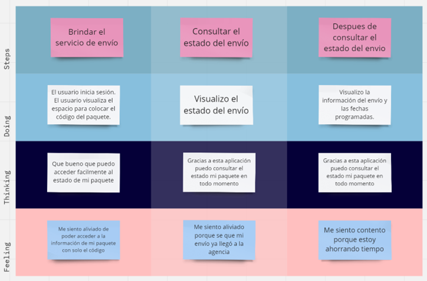
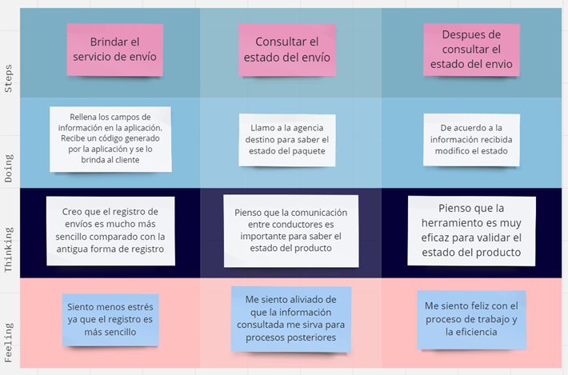

<a href="Tabla_de_Contenidos.md">Volver a tabla de contenidos</a>

## 3.1. To-Be Scenario Mapping.
#### To-Be Scenario Map de remitentes.
A continuación, se muestra un cuadro con las acciones del to-be scenario map para el segmento de remitentes. En ello, se muestra 3 pasos que realizarán los usuarios de este segmento en la plataforma para observar el estado del servicio de envío de paquete a través de la agencia.

Enlace: [Documento en Miro](https://miro.com/app/board/uXjVMp24Pnw=/?share_link_id=974450294918)

#### To-Be Scenario Map del usuario empresa.
En el siguiente cuadro se muestra los pasos de las acciones que realizan las empresas para brindar el servicio de enviar el paquete que reciben en su agencia.

Enlace: [Documento en Miro](https://miro.com/app/board/uXjVMp24Pnw=/?share_link_id=974450294918)

## 3.2. User Stories.
### User Stories
| User Story ID | Título                                              | Descripción                                                                                                                                                                                                                                                        | Criterios de Aceptación                                                                                                                                                                                                                                                                                                                                                                                                                                                                                                                                                                                                                                                                                                                                                                                                                                                                                                                                                                                                                                                                                                                                                                                                                                                                          | Relacionado con (Epic ID) |
|:--------------|:----------------------------------------------------|:-------------------------------------------------------------------------------------------------------------------------------------------------------------------------------------------------------------------------------------------------------------------|:-------------------------------------------------------------------------------------------------------------------------------------------------------------------------------------------------------------------------------------------------------------------------------------------------------------------------------------------------------------------------------------------------------------------------------------------------------------------------------------------------------------------------------------------------------------------------------------------------------------------------------------------------------------------------------------------------------------------------------------------------------------------------------------------------------------------------------------------------------------------------------------------------------------------------------------------------------------------------------------------------------------------------------------------------------------------------------------------------------------------------------------------------------------------------------------------------------------------------------------------------------------------------------------------------|:--------------------------|
| US01          | Registrar paquetes                                  | **Como** empresa de transporte **quiero** registrar los datos de los paquetes que ingresan **para** que puedan tener acceso** a las funcionalidades del aplicativo                                                                                                 | 
**Escenario: El administrador registra un paquete correctamente**

** 

**Dado** que** el administrador se encuentra en la pantalla “Registro”**  

**Cuando** selecciona el botón “Agregar” se muestra un formulario.

**Y** completa los datos que solicitan correctamente.

**Entonces** se mostrará un mensaje de confirmación.

 

**Escenario: El administrador registra un paquete incorrectamente**

** 

**Dado** que** el administrador se encuentra en la pantalla “Registro”**  

**Cuando** selecciona el botón “Agregar” se muestra un formulario.

**Y** no complete todos los datos que se solicitan.

**Entonces** se mostrará un mensaje de error.
                                                                                                                                                                                                                                                                                                                                                                                                                                                                                                                                                          | EP02                      |
| US02          | Ingresar información de los envíos                  | **Como** administradora de una empresa de transporte de carga terrestre, **quiero** informar a mis clientes el estado del envío de sus mercaderías **para** mejorar la satisfacción del cliente y la eficiencia operativa de la empresa                            | 
**Escenario**: El administrador recepciona y/o despacha diferentes mercaderías de los clientes. 

**Dado** que el administrador se encuentra en la sección Despachos y tiene los códigos de envío. 

**Cuando** el administrador adjunto al sistema todos los códigos de envíos que se han realizado y el estado donde se encuentra. 

**Entonces** la aplicación mostrará el estado actual de envío de la mercadería. Caso contrario, la aplicación mostrará al cliente un mensaje indicando que el código de envío no existe.
                                                                                                                                                                                                                                                                                                                                                                                                                                                                                                                                                                                                                                                                                                                                     | EP02                      |
| US03          | Modificar información de paquetes                   | **Como** empresa de transporte **quiero** modificar los datos de los paquetes que ingresan **para** corregir la información en caso se haya realizado un registro incorrecto.                                                                                      | 
**Escenario 1: El administrador modifica la información de un paquete**

** 

**Dado** que el administrador se encuentra en la sección “Lista de Registros”

**Cuando** visualice el registro que desea modificar

**Y** seleccione el ícono de configuración

**Y** aparecerá un formulario donde podrá modificar los campos, luego seleccionará el botón de “Actualizar”

**Entonces** se mostrará un mensaje de confirmación.** 
                                                                                                                                                                                                                                                                                                                                                                                                                                                                                                                                                                                                                                                                                                                                                                                                                         | EP02                      |
| US04          | Visualizar el estado de sus envíos                  | ` `**Como** cliente de una empresa de transporte de carga terrestre, **quiero** saber el estado del envío de mi mercadería, **para** tener un control de mis envíos.                                                                                               | 
**Escenario**: El cliente visualiza el estado de sus envíos

**Dado** que el cliente se encuentra en la sección de consulta de mercadería  

**Cuando** ingrese un código de envío válido 

**Entonces** la aplicación le mostrará el estado de su envío 

**Escenario**: El cliente no visualiza el estado de sus envíos

**Dado** que el cliente se encuentra en la sección de consulta de mercadería.

**Cuando** el cliente ingresa un código de envío inválido

**Entonces** se muestra en la pantalla un mensaje “Código de envío inválido” y no visualizará el estado de sus envíos.

                                                                                                                                                                                                                                                                                                                                                                                                                                                                                                                                                                                                                                                     | EP03                      |
| US05          | 
Recibir notificaciones en tiempo real

 | **Como** cliente, **quiero** recibir notificaciones en tiempo real sobre el estado de mis envíos de mercadería **para** poder estar informado en todo momento.                                                                                                     | 
**Escenario**: Notificación de actualización de estado del envío

**Dado** que un cliente ha registrado su envío y ha habilitado las notificaciones de actualización de estado

**Cuando** el estado del envío cambia (por ejemplo, de "en tránsito" a "en espera de entrega")

**Entonces** el cliente recibe una notificación en tiempo real con información actualizada sobre el estado del envío.

**Escenario**: Notificación de entrega

**Dado** que un cliente ha registrado su envío y ha habilitado las notificaciones de entrega

**Cuando** el envío es entregado satisfactoriamente en la dirección del cliente

**Entonces** el cliente recibe una notificación en tiempo real confirmando la entrega exitosa del envío.

**Escenario**: Notificación de retraso en la entrega

**Dado** que un cliente ha registrado su envío y ha habilitado las notificaciones de actualización de estado

**Cuando** hay un retraso en la entrega del envío debido a factores externos (por ejemplo, problemas climáticos, problemas de transporte)

**Entonces** el cliente recibe una notificación en tiempo real informando sobre el retraso en la entrega y la nueva fecha estimada de entrega.

  
 | EP03                      |
| US06          | Eliminar paquetes                                   | **Como** empresa de transporte **quiero** eliminar paquetes que fueron cancelados **para** solo tener registrados a los paquetes vigentes.                                                                                                                         | 
**Escenario: El administrador elimina un paquete**

` `**Dado** que el administrador se encuentra en la sección “Lista de Registros”

**Cuando** visualice el registro que desea eliminar

Y seleccione la opción “Eliminar”

**Entonces** se eliminará de la lista de registros.
                                                                                                                                                                                                                                                                                                                                                                                                                                                                                                                                                                                                                                                                                                                                                                                                                                                                                                                                                                                     | EP02                      |
| US07          | Ver el historial de envíos de mercadería            | **Como** cliente **quiero** visualizar la información de los diferentes envíos de mercadería realizados **para** poder hacer un seguimiento de los pedidos que he realizado en el pasado.                                                                          | 
**Escenario:** El cliente ve el historial de envíos de mercadería

**Dado** que el cliente se encuentra en la sección historial de envíos. 

**Cuando** el cliente selecciona el nombre de un mes del año actual. 

**Entonces** la aplicación mostrará las diferentes fechas de envíos realizados en ese mes y con qué empresa lo hizo.
                                                                                                                                                                                                                                                                                                                                                                                                                                                                                                                                                                                                                                                                                                                                                                                                                                                                                                                                   | EP03                      |
| US08          | Consultar reporte de envíos a clientes              | **Como** administradora de una empresa de transporte, **quiero** saber si se ha informado a todos los clientes sobre el estado de sus envíos **para** identificar a los clientes que todavía no han sido informados del estado de sus envíos.                      | 
**Escenario: La administradora consulta si se ha informado de las recepciones, envíos a destino o entrega de diferentes mercaderías a los clientes**. 

**Dado** que el administrador/a se encuentra en la sección despachos y tiene los códigos de envío. 

**Cuando** este adjunte al sistema todos los códigos de envíos que se han realizado y el estado donde se encuentra. 

**Entonces** la  aplicación mostrará el estado actual de envío de la mercadería. Caso contrario, la aplicación mostrará al cliente un mensaje que el código de envío no existe.

                                                                                                                                                                                                                                                                                                                                                                                                                                                                                                                                                                                                                                                                                                  | EP03                      |
| US09          | Gestionar los remitentes                            | **Como** administrador **quiero** crear, modificar y eliminar remitentes **para** que la administración sea de manera eficiente.                                                                                                                                   | 
**Escenario: El administrador crea un remitente**

**Dado** que el administrador se encuentra en la página de inicio

**Y** se dirige a la sección de “Remitentes”

**Cuando**

Le da click al botón “Nuevo”

Y complete los datos que piden

**Entonces** al darle click al botón “Guardar”

se guardará exitosamente los datos

**Escenario: El administrador modifica un remitente**

**Dado** que el administrador se encuentra en la página

**Y** se dirige a la sección de “Remitentes”

**Cuando**

Se va a la parte del consignatario que quiere modificar

**Y**  le da click al botón lápiz

**Entonces** Cambio los datos que quiere modificar

**Y** le da click a “Guardar”

**Y** se guardaron los datos exitosamente

**Escenario: El administrador elimina un remitente**

**Dado** Cuando el administrador se encuentra en la página

**Y** se dirige a la sección de “Remitentes”

**Cuando**

Se va a la parte del remitente que quiere eliminar

**Y** le da click al botón con símbolo de tacho

**Entonces** Le doy click a “Eliminar”

And se eliminan los datos exitosamente

                                                      | EP04                      |
| US10          | Gestionar los consignatarios                        | **Como** administrador **quiero** tener el control de los consignatarios **para** crear, actualizar su información o eliminar si ya no tiene ningún envío pendiente                                                                                                | 
**Escenario: El administrador crea un consignatario**

**Dado** que el administrador se encuentra en la página

` `**Y** se dirige a la sección de “Consignatarios”

` `**Cuando** le da click al botón “Nuevo”

**Y** completa los datos que piden

**Entonces** al darle click al botón “Guardar” se guarda exitosamente los datos

**Escenario: El administrador modifica un consignatario**

**Dado** que el administrador se encuentra en la página de inicio

**Y** se dirige a la sección de “Consignatarios”

**Cuando**

Se va a la parte del consignatario que quiere modificar

**Y** le de click al botón lápiz

**Entonces** cambio los datos que quiere modificar

**Y** al darle click al botón “Guardar” se guardarán los datos exitosamente

**Escenario: El administrador elimina un consignatario**

**Dado** que el administrador se encuentra en la página

**Y** se dirige a la sección de “Consignatarios”

**Cuando**

Se va a la parte del consignatario que quiere eliminar

**Y** le da click al botón con símbolo de tacho

**Entonces** le de click a “Eliminar” ,  se eliminan los datos exitosamente

                                            | EP04                      |
| US11          | Gestionar envíos                                    | **Como** remitente **quiero** manejar el control de envíos **para** que no haya confusiones entre tantos envíos                                                                                                                                                    | 
**Escenario: El administrador crea un envío**

**Dado** que el administrador se encuentra en la página de inicio

`  `Y se dirija a la sección de “Envíos”

**Cuando** le da click al botón “Nuevo”

**Y** completa los datos que piden

**Entonces** Le da click al botón “Guardar” se guardará exitosamente los datos

**Escenario: El administrador modifica un envío**

**Dado** que el administrador se encuentra en la página

**Y** se dirige a la sección de “Envíos”

**Cuando** Se va a la parte del Envíos que quiere modificar

**Y** le da click al botón lápiz

**Entonces** cambia los datos que quiere modificar

**Y** le da click a “Guardar “se guardarán los datos exitosamente

**Escenario: El administrador elimina un envío**

**Dado** que el administrador se encuentra en la página

**Y** se dirige a la sección de “Envíos”

**Cuando** se va a la parte del Envíos que quiere eliminar

**Y** le da click al botón con símbolo de tacho

**Entonces** Le doy click a “Eliminar”

**Y** se eliminan los datos exitosamente

                                                                                                                      | EP04                      |
| US12          | Gestionar destinos                                  | **Como** remitente **quiero** manejar los destinos de los consignatarios **para** añadir nuevos destinos, eliminar algún destino equivocado o modificar el nombre                                                                                                  | 
**Escenario: El administrador crea un destino**

**Dado** que el administrador se encuentra en la página de inicio

**Y** se dirige a la sección de “Destinos”

**Cuando**

Le da click al botón “Nuevo”

**Y** completa los datos que piden

**Entonces** Le da click al botón “Guardar”

** se guarda exitosamente los datos

**Escenario: El administrador modifica un destino**

**Dado** que el administrador se encuentra en la página de inicio

And se dirige a la sección de “Destinos”

**Cuando**

Se va a la parte del destino que quiere modificar

And le da click al botón lápiz

**Entonces** Cambio los datos que quiere modificar

**Y** le da click a “Guardar”

**Y** se guardaran los datos exitosamente

**Escenario: El administrador elimina un destino**

**Dad**o Cuando el administrador se encuentra en la página

**Y** se dirige a la sección de “Destinos”

**Cuando** se va a la parte del destino que quiere eliminar

And le da click al botón con símbolo de tacho

**Entonces** le doy click a “Eliminar”

**Y** se eliminan los datos exitosamente

                                                                  | EP04                      |
| US13          | Gestionar los documentos                            | **Como** remitente **quiero** manejar los tipos de documentos **para** emitirlos de acuerdo con lo que el consignatario decida                                                                                                                                     | 
**Escenario: El administrador crea un tipo de documento**

**Dado** que el administrador se encuentra en la página

**Y** se dirige a la sección de “Tipo de documento”

**Cuando** le da click al botón “Nuevo”

**Y** completa los datos que piden

**Entonces** Le da click al botón “Guardar” se guardará exitosamente los datos

**Escenario: El administrador modifica un tipo de documento**

**Dado** que el administrador se encuentra en la página

And se dirige a la sección de “Tipo de documento”

**Cuando**

Se va a la parte de tipo de documento que quiere modificar

**Y** le da click al botón lápiz

**Entonces** cambie los datos que quiere modificar

**Y** le da click a “Guardar” se guardarán los datos exitosamente

**Escenario: El administrador elimina un tipo de documento**

**Dado** que el administrador se encuentra en la página

**Y** se dirige a la sección de “Tipo de documento”

**Cuando**

Se va a la parte de tipo de documento que quiere eliminar

**Y** le da click al botón con símbolo de tacho

**Entonces** Le doy click a “Eliminar”

**Y** se eliminan los datos exitosamente
                             | EP04                      |
| US14          | Registrar comentarios                               | **Como** usuario **quiero** comentar mi experiencia **para** poder compartir con los demás usuarios.                                                                                                                                                               | 
**Escenario 1: El usuario registra un comentario.**

**Dado** el usuario está registrado 

**Y** se dirija a la sección “Comentarios” 

**Cuando** registre su comentario 

**Y** seleccione el botón “Agregar comentario”** 

**Entonces** se mostrará un mensaje de confirmación. 

**Escenario 2: El usuario registra un comentario.**

**Dado** el usuario está registrado 

**Y** se dirija a la sección “Comentarios” 

**Cuando** no registre su comentario 

**Y** seleccione el botón “Agregar comentario”** 

**Entonces** se mostrará un mensaje de error. 
                                                                                                                                                                                                                                                                                                                                                                                                                                                                                                                                                                                                                                                      | EP05                      |
| US15          | Modificar comentarios                               | **Como** usuario **quiero** modificar mi comentario **para** que se muestre mi experiencia con la aplicación.                                                                                                                                                      | 
` `**Escenario 1: El usuario modifica un comentario**

**Dado** el usuario está registrado 

**Y** se dirija a la sección “Comentarios” 

**Cuando** visualice su comentario 

**Y** seleccione el botón “Editar”, luego modifique su comentario

Y seleccione el botón “Actualizar”

**Entonces** se mostrará un mensaje de confirmación. 
                                                                                                                                                                                                                                                                                                                                                                                                                                                                                                                                                                                                                                                                                                                                                                                                                                                                                                                 | EP05                      |
| US16          | Eliminar comentarios                                | **Como** usuario **quiero** eliminar mi comentario **para** no se muestre en la aplicación.                                                                                                                                                                        | 
** 

**Escenario 1: El usuario modifica un comentario**

**Dado** el usuario está registrado 

**Y** se dirija a la sección “Comentarios” 

**Cuando** visualice su comentario 

**Y** seleccione el botón “Eliminar”

**Entonces** se mostrará un mensaje de confirmación. 

**Escenario 1: El usuario modifica un comentario**

**Dado** el usuario está registrado 

**Y** se dirija a la sección “Comentarios” 

**Cuando** no encuentre su comentario 

**Entonces** no podrá eliminar ningún comentario.
                                                                                                                                                                                                                                                                                                                                                                                                                                                                                                                                                                                                                                                                                                | EP05                      |
| US17          | Registrar empresa de transporte                     | 
**Como** empresa de transporte, **quiero** registrarme en la plataforma para poder utilizar sus servicios y gestionar los envíos de manera eficiente.

**Para** que la plataforma proporcione un formulario de registro para empresas de transporte.
   | 
**Escenario: La empresa de transporte se registra como usuario** 

**Dado** que la administradora de la empresa se encuentra en la página de inicio. 

**Cuando** la administradora vea que no tiene una cuenta, se le mostrará un formulario donde podrá registrarse 

**Entonces** con los datos ingresados correctamente como teléfono, ruc, nombre, se registrará como nuevo usuario

**Escenario: La administradora de la empresa no se registra como usuario**

**Dado** la administradora de la empresa se encuentra en la página de inicio

**Cuando** el cliente vea que no tiene una cuenta, se le mostrará un formulario donde podrá registrarse 

**Entonces** los datos no son ingresados correctamente y se les mostrará un mensaje de “El campo no ha sido ingresado o dato incorrecto"
                                                                                                                                                                                                                                                                                                                                                                                                                                          | EP02                      ||
US18

|Crear API de consignatarios|**Como** desarrollador de la plataforma **quiero** que los datos de los consignatarios se guardan **para** luego poder modificarlos si es necesario|
**Escenario 1: El developer crea consignatario**

**Dado** que el developer se encuentra en el backend

**Cuando** programa al consignatario

**Entonces** se creará consignatario en la base de datos.

**Escenario 2: El developer elimina un consignatario**

**Dado** que el developer se encuentra en el backend

**Cuando**

busca el nombre de un consignatario para eliminar

**Entonces** llena la razón de la eliminación de la cuenta y hace clic en el botón eliminar.**  

||
| US19          | Crear el API de envíos                              | **Como** desarrollador de la plataforma **quiero** que los datos de los envíos se guardan **para** luego puedan ser modificados                                                                                                                                    | 
**Escenario: El developer implementa service envíos**

**Dado** que el developer se encuentra en el backend

**Cuando**

programa envíos dentro de la aplicación

**Entonces** se creará un shipment en la base de datos con la información proporcionada

                                                                                                                                                                                                                                                                                                                                                                                                                                                                                                                                                                                                                                                                                                                                                                                                                                                                                                                                                                                                      |                           |
| US20          | Crear el API de tipo de paquete                     | **Como** desarrollador de la plataforma **quiero** que los datos de los tipos de paquete se almacenen **para** luego poder modificarlos y/o utilizarlos si es necesario                                                                                            | 
**Escenario 1: El developer implementa tipo de paquetes**

**Dado** que el developer se encuentra en el backend

**Cuando** programa el tipo de paquetes con su respectiva información

**Entonces** se creará un type of package en la base de datos con la información proporcionada.

**Escenario: El administrador modifica un tipo de paquete**

**Dado** que el administrador se encuentra en el panel de administración 

**Cuando l**e da click al botón “TypeOfPackage”, completa los datos con información inválida, le da click al botón “modificar”, modifica los campos con información válida

y le da click a “modificar”

**Entonces** se modificará los campos con información válida.
                                                                                                                                                                                                                                                                                                                                                                                                                                                                                                                                    |                           |
| US21          | Crear el API de documentos                          | **Como** desarrollador de la plataforma **quiero** que los datos de los documentos se almacenen **para** luego poder modificarlos si es necesario                                                                                                                  | 
**Escenario 1: El developer implementa la funcionalidad de documentos**

**Dado** que el developer se encuentra en el backend

**Cuando** implementa los documentos

**Entonces** hace validaciones para evitar errores

  
                                                                                                                                                                                                                                                                                                                                                                                                                                                                                                                                                                                                                                                                                                                                                                                                                                                                                                                                                                                                                                     |                           |
| US22          | Crear el API de remitentes                          | **Como** desarrollador de la plataforma **quiero** que los datos de los remitentes se guardan **para** luego poder modificarlos si es necesario                                                                                                                    | 
**Escenario 1: El developer implementa a remitente**

**Dado** que el developer se encuentra en el backend

**Cuando** implementa las funcionalidades de remitente

**Entonces** valida sus funcionalidades.

                                                                                                                                                                                                                                                                                                                                                                                                                                                                                                                                                                                                                                                                                                                                                                                                                                                                                                                                                                                                                                                        |                           |

### Epics

## 3.3. Impact Mapping.
#### Segmento de representante de segmento de empresas de envío de paquetes.
A continuación, se muestra el mapa de impacto que tendrá la solución de nuestro proyecto softroute en las empresas. Por ejemplo, se optimizan la gestión de los envíos y por ente tiende a reducir el tiempo para formalizar el servicio de envío. 

### Segmento de remitente de paquetes de envío a nivel del Perú

## 3.4. Product Backlog.
El product backlog en Scrum es una lista de características que han sido priorizadas desde el punto de vista del negocio.

| #Orden | User Story ID | Título                                   | Descripción                                                                                                                                                                                                                                                      | Story Points |
|:-------|:--------------|:-----------------------------------------|:-----------------------------------------------------------------------------------------------------------------------------------------------------------------------------------------------------------------------------------------------------------------|:-------------|
| 1      | US01          | Registrar paquetes                       | **Como** empresa de transporte **quiero** registrar los datos de los paquetes que ingresan **para** que puedan tener acceso** a las funcionalidades del aplicativo                                                                                               | 8            |
| 2      | US02          | Ingresar información de los envíos       | **Como** administradora de una empresa de transporte de carga terrestre, **quiero** informar a mis clientes el estado del envío de sus mercaderías **para** mejorar la satisfacción del cliente y la eficiencia operativa de la empresa                          | 8            |
| 3      | US04          | Visualizar el estado de sus envíos       | ` `**Como** cliente de una empresa de transporte de carga terrestre, **quiero** saber el estado del envío de mi mercadería, **para** tener un control de mis envíos.                                                                                             | 8            |
| 4      | US05          | Recibir notificaciones en tiempo real    | **Como** cliente, **quiero** recibir notificaciones en tiempo real sobre el estado de mis envíos de mercadería **para** poder estar informado en todo momento.                                                                                                   | 8            |
| 5      | US18          | Crear API de consignatarios              | **Como** desarrollador de la plataforma **quiero** que los datos de los consignatarios se guardan **para** luego poder modificarlos si es necesario                                                                                                              | 8            |
| 6      | US19          | Crear el API de envíos                   | **Como** desarrollador de la plataforma **quiero** que los datos de los envíos se guardan **para** luego puedan ser modificados                                                                                                                                  | 8            |
| 7      | US20          | Crear el API de tipo de paquete          | **Como** desarrollador de la plataforma **quiero** que los datos de los tipos de paquete se almacenen **para** luego poder modificarlos y/o utilizarlos si es necesario                                                                                          | 8            |
| 8      | US21          | Crear el API de documentos               | **Como** desarrollador de la plataforma **quiero** que los datos de los documentos se almacenen **para** luego poder modificarlos si es necesario                                                                                                                | 8            |
| 9      | US03          | Modificar información de paquetes        | **Como** empresa de transporte **quiero** modificar los datos de los paquetes que ingresan **para** corregir la información en caso se haya realizado un registro incorrecto.                                                                                    | 5            |
| 10     | US07          | Ver el historial de envíos de mercadería | **Como** cliente **quiero** visualizar la información de los diferentes envíos de mercadería realizados **para** poder hacer un seguimiento de los pedidos que he realizado en el pasado.                                                                        | 5            |
| 11     | US09          | Gestionar los remitentes                 | **Como** administrador **quiero** crear, modificar y eliminar remitentes **para** que la administración sea de manera eficiente.                                                                                                                                 | 5            |
| 12     | US10          | Gestionar los consignatarios             | **Como** administrador **quiero** tener el control de los consignatarios **para** crear, actualizar su información o eliminar si ya no tiene ningún envío pendiente                                                                                              | 5            |
| 13     | US11          | Gestionar envíos                         | Como remitente quiero manejar el control de envíos para que no haya confusiones entre tantos envíos                                                                                                                                                              | 5            |
| 14     | US12          | Gestionar destinos                       | **Como** remitente **quiero** manejar los destinos de los consignatarios **para** añadir nuevos destinos, eliminar algún destino equivocado o modificar el nombre                                                                                                | 5            |
| 15     | US13          | Gestionar los documentos                 | **Como** remitente **quiero** manejar los tipos de documentos **para** emitirlos de acuerdo con lo que el consignatario decida                                                                                                                                   | 5            |
| 16     | US14          | Registrar comentarios                    | **Como** usuario **quiero** comentar mi experiencia **para** poder compartir con los demás usuarios.                                                                                                                                                             | 5            |
| 17     | US06          | Eliminar paquetes                        | **Como** empresa de transporte **quiero** eliminar paquetes que fueron cancelados **para** solo tener registrados a los paquetes vigentes.                                                                                                                       | 3            |
| 18     | US08          | Consultar reporte de envíos a clientes   | **Como** administradora de una empresa de transporte, **quiero** saber si se ha informado a todos los clientes sobre el estado de sus envíos **para** identificar a los clientes que todavía no han sido informados del estado de sus envíos.                    | 3            |
| 19     | US15          | Modificar comentarios                    | **Como** usuario **quiero** modificar mi comentario **para** que se muestre mi experiencia con la aplicación.                                                                                                                                                    | 3            |
| 20     | US17          | Registrar empresa de transporte          | 
**Como** empresa de transporte, **quiero** registrarme en la plataforma para poder utilizar sus servicios y gestionar los envíos de manera eficiente.

**Para** que la plataforma proporcione un formulario de registro para empresas de transporte.
 | 3            |
| 21     | US16          | Eliminar comentarios                     | **Como** usuario **quiero** eliminar mi comentario **para** no se muestre en la aplicación.                                                                                                                                                                      | 1            |