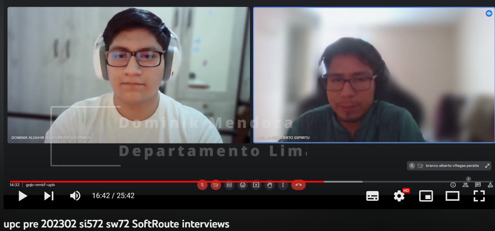
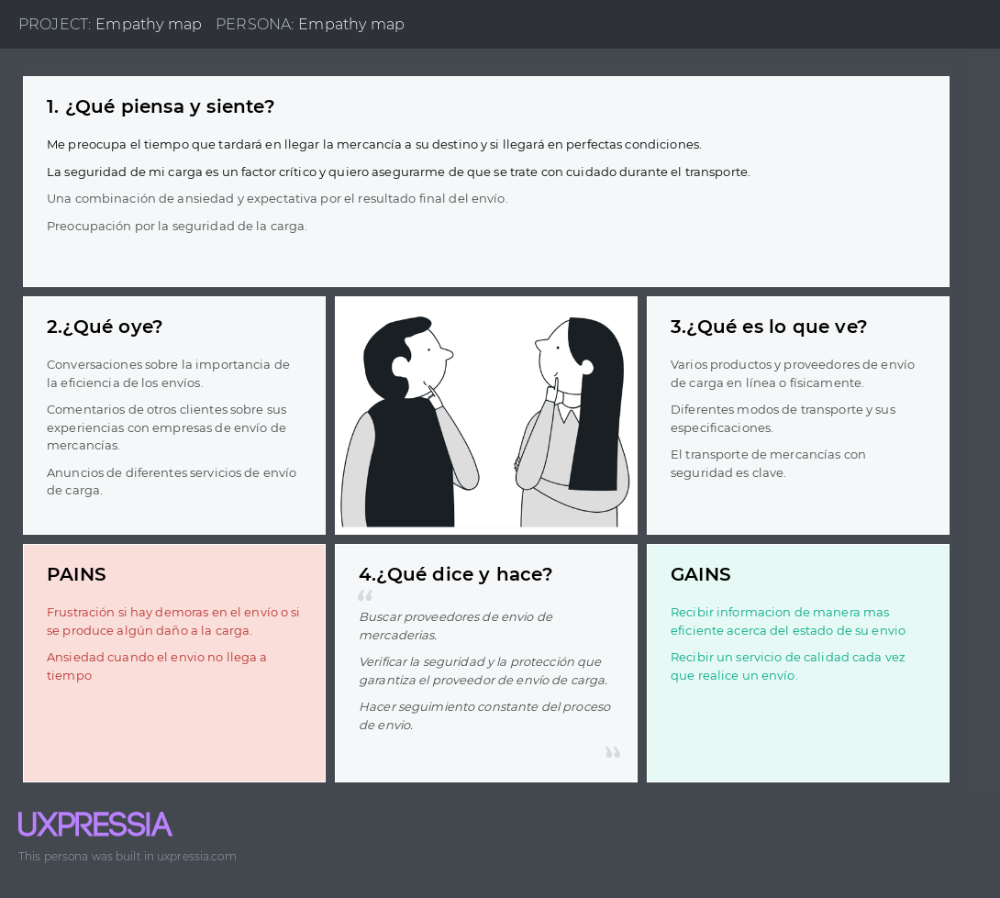

<a href="https://github.com/SoftRouteV2/upc-pre-202302-si572-SW72-softroute-report/blob/main/Tabla_de_Contenidos.md">Volver a tabla de contenidos</a>

# Capítulo II: Requirements elicitation & analysis

 
## Competidores

### Análisis Competitivo
<table><tr><th colspan="7" valign="top"><b>Competitive Analysis Landscape</b></th></tr>
<tr><td colspan="2" valign="top"><b>¿Por qué llevar a cabo este análisis?</b></td><td colspan="5" valign="top">Queremos tener una idea clara de lo que buscamos en nuestra app y que esto sea el diferenciador de otras aplicaciones similares</td></tr>
<tr><td colspan="3" valign="top"><b>(En la cabecera colocar por cada competidor nombre y logo)</b></td><td colspan="1" valign="top"><b>VaRuta</b></td><td colspan="1" valign="top"><b>Olva Curier</b></td><td colspan="1" valign="top"><b>Shalom</b></td><td colspan="1" valign="top"><b>Cruz del Sur Cargo</b></td></tr>
<tr><td colspan="1" rowspan="2" valign="top"><b>Perfil</b></td><td colspan="6" valign="top">Overview</td></tr>
<tr><td colspan="2" valign="top">
Ventaja competitiva

¿Qué valor ofrece a los clientes?
</td><td colspan="1" valign="top">Atención 24 horas y un área especializada en atención al cliente</td><td colspan="1" valign="top">Llega a cualquier parte del Perú con sus agencias</td><td colspan="1" valign="top">Tiene una sección especializada a empresas</td><td colspan="1" valign="top">Tiene servicios de carga completa y carga parcial</td></tr>
<tr><td colspan="1" rowspan="2" valign="top">

<b>Perfil de Marketing</b>
</td><td colspan="2" valign="top">Mercado objetivo</td><td colspan="1" valign="top">Personas que envían productos vía terrestre a nivel nacional</td><td colspan="1" valign="top">Personas que envían productos vía terrestre a nivel nacional e internacional</td><td colspan="1" valign="top">Personas/empresas que envíen mercadería a otras partes del Perú</td><td colspan="1" valign="top">Personas que envíen productos o quieran otro tipo de actividad con camiones</td></tr>
<tr><td colspan="2" valign="top">Estrategias de marketing</td><td colspan="1" valign="top">Tendremos una frase que nos identifique como empresa, la atención personalizada y camiones con banners de nuestra empresa  </td><td colspan="1" valign="top">Camiones con el logo de la empresa que pasean por Lima repartiendo</td><td colspan="1" valign="top">Agencias en puntos estratégicos </td><td colspan="1" valign="top">La empresa también ofrece servicios de buses interprovinciales por lo que es este servicio se ofrece como adicional a los pasajeros</td></tr>
<tr><td colspan="1" rowspan="3" valign="top">

<b>Perfil de Producto</b>
</td><td colspan="2" valign="top">Productos & Servicios</td><td colspan="1" valign="top">Nuestra app tendrá registros de envíos más rápidos por lo que su producto llegará antes. Además, también se dispondrán de envíos “express” para provincias.</td><td colspan="1" valign="top">Tienen una flota de camiones que reparten a nivel nacional. Además, se están adentrando al mercado internacional. Por otra parte, también tienen el servicio de “olva compras”</td><td colspan="1" valign="top">Tienen servicios para empresas y personas naturales. A parte de eso, ofrecen servicios de mudanzas a sus clientes.</td><td colspan="1" valign="top">La empresa tiene servicios de entrega de encomiendas, carga completa para mudanzas u otro tipo de carga seca y carga parcial para el traslado de mercadería.</td></tr>
<tr><td colspan="2" valign="top">Precios & Costos</td><td colspan="1" valign="top">Nuestro costo dependerá del distrito a donde se envíe</td><td colspan="1" valign="top">Nuestro costo dependerá del distrito a donde se envíe</td><td colspan="1" valign="top">Nuestro costo dependerá del distrito a donde se envíe</td><td colspan="1" valign="top">Nuestro costo dependerá del distrito a donde se envíe</td></tr>
<tr><td colspan="2" valign="top">Canales de distribución (Web y/o Móvil)</td><td colspan="1" valign="top"></td><td colspan="1" valign="top"></td><td colspan="1" valign="top"></td><td colspan="1" valign="top"></td></tr>
<tr><td colspan="1" rowspan="5" valign="top"><b>Análisis SWOT</b></td><td colspan="6" valign="top">
Realice esto para su startup y sus competidores. Sus fortalezas deberían apoyar sus oportunidades y contribuir a lo que ustedes definen como su posible ventaja

competitiva.
</td></tr>
<tr><td colspan="2" valign="top">Fortalezas</td><td colspan="1" valign="top">Nuestro envío será más rápido al igual que nuestros canales de atención</td><td colspan="1" valign="top">Empresa consolidada a nivel nacional con diferentes servicios</td><td colspan="1" valign="top">Empresa conocida por sus bajos precios de envío y porque llega más rápido</td><td colspan="1" valign="top">Tener una flota de buses reconocida que hace que los clientes confíen</td></tr>
<tr><td colspan="2" valign="top">Debilidades</td><td colspan="1" valign="top">No contar con envíos internacionales por el momento y no contar con tiendas físicas</td><td colspan="1" valign="top">Los envíos a veces demoran de 2-3 días y a provincia hasta una semana sin contar el registro de envío que tarda 1 día</td><td colspan="1" valign="top">No tienen muchas agencias alrededor del país por lo que dificulta el traslado del pedido.</td><td colspan="1" valign="top">Sus agencias o tiendas son limitadas, no se encuentran en la selva. </td></tr>
<tr><td colspan="2" valign="top">Oportunidades</td><td colspan="1" valign="top">Al tener una app, es mucho más fácil llegar a más clientes</td><td colspan="1" valign="top">Entrar al mercado internacional y tener clientes</td><td colspan="1" valign="top">Cuentan con más servicios que les permite tener clientes de otros rubros</td><td colspan="1" valign="top">Algunos servicios solo se encuentran en Lima el cual se pueden expander.</td></tr>
<tr><td colspan="2" valign="top">Amenazas</td><td colspan="1" valign="top">Las otras empresas que cuentan con más experiencia</td><td colspan="1" valign="top">Paqueterías como DHL que también tienen envíos y otras empresas de rubros similares</td><td colspan="1" valign="top">Empresas del mismo o similar rubro de los servicios que ofrece con precios más bajos.</td><td colspan="1" valign="top">Empresas que sí tienen agencias en diferentes partes del Perú y cuenten con servicios mejor localizados</td></tr>
</table>

### Estrategias y táctica frente a competidores

Sabemos que en la actualidad cada vez nacen nuevas *start-ups* que buscan un espacio dentro del mercado competitivo, y marcar la diferencia es esencial para lograr el objetivo. Por eso la planificación de nuevas estrategias juegan un papel importante en el desarrollo del proyecto,
con el fin de tener éxito dentro del mercado y posicionarnos entre los mejores proyectos.

**Estrategias elegidas por el equipo:**

**Mejora de la experiencia del cliente para fomentar la fidelización:** La optimización de la experiencia del usuario constituye una de las principales prioridades en el marco de nuestro proyecto. Para tal efecto, se ha dispuesto ofrecer una atención personalizada de primer nivel, además de procurar una pronta y eficiente respuesta a cualquier inquietud o cuestionamiento que pudiera surgir por parte de nuestra estimada clientela.

**Mejora continua de la tecnología:** Con el objetivo de diferenciarnos de nuestros competidores y ofrecer a nuestros clientes una experiencia de vanguardia, estamos comprometidos a invertir en tecnologías innovadoras, como nuevos softwares y otras soluciones de última generación. De esta manera, podremos proporcionar opciones únicas y distintivas a nuestros clientes, manteniéndonos a la vanguardia de las tendencias tecnológicas actuales y satisfaciendo sus necesidades en constante evolución.\
\
**Ampliación de la oferta de productos:** Con el desarrollo de nuestro principal producto buscaremos la expansión, con el fin de ofrecer más opciones a los clientes que estén interesados en enviar paquetes. Un ejemplo de ampliación de productos podría ser a futuro el envío
personalizado de productos en específico que necesiten un cuidado en especial.

## Entrevistas

### Diseño de entrevistas

**Introducción/Presentación** 

Buenos días/tardes/noches, soy [...] estudiante de UPC de la carrera de ingeniería de software, junto con mi equipo estamos desarrollando plataforma web, una plataforma que permitirá realizar seguimiento a los paquetes enviados a través de las agencias de transporte de cargas. Para
ello, quisiéramos conocer su situación actual en este rubro de envíos de encomiendas y deberá responder las siguientes preguntas.  

**Preguntas generales** 

1.  ¿Cuál es su nombre completo? 

 
2.  ¿Cuál es su edad? 

 
3.  ¿En qué distrito vive? 

**Segmento Objetivo: Remitentes** 

1.  ¿Cuál es su ocupación actual? 

2.  ¿Con qué frecuencia envía paquetes dentro del Perú? En una escales del 0 al 10. 

3.  ¿Cómo hace seguimiento al estado de sus envíos? 

4.  ¿Considera que la información que le proporcionan para seguimiento     es suficiente?  

     Si su respuesta es sí o no: ¿Por qué? 

5.  ¿Qué plataforma utiliza para rastrear sus paquetes? 
 Si su respuesta es sí utiliza plataformas: ¿Por qué eligió esa plataforma en particular? 

6.  ¿Cómo evaluaría el servicio que recibe de su agencia de envíos? 
 
7.  Mencionar al entrevistado el proyecto SoftRoute y acerca de los dispositivos IoT como uso de GPS para notificaciones en tiempo real del estado del envío. 
 ¿Usaría este servicio y por qué? 

8.  Si fuera posible, ¿qué funciones o información adicional agregaría en la plataforma de seguimiento de pedidos? 

 

**Segmento Objetivo: Agencias de envíos** 

1.  ¿Para qué empresa de envíos de paquetes trabaja actualmente? 

2.  ¿Con qué frecuencia se realizan envíos a nivel nacional en su empresa? 

3.  ¿Tienen alguna plataforma para mantener informados a los clientes sobre el estado de sus pedidos? 
     Si su respuesta es sí o no: ¿Por qué? 

4.  ¿Considera que la información de seguimiento que brindan actualmente es suficiente? 
    Si su respuesta es sí o no: ¿Por qué? 

5.  ¿Han recibido quejas de clientes por falta de información acerca del paquete enviado? 

6.  Mencionar al entrevistado el proyecto SoftRoute y acerca de los dispositivos IoT como uso de GPS para notificaciones en tiempo real del estado del envío. 
    ¿Usaría este servicio y por qué? 

7.  Si fuera posible, ¿qué funciones o información adicional agregaría en la plataforma de seguimiento de pedidos? 

 
**Finalización**  

Hasta aquí llegaron las preguntas, gracias por su tiempo. 

 

### Registros de entrevistas

**Entrevista a segmento de remitente de envíos**

**Entrevista 1**

 

La entrevista empieza en el minuto 0:00 y finaliza en 3:23.

**Nombres:** Yenifer Jazmin Rojas Castro

**Edad:** 20 años

**Lugar de residencia:** Junín - Orcutuna

**Arquetipo:** Persona remitente de encomienda

**Resumen**

Es estudiante universitaria que realiza envíos de manera frecuente en una escala de 5. El seguimiento de los envíos que realiza en la agencia no se monitorea mediante alguna plataforma o aplicación móvil. Para informarse de su envío solo hace llamadas a la agencia, muchas veces por problemas naturales el envío se tarda en llega y la agencia desconoce el paradero del paquete. Considera que el servicio que le brinda la empresa considera que es deficiente. Opina que usaría la aplicación móvil del proyecto SoftRoute para realizar envíos de manera segura y estar pendiente del estado de la encomienda. Recomienda tener en cuenta que algunas zonas del Perú no cuentan con internet

**Entrevista 2**

 

La entrevista empieza en el minuto 3:25 y finaliza en 10:05.

**Nombres:** Artemio Valdivia

**Edad:** 22 años

**Lugar de residencia:** Ucayali - Irazola

**Arquetipo:** Persona remitente de encomienda

**Resumen**

Su ocupación actual es ser estudiante y considera que realiza envíos en una escala de 5 de un total de 10 que significa muy frecuente. Hace seguimiento a sus envíos que realiza a través de llamadas telefónicas. Envía sus paquetes en agencias interprovinciales, pero no está muy contento con el servicio que le brinda porque muchas veces se dañó su producto enviado. Conoce plataformas de seguimiento de shalom y olva pero no realiza envíos en esta agencia porque demoran en el tiempo de entrega del paquete. Usaría el servicio que brinda SoftRoute porque le parece bien la facilidad que le brinda al momento de registrar su paquete y considera que muchas personas llegarían a utilizarlo. Le convence la idea de rastrear sus paquetes de envío porque de esta manera va a tener mayor confianza y la persona que recoge el pedido asistirá a tiempo para recibir su encomienda.

**Entrevista 3**

 

La entrevista empieza en el minuto 10:06 y finaliza en 13:14.

**Nombres:** Adrian Rubio Calixto

**Edad:** 23 años

**Lugar de residencia:** Lima -- San Miguel

**Arquetipo:** Persona remitente de encomienda

**Resumen**

Es una persona vendedora mediante los canales virtuales y de forma presencial. Semanalmente realiza envíos en una escala de 8 en el rango de 0 a 10, puesto que siempre realiza ventas. Para conocer el estado del tramo en que se encuentra su envío lo hace a través de llamadas a la
agencia. Considera que la información que le brindan no es exacta sino solo una aproximada. No usa una plataforma para conocer el estado de su paquete enviado. Opina que si usara el servicio que ofrece la aplicación SoftRoute porque le ayudaría facilitar el envío de sus ventas a sus
clientes. Finalmente, quiere ver en la aplicación móvil la categorización del paquete que va a enviar. 

**Entrevista a segmento de agencia de envíos**

**Entrevista 1**

 

La entrevista empieza en el minuto 13:21 y finaliza en 16:41.

**Nombres:** Branco Villegas

**Edad:** 23 años

**Lugar de residencia:** Lima - Ventanilla

**Arquetipo:** Persona trabaja en agencia de envíos de paquetes

**Resumen**

Trabaja para la empresa Riber Tours, se realiza envíos a nivel nacional de manera diaria en dicha empresa. En la empresa no hay un seguimiento que se brinda a los paquetes enviados a través de una aplicación móvil. La información que brindan acerca del paquete a enviar respecto al
tiempo de llegada es aproximada y tampoco el cliente puede ver donde se encuentra su encomienda en tiempo real. Recibió quejas de sus clientes, puesto que desean saber una fecha más precisa en el que llegará su paquete enviado y una visibilidad en tiempo real. En su experiencia de
la empresa tuvieron un carro que se averío y ello generó molestia en los clientes, puesto que no sabían de dicho suceso. Considera que si usara los dispositivos IoT para que sus clientes estén más satisfechos y mediante la aplicación SoftRoute puedan informar mejor a las personas
que remiten las encomiendas.

**Entrevista 2**

 

La entrevista empieza en el minuto 16:42 y finaliza en 20:38

**Nombres:** Dominik Mendoza Ramos

**Edad:** 23 años

**Lugar de residencia:** Lima

**Arquetipo:** Persona trabaja en agencia de envíos de paquetes

**Resumen**

Trabaja para la empresa Transmar cargo, los envíos se realizan diariamente. La empresa no cuenta con una plataforma para informar a sus clientes, sino que realiza de manera tradicional a través de llamadas. Por los contratiempos que tuvo la empresa previamente, ahora solo
informan a sus clientes con una fecha estimada de acuerdo con el tiempo de viaje de la ruta. Pero esta información estimada no es suficiente porque recibe llamadas muy seguidas en la central telefónica. Recibió quejas por los paquetes dañados, pero mayormente por incumplimiento de
tiempo. Si el tiempo de viaje supera la estimación que realiza la empresa, entonces el cliente esta insatisfecho y estos casos ocurre por temas como derrumbes que obstruyen la vía terrestre. Utilizaría el sistema que muestra SoftRoute para informar a sus clientes en tiempo
real acerca del estado de su paquete enviado. Si fuera posible añadiría la funcionalidad de recibir notificaciones al cuando el paquete se encuentra en un determinado departamento.

**Entrevista 3**

 

La entrevista empieza en el minuto 20:39 y finaliza en 25:42

**Nombres:** Yhon Jesus Rosas

**Edad:** 21 años

**Lugar de residencia:** Lima -- San Juan de Miraflores

**Arquetipo:** Persona trabaja en agencia de envíos de paquetes

**Resumen**

Trabaja a medio tiempo para la empresa GyM en el segmento de envíos de encomiendas. La frecuencia con la que se envía las encomiendas es de manera diaria. La empresa no cuenta con una plataforma que realice el seguimiento de los paquetes enviados. Solo cuentan con las llamadas telefónicas para comunicar a la persona que recoge el paquete cuando llega a su destino. Recibió quejas de los clientes porque el paquete no llego en el tiempo estimado, pero el motivo de ello fue una avería que escapa del alcance la agencia de envíos. El usuario no tiene conocimiento de ello, porque para la empresa le es imposible llamar a todas las personas para informarles del estado de sus envíos. Considera que si usará la aplicación móvil SoftRoute porque sería una ayuda para
la empresa y tanto para el cliente para que la comunicación del estado del paquete enviado sea más rápida. Algo adicional que considera agregar es un previo mensaje que notifique a los clientes el tiempo que falta para que llegue el paquete al lugar destino.

### Análisis de entrevistas

**Análisis del segmento de persona remitente de envíos**

-   El 100% de los entrevistados afirman que en la empresa que realizan envíos actualmente no cuenta con una plataforma o aplicación móvil que le informe del estado del paquete que envían.

-   El 67% de los entrevistados realizan envíos a nivel nacional en una escala de 5, en un rango de 0 a 10.

-   El 33% de los entrevistados realizan envíos a nivel nacional con una escala de 8, en un rango de 0 a 10.

-   El 100% de los entrevistados evalúan a las agencias de envío como deficiente por la falta de información acerca de si el pedido ya llego o no al lugar destino.

-   El 33% evalúa a las empresas como un servicio que no brinda comodidad al momento de ir a registrar sus envíos, por un exceso de tiempo empleado.

-   El 100% de los entrevistados realiza seguimiento a sus envíos de encomiendas a través de llamadas telefónicas a la agencia.

-   El 33% de los entrevistados consideran que la atención vía telefónica es estresante porque no contestan en muchas ocasiones las agencias.

-   El 33% de los entrevistados conoce a las plataformas de Shalom y Olva, pero no ha realizado uso por el tiempo que demora el envío en dicha agencia.

-   El 100% de los entrevistados consideran que la aplicación SoftRoute sería de gran ayuda para evitar saturar las líneas telefónicas y estar informado del estado del paquete enviado de manera rápida y fácil.

**Análisis del segmento de agencia de envíos**

-   El 100% de los entrevistados no tienen una plataforma que informe a los clientes acerca del estado de sus envíos realizados mediante la agencia.

-   El 100% de las agencias atiende a sus clientes mediante llamadas y en muchas ocasiones estos son saturados.

-   El 100% de las agencias realizan envíos de paquetes de manera diaria a nivel nacional.

-   El 100% de los entrevistados mencionan que no tienen una forma de enterarse de alguna falla mecánica o desastres naturales, cuando la zona donde ocurre ello es en un lugar fuera de señal telefónica.

-   El 33% de las empresas de agencia de envío recibieron quejas por motivo de daños en los paquetes que entrego.

-   El 67% de los entrevistados mencionan que recibieron quejas por falta de información al cliente, debido a que no hay un sistema de consulta rápida.

-   El 100% de los entrevistados consideran que la forma de estimar el tiempo de llegada del paquete destino no es una información exacta para el cliente.

-   El 100% de los entrevistados usarían el producto SoftRoute porque facilitaría a sus clientes a estar más informados y no generar molestias.

-   El 67% de los entrevistados mencionan que una funcionalidad en la aplicación a considerarse es el envió de notificaciones para informar a sus clientes cuando la encomienda se encuentra en una determina provincia o región cercana a su lugar destino.

## Needfinding

### User personas

**Segmento Objetivo: Remitentes**

El diagrama de la user persona Juana Perez proporciona una visión completa y detallada de sus características, metas, motivaciones y desafíos. Esto permitirá una comprensión profunda de sus necesidades, ayudando a adaptar estrategias y servicios para maximizar su satisfacción como representante de agencias de envíos.

***User persona: Juana Perez***

>  
>
> *Nota: User persona relacionado al segmento remitentes. Fuente:
> Elaboración propia, 2023. Link:
> [https://uxpressia.com/w/xlVHV/p/AÑzbJM/p/j6gDm](https://uxpressia.com/w/xlVHV/p/AÑzbJM/p/j6gDm)*

**Segmento Objetivo: Agencias de Envíos**

El diagrama de la user persona Priscila Barreto proporciona una visión completa y detallada de sus características, metas, motivaciones y desafíos. Esto permitirá una comprensión profunda de sus necesidades, ayudando a adaptar estrategias y servicios para maximizar su satisfacción como representante de agencias de envíos.

***User persona: Pricila Barreto***

>  
>
> *Nota: : User persona relacionado al segmento representante de agencia de envíos. Fuente:
> Elaboración propia, 2023. Link:
> [https://uxpressia.com/w/A9OPz/p/K1WIB/p/ucFKF](https://uxpressia.com/w/xlVHV/p/AÑzbJM/p/j6gDm)*

 

### User Task Matrix

***Cuadro Task Matrix de ambos Users***

 <table><tr><th colspan="1" rowspan="2" valign="top">User task</th><th colspan="2" valign="top">Agencia de envíos </th><th colspan="2" valign="top">Remitentes</th></tr>
<tr><td colspan="1" valign="top">Frecuencia</td><td colspan="1" valign="top">Importancia</td><td colspan="1" valign="top">Frecuencia</td><td colspan="1" valign="top">Importancia</td></tr>
<tr><td colspan="1" valign="top">Creación de cuenta</td><td colspan="1" valign="top">A veces</td><td colspan="1" valign="top">Alta</td><td colspan="1" valign="top">A veces </td><td colspan="1" valign="top">Alta</td></tr>
<tr><td colspan="1" valign="top">Interfaz práctica y sencilla de usar</td><td colspan="1" valign="top">Siempre</td><td colspan="1" valign="top">Media</td><td colspan="1" valign="top">Siempre</td><td colspan="1" valign="top">Media</td></tr>
<tr><td colspan="1" valign="top">Registrar envíos</td><td colspan="1" valign="top">Siempre</td><td colspan="1" valign="top">Alta</td><td colspan="1" valign="top">Nunca</td><td colspan="1" valign="top">Baja</td></tr>
<tr><td colspan="1" valign="top">Visualizar el estado de los envíos</td><td colspan="1" valign="top">Seguido </td><td colspan="1" valign="top">Alta</td><td colspan="1" valign="top">Seguido </td><td colspan="1" valign="top">Alta</td></tr>
<tr><td colspan="1" valign="top">Compatible con diferentes dispositivos y sistemas operativos</td><td colspan="1" valign="top">Siempre</td><td colspan="1" valign="top">Alta </td><td colspan="1" valign="top">Seguido</td><td colspan="1" valign="top">Alta</td></tr>
<tr><td colspan="1" valign="top">Consultar reporte de envío a los clientes</td><td colspan="1" valign="top">Seguido </td><td colspan="1" valign="top">Alta </td><td colspan="1" valign="top">Nunca</td><td colspan="1" valign="top">Baja</td></tr>
<tr><td colspan="1" valign="top">Visualizar historial de envíos </td><td colspan="1" valign="top">A veces </td><td colspan="1" valign="top">Media</td><td colspan="1" valign="top">A veces</td><td colspan="1" valign="top">Baja</td></tr>
<tr><td colspan="1" valign="top">Contar con calendario para programar envíos </td><td colspan="1" valign="top">Siempre </td><td colspan="1" valign="top">Alta</td><td colspan="1" valign="top">Siempre</td><td colspan="1" valign="top">Alta</td></tr>
</table>

*Nota: Se realizó el recuadro de tareas o Task Matrix, de las acciones que realizan nuestros dos User personas, pertenecientes a nuestros dos segmentos objetivos. Fuente: Elaboración propia, 2023*

### User Journey Mapping

**Segmento Objetivo: Remitentes (Juana Perez)**

 

*Nota: Journey Map relacionado al User persona del segmento empresas de
envíos. Fuente: Elaboración propia, 2023*

***Segmento Objetivo: Agencias de Envios (Pricila Barreto)***

 

*Nota: Journey Map relacionado al User persona del segmento empresas de
envíos. Fuente: Elaboración propia, 2023.*

### Empathy Mapping

**Segmento Objetivo: Remitentes (Juana Perez)**

Este diagrama de empatía captura las perspectivas, emociones y necesidades de Juana Perez de manera más detallada. Puede ser una herramienta valiosa para validar la idea del producto del proyecto, ya que proporciona una comprensión más profunda de su experiencia.

 

Nota: Empathy Map relacionado al User persona del segmento remitentes.
Fuente: Elaboración propia, 2023.

**Segmento Objetivo: Agencias de Envios (Pricila Barreto)**

Este diagrama de empatía captura las perspectivas, emociones y necesidades de Pricila Barreto de manera más detallada. Puede ser una herramienta valiosa para validar la idea del producto del proyecto, ya que proporciona una comprensión más profunda de su experiencia.

 

*Nota: Empathy Map relacionado al User persona del segmento remitentes.*
*Fuente: Elaboración propia, 2023.*

### As-is Scenario Mapping

**As-is scenario map del segmento de remitentes**

 

Link: <https://miro.com/app/board/uXjVO6TV6nk=/>

**As-is scenario map del segmento de agencia de envíos de encomienda**

Link: <https://miro.com/app/board/uXjVO6TV6nk=/>