# **CAPÍTULO V: SOLUTION UI/UX DESIGN**

   1. ## Style Guidelines
      1. ### General Style Guidelines
**Logo:** 

El logo de nuestra aplicación este asociado al rubro de transporte

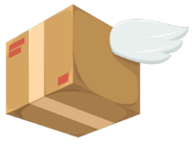

**Lenguaje aplicado:**

Debido a las características de nuestros segmentos objetivos y la naturaleza del producto software, el lenguaje será casual y respetuoso al mismo tiempo. Esto permitirá a los usuarios generar confianza hacia nuestra aplicación.

**Colores:**

Según los elementos del diseño, usamos como colores predominantes naranja y blanco, porque esos son los colores que trasmiten energía, amabilidad, innovación y alegría.

| Purpura Blanco Azul                             | Purpura Blanco Azul                                | Purpura Blanco Azul                          |
|-------------------------------------------------|----------------------------------------------------|----------------------------------------------|
| 
Hexadecimal: #6200EE

RGB: 98 0 238
 | 
Hexadecimal: #ffffff

RGB: 255 255 255
 | 
Hexadecimal: #3700B3

RGB: 0 0 0
 |

**Iconos:**

Colocados de forma estratégica para lograr que el usuario pueda desenvolverse de manera intuitiva y sencilla a lo largo de todos los bloques de la aplicación web.

**Fuentes:**

Para la tipografía, se usará las fuentes Roboto.

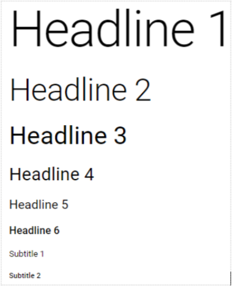

1. ### Web, Mobile and IoT Style Guidelines
**Web Style Guidelines**

Los estándares visuales y de interacción a aplicar en la aplicación web son:

**Simpleza:** La simplicidad está presente una buena interfaz gráfica, porque permite que el usuario pueda desplazarse de manera fluida.

**Evasión de errores durante la interacción:** Tenemos que asegurarnos que el sistema no presenta errores al momento de interactuar con el usuario, una buena forma de asegurar ello es con los diagramas de flujo y el prototipado. 

**Claridad:** La interfaz gráfica de la aplicación web tiene que tener palabras precisas y sencillas de entender.

**Representación fija y permanente de un determinado contexto de acción:** Se deben evitar los cambios bruscos de diseño al cambiar de página.  

**Fácil identificación:** Debe existir una buena organización de modo que el cliente pueda hallar las herramientas que requiere con facilidad.  

**Diseño ergonómico:** Para los iconos de nuestra aplicación web deben aplicar iconos universales, de este modo no se confunde al cliente. Por otro lado, debemos tener en cuenta el diseño universal de elementos específicos, como la posición del logo en la barra de navegación.

**Herramientas de ayuda:** En caso el usuario desconozca el funcionamiento de alguna herramienta de la interfaz, se necesitará brindar herramientas de soporte.  

**Acciones útiles y reversibles:** Cualquier cambio que el cliente desee hacer en la interfaz debe ser sencilla y reversible en caso de que el cambio sea accidental o el usuario con el tiempo no lo desee.

**Rapidez:** Debemos diseñar la interfaz de modo que el usuario pueda desplazarse a través de la información, encontrarla y percibir de manera rápida y sencilla.

**Mobile Style Guidelines**

Para el desarrollo de la aplicación móvil se desarrollará en flutter y los componentes de la aplicación están basados de Material Design para Flutter. 

**Componentes:**

En la siguiente imagen se muestra los botones comunes para las acciones a realizar dentro de la aplicación. También, se muestra los botones flotantes.

.

En la siguiente imagen se muestra los iconos de los botones.

Esta imagen muestra un ejemplo de la barra de navegación.

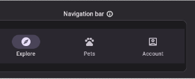

Los text inputs que se utilizan son los siguientes:

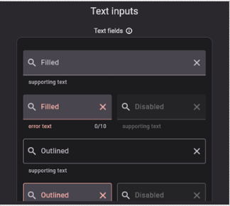.

Finalmente, usaremos cards para informar los envíos realizados.

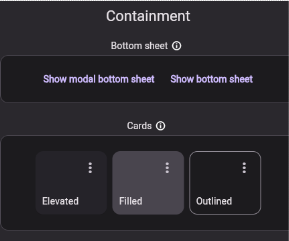

**Tipografía:**

La tipografía para utilizar es importante para la aplicación móvil. El que consideramos a utilizar, se basa en la siguiente imagen para que el usuario se sienta cómodo con la lectura de la información brindada.

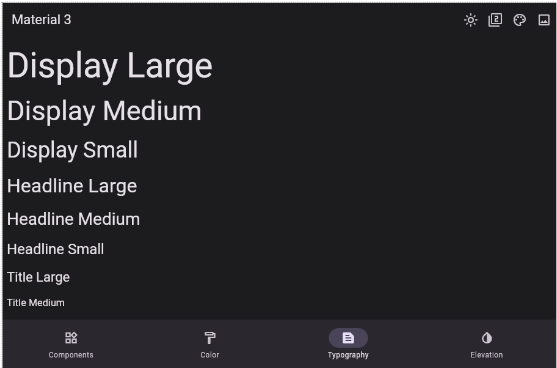

**Lenguaje:**

El lenguaje de la aplicación es formal y coloquial, para que los segmentos de empresa y clientes se sientan cómodos al interactuar con la aplicación móvil.

**IoT Style Guidelines**

**Privacidad y transparencia:**

Los datos de IoT solo deben recopilarse, transmitirse, procesarse y utilizarse. El propósito de la recopilación de datos de este proyecto es el monitoreo de la ubicación en que se encuentra una encomienda realizada. Estos datos recopilados deben ser visualizados solo por el cliente que posee el código de truking del envío realizado.

**Gestión de datos:**

Cada conjunto de datos de dispositivos IoT debe validarse y verificarse mediante la recopilación de datos y datos históricos. Los datos deben tener versiones para que los datos actualizados puedan distinguirse del original y/0 copia maestra. Las políticas de retención y eliminación de la copia maestra deben definirse explícitamente.

**Infraestructura:**

Para respaldar la coordinación de las implementaciones de IoT en todo el país, las agencias deben mantener un inventario de los dispositivos IoT que implementan mediante un formato estandarizado. Las agencias deben mantener un inventario de los activos públicos o privados en los que están instalados los dispositivos y las redes utilizados por estos dispositivos IoT.

**Seguridad:**

Los sistemas de IoT deben diseñarse con un enfoque explícito en minimizar los riesgos de seguridad (por ejemplo, operación no autorizada o piratería, fallas del sistema, manipulación y riesgos ambientales), limitando el impacto potencial de una violación de seguridad (por ejemplo, la divulgación de información de identificación personal), y garantizar que cualquier compromiso pueda detectarse y gestionarse rápidamente.

Los sistemas de IoT deben utilizar marcos de seguridad establecidos , cuando sea posible, y garantizar que la comunicación entre los componentes esté estrictamente restringida.

Todos los datos deben estar protegidos en tránsito y en reposo, y los sistemas deben estar protegidos contra el acceso u operación no autorizados. Los mecanismos de almacenamiento de datos no deben eliminarse fácilmente de los dispositivos y los sistemas no deben tener interfaces externas vulnerables (por ejemplo, puertos USB no seguros).

**Operación y sostenibilidad:** 

Se debe exigir una necesidad demostrada, un caso de negocio y un beneficio público (por ejemplo, resultados económicos, sociales y ambientales) antes de implementar cualquier nuevo dispositivo o solución de IoT. Además, se debe exigir una prueba de concepto antes de los despliegues en toda la ciudad.

Se deben mantener métricas de desempeño para las soluciones. Los acuerdos deben especificar los resultados previstos de una solución y los niveles de servicio y prever sanciones, modificaciones o terminaciones del acuerdo en caso de que la solución no funcione.
1. ## Information Architecture
En esta sección se mostrará la arquitectura de la información utilizada, parte del proceso de un diseño UX, Aquí se mostrará el contenido de manera organizada tomando en cuenta las necesidades específicas de la audiencia objetiva, producto  y los objetivos que se tienen.
1. ### Organization Systems
Establecer una jerarquía visual clara es importante para crear una página web bien optimizada. Debido a la forma en que nuestros sistemas visuales están conectados. Tendremos a escanear y analizar rápidamente muchos bits de información visual, como bordes, contraste, tamaño y movimiento, para evaluar y comprender nuestro entorno, Esto es cierto ya sea que estemos mirando un campo o una página web. Se mostrarán algunos ejemplos de la jerarquía que se planea utilizar en esta aplicación.

El flujo que queremos que los usuarios tengan al ingresar a la aplicación es el siguiente: 

1. Al ingresar el usuario, lo primero que verá será un buscador de sus paquetes en el que puede poner tanto el código de envío o si no se acuerda puede poner la ciudad a la que envío. 
2. Luego ve el total de los envíos realizados al mes, lo que le dará una idea de cuánto ha vendido 
3. Al lado derecho podrá observar un calendario que está marcado si en esas fechas ha realizado algún envío. 
4. Al lado izquierdo verá las ubicaciones exactas de las agencias. Tiene una barra desplegable que le ayudará a elegir la opción que más cerca le quede. 
5. Finalmente, en la parte superior, se puede observar una barra de navegación en donde se encuentra el logo, los datos de la cuenta (persona), los envíos que ha realizado con más opciones y la configuración
   
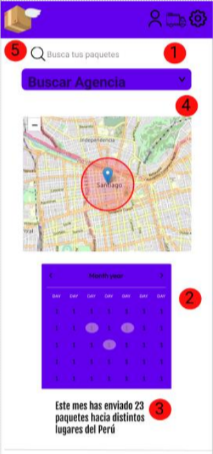

El flujo que queremos que los usuarios tengan al ver los detalles de un paquete enviado es el siguiente: 

1. Al poner el código de envío, se le despliega la información total. 
2. Podrá observar quién lo envió (el usuario) y quién lo recibirá con el número de DNI.
3. También podrá observar el destino y la cantidad de paquetes que deberían llegarle.
4. Finalmente, podrá ver la hora y fecha estimada de entrega el cual le ayudará a que el cliente pueda estar en casa a esas horas.

1. ### Labeling Systems
Para los labelling systems se ha utilizado un lenguaje formal y símbolos fáciles de entender.

| VaRuta                 | Nombre de la aplicación que dirige al usuario a la pantalla principal                                                                                                 |
|:-----------------------|:----------------------------------------------------------------------------------------------------------------------------------------------------------------------|
| Buscar tus paquetes    | Apartado en donde podrá poner el código de envío o la ciudad a la que se le envió                                                                                     |
| Buscar agencia         | Apartado en dónde se listarán las agencias con un botón para ver el mapa de dónde se encuentra la agencia                                                             |
| Símbolo de una persona | Apartado en donde se encontrará los datos del usuario como el nombre, documento de identidad, teléfono                                                                |
| Símbolo de un camión   | Apartado en donde podrá también ver los envíos realizados desde el más reciente al más antiguo con más opciones para encontrar más rápido el envío que quisiera saber |
| Símbolo de tuerca      | Apartado en donde se encuentra la configuración y el cierre de sesión. Aquí podrás cambiar el método de pago con el que realizas el envío.                            |

1. ### SEO Tags and Meta Tags
Un meta tag o también llamado meta descripción es una etiqueta HTML que se 

utiliza para la descripción de una página web. Este aparecerá debajo de la URL de 

la página web (Harsel, 2020).

Los meta tags que se incluirán son los siguientes:

1. Título: Hablando estrictamente no es un meta-tag sino una etiqueta autónoma de HTML. Sin embargo, es válido considerarlo parte de los metadatos. Esta etiqueta se debe de tratar como un elemento obligado en el encabezado del documento HTML, esta se encargará de darle título a la página web. Es de suma importancia tenerla, puesto que los buscadores más importantes usan esta etiqueta para titular las entradas en las listas de resultados.
2. Descripción: Aquí podemos dar una descripción breve y concisa del contenido del sitio web. Esta información es la que se muestra debajo la URL en los buscadores más generalizados como Google.
3. Palabras clave: Aquí podemos definir palabras clave para el buscador. Esto nos ayudará a que nuestra página se posicione en las primeras búsquedas, por lo que se consideró uno de los factores SEO más importantes.

Landing Page:

- **Título:**

<title>VaRuta</title>

- **Descripción:**

<meta name="description" content="Conoce la aplicación de envíos que te 

facilitará los envíos"/>

- **Palabras clave:**

<meta name="keywords" content="Envíos, Transporte, paquetes, precios, 

tarifas"/>

1. ### Searching Systems
Para los searching systems se ha utilizado un lenguaje formal y fácil de entender.

| Barra de filtrado de envíos | En esta sección encontraras los diferentes filtros que están relacionados a los envíos como a dónde fue el envío, las fechas en las que realizaste un envío |
|:----------------------------|:------------------------------------------------------------------------------------------------------------------------------------------------------------|

1. ### Navigation Systems

Se decidió hacerlo de esta forma, puesto que es más fácil para el usuario que no se acuerda el código del envío. Con esto, podrá encontrar el envío que busca con fechas aproximadas y opciones del destino del envío.

1. ## Landing Page UI Design
   1. ### Landing Page Wireframe

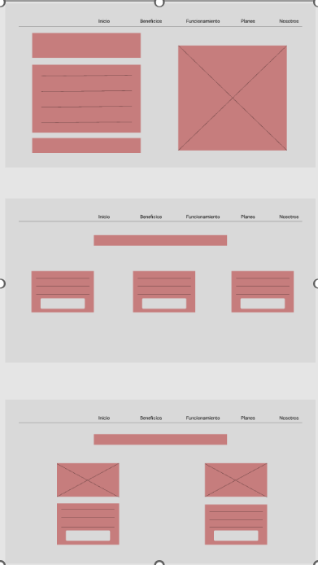

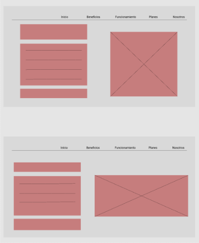

   1. ### Landing Page Mock-up

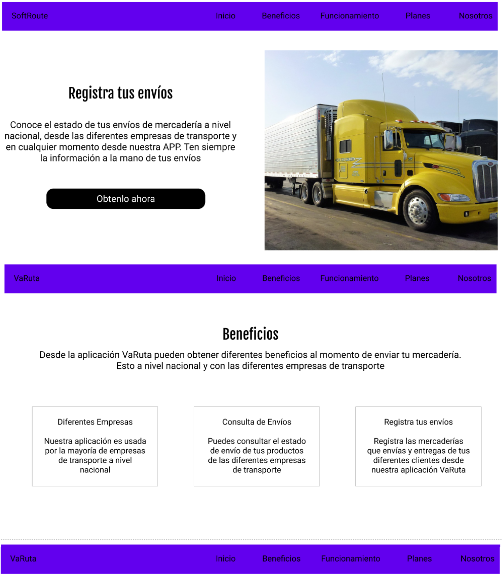

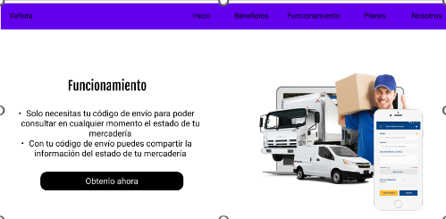

1. ## Applications UX/UI Design
   1. ### Applications Wireframes
En esta sección se evidenciará los wireframes de la aplicación web.

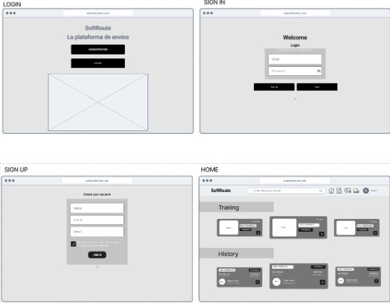

Véase en el anexo: <https://www.figma.com/file/bzGYrJdsJoX1WwExTHYUva/SoftRoute?type=whiteboard&node-id=0%3A1&t=ivAhgU1YcBWscKoN-1> 
1. ### Applications Wireflow Diagrams
En esta sección se mencionaran los flujos de procesos.
En primer lugar, se tiene la parte de iniciar sesión o crear cuenta.

En segundo lugar, se tiene el flujo de ver ubicación del pedido

En tercer lugar, se tiene ver el historial de pedidos.

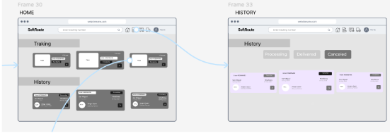

En cuarto lugar, se tiene ver comentarios.

Por último, se tiene el flujo de crear pedido .

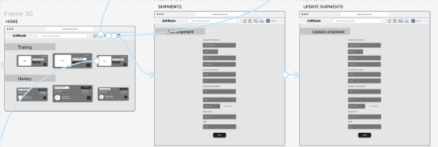

1. ### Applications Mock-ups

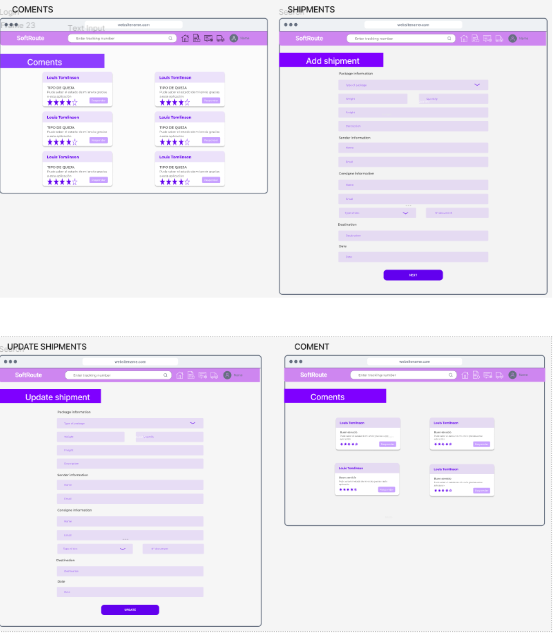

1. ### Applications User Flow Diagrams

1. ## Applications Prototyping

