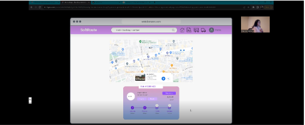
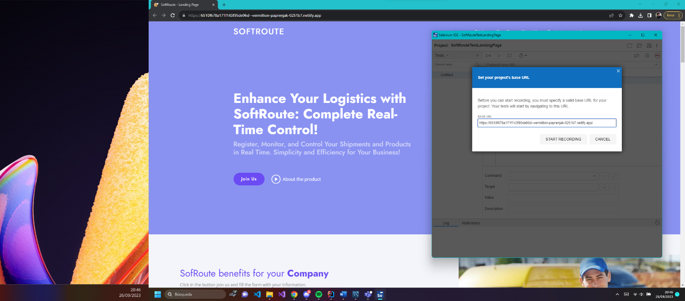
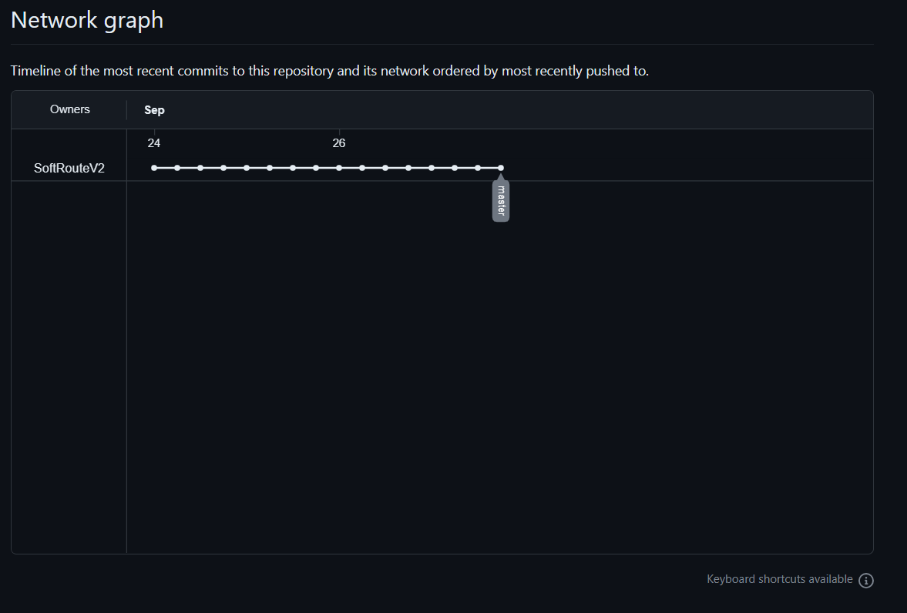
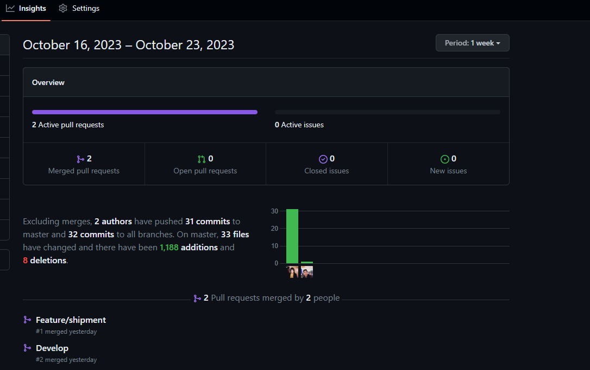

[comment]: <> (Carátula)

<b>Informe de Trabajo Final</b>

Project Report

Universidad Peruana de Ciencias Aplicadas, Ingeniería de Software, 8vo Ciclo

Curso: Desarrollo de Soluciones IoT

Sección: SW71

Profesor: Marco Antonio León Baca

SoftRoute

SoftRoute

Relación de integrantes:

- U20201A924 Carrillo Mainicta, Michael
- U20201B561 Cierto Espiritu, Abel Angel
- U20201B975 Huaman Huaranga, Lennin Daniel
- U20201B944 Valencia Rivera, Fiorella Viviana
- U201521128 Zurita Palacios, De la Mar Geronimo

Ciclo: 2023-2

---
[comment]: <> (Historial de versiones)

<b> Historial de versiones </b>

| _Versión_    | _Fecha_     | _Autor_       | _Descripción de modificación_                                                                                                                                                                                                                                                                                                                          |
|--------------|-------------|---------------|--------------------------------------------------------------------------------------------------------------------------------------------------------------------------------------------------------------------------------------------------------------------------------------------------------------------------------------------------------|
| 3/09/2023    | 3/09/2023   | Abel Cierto   | 
El documento se modificó hasta el apartado de entrevistas y su respectivo registro. Para ello, el equipo previamente definió el Lean UX canvas de esta empresa emergente. En ella se plantea los objetivos de negocio, las hipótesis de lo que el equipo busca lograr y las falencias donde el equipo debe investigar más a detalle |
| 5/09/2023    | 5/09/2023   | Abel Cierto   | 
El equipo avanzó hasta el apartado de Bounded Context y esto fue elaborado mediante la herramienta “mural”, de acuerdo con los 10 pasos necesarios en su desarrollo.                                                                                                                                                                |
| 10/09/2023   | 10/09/2023  | Abel Cierto   | 
El equipo terminó de redactar todos los ítems solicitados hasta el capítulo 4.                                                                                                                                                                                                                                                      |
| 20/09/2023   | 20/09/2023  | Abel Cierto   | 
El equipo terminó de definir todo respecto al capítulo 5, incluyendo los style guideliness, información architecture, landing page UI Design, applications UX/UI Design,                                                                                                                                                            |
| 26/09/2023   | 26/09/2023  | Abel Cierto   | 
El equipo para esta fecha terminó de realizar el landing page y se completó todos los ítems del capítulo 6 para la entrega del parcial.                                                                                                                                                                                             |

---
[comment]: <> (Historial de versiones)

<b>Project Report Collaboration Insights </b>

Se ha creado un repositorio en dónde hemos centralizado la documentación del proyecto.

Link del repositorio: [SoftRouteV2-documentation](https://github.com/SoftRouteV2/upc-pre-202302-si572-SW72-softroute-report).

Asimismo, se ha creado una rama develop que se usa como 
base para que cada integrante del equipo cree sus ramas feature en donde podrán
avanzar sus asignaciones de acuerdo a lo acordado en una reunión previa. 
A continuación unas ilustraciones al respecto.

   
   
  

En adición, se ha acordado con el equipo tener reuniones semanales en donde se realizarán revisiones de avance y consultas al respecto.

---
[comment]: <> (Indice)

# Indice
<!-- TOC -->
* [Indice](#indice)
* [Student Outcome](#student-outcome)
* [Capítulo I: Introducción](#capítulo-i-introducción)
  * [1.1 Startup Profile](#11-startup-profile)
    * [1.1.1 Descripción de la Startup](#111-descripción-de-la-startup)
    * [1.1.2 Perfiles de integrantes del equipo](#112-perfiles-de-integrantes-del-equipo)
  * [1.2 Solution Profile](#12-solution-profile)
    * [1.2.1 Antecedentes y problemática](#121-antecedentes-y-problemática)
      * [5W's y 2H's](#5ws-y-2hs)
    * [1.2.2. Lean UX Process](#122-lean-ux-process)
      * [1.2.2.1 Lean UX Problem Statements](#1221-lean-ux-problem-statements)
      * [1.2.2.2. Lean UX Assumptions](#1222-lean-ux-assumptions)
      * [1.2.2.3. Lean UX Hypothesis Statements](#1223-lean-ux-hypothesis-statements)
      * [1.2.2.4. Lean UX Canvas](#1224-lean-ux-canvas)
  * [1.3. Segmentos objetivo](#13-segmentos-objetivo)
* [Capítulo II: Requirements elicitation & analysis](#capítulo-ii-requirements-elicitation--analysis)
  * [2.1. Competidores](#21-competidores)
    * [2.1.1. Análisis competitivo](#211-análisis-competitivo)
    * [2.1.2. Estrategias y tácticas frente a competidores.](#212-estrategias-y-tácticas-frente-a-competidores)
  * [2.2. Entrevistas](#22-entrevistas)
    * [2.2.1. Diseño de entrevistas](#221-diseño-de-entrevistas)
    * [2.2.2. Registro de entrevistas](#222-registro-de-entrevistas)
    * [2.2.3. Análisis de entrevistas](#223-análisis-de-entrevistas)
  * [2.3. Needfinding](#23-needfinding)
    * [2.3.1. User Personas](#231-user-personas)
    * [2.3.2. User Task Matrix](#232-user-task-matrix)
    * [2.3.3. User Journey Mapping.](#233-user-journey-mapping)
    * [2.3.4. Empathy Mapping](#234-empathy-mapping)
    * [2.3.5. As-is Scenario Mapping](#235-as-is-scenario-mapping)
* [Capítulo III: Requirements Specification](#capítulo-iii-requirements-specification)
  * [3.1. To-Be Scenario Mapping.](#31-to-be-scenario-mapping)
  * [3.2. User Stories.](#32-user-stories)
  * [3.3. Impact Mapping.](#33-impact-mapping)
  * [3.4. Product Backlog.](#34-product-backlog)
* [CAPÍTULO IV: SOLUTION SOFTWARE DESIGN](#capítulo-iv-solution-software-design-)
  * [4.1. Strategic-Level Domain-Driven Design](#41-strategic-level-domain-driven-design)
    * [4.1.1. EventStorming](#411-eventstorming)
      * [4.1.1.1 Candidate Context Discovery.](#4111-candidate-context-discovery)
      * [4.1.1.2 Domain Message Flows Modeling](#4112-domain-message-flows-modeling)
      * [4.1.1.3 Bounded Context Canvases](#4113-bounded-context-canvases)
    * [4.1.2. Context Mapping](#412-context-mapping)
    * [4.1.3 Software Architecture](#413-software-architecture)
      * [4.1.3.1 Software Architecture System Landscape Diagram](#4131-software-architecture-system-landscape-diagram)
      * [4.1.3.2 Software Architecture Context Level Diagramas](#4132-software-architecture-context-level-diagramas)
      * [4.1.3.3 Software Architecture Container Level Diagrams](#4133-software-architecture-container-level-diagrams)
      * [4.1.3.4 Software Architecture Deployment Diagrams](#4134-software-architecture-deployment-diagrams)
  * [4.2. Tactical-Level Domain-Driven Design](#42-tactical-level-domain-driven-design)
    * [4.2.1. Bounded Context: User](#421-bounded-context-user)
      * [4.2.1.1. Domain Layer](#4211-domain-layer)
      * [**4.2.1.2** Interface Layer](#4212-interface-layer)
      * [**4.2.1.3** Application Layer](#4213-application-layer)
      * [**4.2.1.4** Infrastructure Layer](#4214-infrastructure-layer)
      * [**4.2.1.5** Bounded Context Software Architecture Component Level Diagrams](#4215-bounded-context-software-architecture-component-level-diagrams)
      * [**4.2.1.6** Bounded Context Software Architecture Code Level Diagrams.](#4216-bounded-context-software-architecture-code-level-diagrams)
        * [4.2.1.6.1. Bounded Context Domain Layer Class Diagrams.](#42161-bounded-context-domain-layer-class-diagrams)
        * [4.2.1.6.2 Bounded Context Database Design Diagram](#42162-bounded-context-database-design-diagram)
    * [**4.2.2** Bounded Context: Shipment](#422-bounded-context-shipment)
      * [**4.2.2.1** Domain Layer](#4221-domain-layer-)
      * [**4.2.2.2** Interface Layer](#4222-interface-layer)
      * [**4.2.2.3** Application Layer](#4223-application-layer)
      * [**4.2.2.3** Infrastructure Layer](#4223-infrastructure-layer)
      * [**4.2.2.4** Bounded Context Software Architecture Component Level Diagrams](#4224-bounded-context-software-architecture-component-level-diagrams)
      * [**4.2.2.5** Bounded Context Software Architecture Code Level Diagrams.](#4225-bounded-context-software-architecture-code-level-diagrams)
        * [Bounded Context Domain Layer Class Diagrams](#bounded-context-domain-layer-class-diagrams)
        * [Bounded Context Database Design Diagram](#bounded-context-database-design-diagram)
    * [**4.2.3** Bounded Context: Package Tracking](#423-bounded-context-package-tracking)
      * [**4.2.3.2** Interface Layer](#4232-interface-layer)
      * [**4.2.3.3** Application Layer](#4233-application-layer)
      * [**4.2.3.4** Infrastructure Layer](#4234-infrastructure-layer)
      * [**4.2.3.5** Bounded Context Software Architecture Component Level Diagrams](#4235-bounded-context-software-architecture-component-level-diagrams)
      * [**4.2.3.6** Bounded Context Software Architecture Code Level Diagrams.](#4236-bounded-context-software-architecture-code-level-diagrams)
        * [Bounded Context Domain Layer Class Diagrams](#bounded-context-domain-layer-class-diagrams-1)
        * [Bounded Context Database Design Diagram](#bounded-context-database-design-diagram-1)
    * [**4.2.4** Bounded Context: Feedback](#424-bounded-context-feedback)
      * [**4.2.4.1** Domain Layer](#4241-domain-layer)
      * [**4.2.4.2** Interface Layer](#4242-interface-layer)
      * [**4.2.4.3** Application Layer](#4243-application-layer)
      * [**4.2.4.4** Infrastructure Layer](#4244-infrastructure-layer)
      * [**4.2.4.5** Bounded Context Software Architecture Component Level Diagrams](#4245-bounded-context-software-architecture-component-level-diagrams)
      * [**4.2.4.6** Bounded Context Software Architecture Code Level Diagrams.](#4246-bounded-context-software-architecture-code-level-diagrams)
        * [Bounded Context Domain Layer Class Diagrams](#bounded-context-domain-layer-class-diagrams-2)
        * [Bounded Context Database Design Diagram](#bounded-context-database-design-diagram-2)
* [CAPÍTULO V: SOLUTION UI/UX DESIGN](#capítulo-v-solution-uiux-design)
  * [5.1. Style Guidelines](#51-style-guidelines)
    * [5.1.1. General Style Guidelines](#511-general-style-guidelines)
    * [5.1.2. Web, Mobile and IoT Style Guidelines](#512-web-mobile-and-iot-style-guidelines)
  * [5.2. Information Architecture.](#52-information-architecture)
    * [5.2.1. Organization Systems](#521-organization-systems)
    * [5.2.2. Labeling Systems.](#522-labeling-systems)
    * [5.2.3. SEO Tags and Meta Tags](#523-seo-tags-and-meta-tags)
    * [5.2.4. Searching Systems](#524-searching-systems)
    * [5.2.5. Navigation Systems](#525-navigation-systems)
  * [5.3. Landing Page UI Design](#53-landing-page-ui-design)
    * [5.3.1. Landing Page Wireframe](#531-landing-page-wireframe)
    * [5.3.2. Landing Page Mock-up.](#532-landing-page-mock-up)
  * [5.4. Applications UX/UI Design](#54-applications-uxui-design)
    * [5.4.1. Applications Wireframes.](#541-applications-wireframes)
    * [5.4.2. Applications Wireflow Diagrams](#542-applications-wireflow-diagrams)
    * [5.4.3. Applications Mock-ups](#543-applications-mock-ups)
    * [5.4.4. Applications User Flow Diagrams](#544-applications-user-flow-diagrams)
  * [5.5. Applications Prototyping](#55-applications-prototyping)
* [Capítulo VI: Product Implementation, Validation & Deployment](#capítulo-vi-product-implementation-validation--deployment)
  * [6.1. Software Configuration Management](#61-software-configuration-management)
    * [6.1.1. Software Development Environment Configuration.](#611-software-development-environment-configuration)
    * [6.1.2. Source Code Management.](#612-source-code-management)
    * [6.1.3. Source Code Style Guide & Conventions.](#613-source-code-style-guide--conventions)
    * [6.1.4. Software Deployment Configuration.](#614-software-deployment-configuration)
  * [6.2. Landing Page, Services & Applications Implementation.](#62-landing-page-services--applications-implementation)
    * [6.2.1. Sprint 1](#621-sprint-1)
      * [6.2.1.1. Sprint Planning 1.](#6211-sprint-planning-1)
      * [6.2.1.2. Sprint Backlog 1.](#6212-sprint-backlog-1)
      * [6.2.1.3. Development Evidence for Sprint Review.](#6213-development-evidence-for-sprint-review)
      * [6.2.1.4. Testing Suite Evidence for Sprint Review.](#6214-testing-suite-evidence-for-sprint-review)
      * [6.2.1.5. Execution Evidence for Sprint Review.](#6215-execution-evidence-for-sprint-review)
      * [6.2.1.6. Services Documentation Evidence for Sprint Review.](#6216-services-documentation-evidence-for-sprint-review)
      * [6.2.1.7. Team Collaboration Insights during Sprint.](#6217-team-collaboration-insights-during-sprint)
    * [6.2.2. Sprint 2](#622-sprint-2)
      * [6.2.2.1. Sprint Planning 2.](#6221-sprint-planning-2)
      * [6.2.2.2. Sprint Backlog 2.](#6222-sprint-backlog-2)
      * [6.2.2.3. Development Evidence for Sprint Review.](#6223-development-evidence-for-sprint-review)
      * [6.2.2.4. Testing Suite Evidence for Sprint Review.](#6224-testing-suite-evidence-for-sprint-review)
      * [6.2.2.5. Execution Evidence for Sprint Review.](#6225-execution-evidence-for-sprint-review)
      * [6.2.2.6. Services Documentation Evidence for Sprint Review.](#6226-services-documentation-evidence-for-sprint-review)
      * [6.2.2.7. Software Deployment Evidence for Sprint Review .](#6227-software-deployment-evidence-for-sprint-review-)
      * [6.2.2.8. Team Collaboration Insights during Sprint.](#6228-team-collaboration-insights-during-sprint)
    * [6.2.3. Sprint 3](#623-sprint-3)
      * [6.2.3.1. Sprint Planning 2.](#6231-sprint-planning-2)
      * [6.2.3.2. Sprint Backlog 2.](#6232-sprint-backlog-2)
      * [6.2.3.3. Development Evidence for Sprint Review.](#6233-development-evidence-for-sprint-review)
      * [6.2.3.4. Testing Suite Evidence for Sprint Review.](#6234-testing-suite-evidence-for-sprint-review)
      * [6.2.3.5. Execution Evidence for Sprint Review.](#6235-execution-evidence-for-sprint-review)
      * [6.2.3.6. Services Documentation Evidence for Sprint Review.](#6236-services-documentation-evidence-for-sprint-review)
      * [6.2.3.7. Software Deployment Evidence for Sprint Review](#6237-software-deployment-evidence-for-sprint-review)
      * [6.2.3.8. Team Collaboration Insights during Sprint.](#6238-team-collaboration-insights-during-sprint)
  * [6.3. Validation Interviews.](#63-validation-interviews)
    * [6.3.1. Diseño de Entrevistas.](#631-diseño-de-entrevistas)
    * [6.3.2. Registro de Entrevistas.](#632-registro-de-entrevistas)
    * [6.3.3. Evaluaciones según heurísticas.](#633-evaluaciones-según-heurísticas)
  * [6.4. Video About-the-Product.](#64-video-about-the-product)
  * [6.5. Video About-the-Team.](#65-video-about-the-team)
* [Conclusiones y recomendaciones.](#conclusiones-y-recomendaciones)
* [Bibliografía](#bibliografía)
* [Anexos](#anexos)
<!-- TOC -->

---
[comment]: <> (Student Outcome)

# Student Outcome

<table >
  <thead>
    <tr>
      <th colspan="3">Criterio especifico</th>
      <th colspan="3"><strong>Acciones realizadas</strong></th>
      <th colspan="3"><strong>Conclusiones</strong></th>
    </tr>
  </thead>
  <tbody>
    <tr>
      <td colspan="3">Participa en equipos multidisciplinarios con eficacia, eficiencia y objetividad, en el marco de un proyecto en soluciones de ingeniería de softwar</td>
      <td colspan="3" align = "justify">
 
<strong>TB1</strong>

    
<strong>Carrillo Mainicta, Michael</strong>

    

        Participé de manera activa en las reuniones del equipo, colaboré en la elaboración del diagrama de base de datos, diagramas de clases y en la aplicación del Tactical-Level Domain-Driven Design en cada bounded context. Considero que mi enfoque eficaz y objetivo fortaleció la colaboración multidisciplinaria y contribuyó al desarrollo integral del proyecto.
    

    
<strong>Cierto Espiritu, Abel Angel</strong>

    

        Participe en el equipo de una manera eficiente. Realice las entrevistas al segmento que se dirige la empresa emergente y en este marco de la ingeniería planteamos una solución de tracking en tiempo real a los paquetes que se envían en los carros. Luego se desarrolló las historias de usuarios que son requisitos fundamentales para implementar el desarrollo de la solución.
    

    
<strong>Huaman Huaranga, Lennin Daniel</strong>

    

        Para el desarrollo de esta entrega desarrollé los segmentos relacionados con la arquitectura de los bounded context, así como los diagramas de clase y base de datos. Para conseguir esto fue necesario que todo el equipo brinde ideas de cómo debe estar organizada la aplicación. De este modo se consiguió determinar los participantes de cada bounded context y cómo cada uno de ellos se relacionan entre sí.
    

    
<strong>Valencia Rivera, Fiorella Viviana</strong>

    

        En el marco de esta entrega, asumí la vital tarea de realizar la meticulosa identificación de los Bounded Context que resultan fundamentales para el adecuado desarrollo del proyecto en cuestión. Dicha labor incluyó la exhaustiva implementación de los 10 pasos esenciales, un proceso meticuloso y estructurado, para la creación y delimitación de estos contextos específicos dentro del ámbito laboral. Este enfoque minucioso y profesional garantizó la correcta definición y comprensión de las áreas del sistema, facilitando así una arquitectura de software eficiente y altamente funcional para el éxito del proyecto.
    

    
<strong>Zurita Palacios, De la Mar Geronimo</strong>

    

        Seleccioné un proyecto de ingeniería de software que requería una variedad de habilidades y conocimientos técnicos. Establecí canales de comunicación claros y promoví la comunicación abierta y regular entre los miembros del equipo. Trabajé estrechamente con los miembros del equipo, compartiendo mis conocimientos y resolviendo problemas de manera conjunta. Aproveché las fortalezas individuales para abordar desafíos específicos del proyecto.
    

    
<strong>TP</strong>

    
<strong>Carrillo Mainicta, Michael</strong>

    

        En esta entrega parcial, para la implementación de la solución, se desarrolló el landing page. En ese sentido, resulto vital la elaboración de los wireframes y mock-ups para una codificación correcta y eficiente. De manera similar, conocer los bounded context así como los dominios que cada uno implica resulto prioritario para la delimitación de nuestras entidades y alcance del proyecto.
    

    
<strong>Cierto Espiritu, Abel Angel</strong>

    

        Para el desarrollo de la TP realizamos la mejora continua según las observaciones indicadas por el profesor. Se mejoró la elaboración del problem estatement. Asimismo, se definió los style guidelines de la aplicación web y móvil. Por último, se desarrolló el landing page.
    

    
<strong>Huaman Huaranga, Lennin Daniel</strong>

    

        Para esta entrega me encargue de la sección Information Architecture en la que tuve que coordinar con el grupo cuál iba a ser la estructura que se utilizaría para el proyecto. Asimismo, me encargue del Software Configuration Management en el que se coordinó sobre las nomenclaturas que usaremos en este proyecto.
    

    
<strong>Valencia Rivera, Fiorella Viviana</strong>

    

        En esta etapa parcial del proyecto, se logró un avance significativo al implementar con éxito el Landing Page. Este componente es crucial, ya que representa la primera impresión del producto para los usuarios. Se trabajó de manera colaborativa para asignar tareas y responsabilidades, coordinando esfuerzos en una reunión integral. La implementación no solo implicó el diseño visual, sino también la integración de contenido relevante y una navegación intuitiva.
    

    
<strong>Zurita Palacios, De la Mar Geronimo</strong>

    

        Trabajé en estrecha colaboración con mis compañeros en los interfaces de usuario y análisis de sistemas para desarrollar una solución de software integral. Contribuí al desarrollo del software, escribiendo código, realizando pruebas y documentando el trabajo realizado.
    

         </td>
      <td colspan="3">

<strong>TB1</strong>

    

        En este proyecto, el equipo participó de manera eficiente. Realizamos entrevistas al segmento al que se dirige nuestra empresa emergente. En el contexto de la ingeniería, propusimos una solución para realizar un seguimiento en tiempo real de los paquetes entregados en los vehículos que son enviados a provincia u otro destino. También, desarrollamos las historias de usuario, que son requisitos fundamentales para llevar a cabo la implementación de esta solución. Asimismo, se laboraron los as-is map, y to-be map para conocer el estado actual y el nuevo que proponemos con la solución. Por otro lado, el mapa de empatía y el mapa de impacto es necesario para delimitar hasta donde es el alcance del proyecto y conocer quiénes son nuestros segmentos de usuarios.
    

    
<strong>TP</strong>

    

        En el desarrollo del trabajo parcial el equipo, diseñó los wireframes y mock-ups de la aplicación a desarrollar. Previamente, se eligió los estilos de web, IoT applications móvil. Por ello, es importante estar actualizado con las soluciones de desarrollo implementadas como equipo.
    

    
<strong>TF</strong>

    

        Carrillo Mainicta, Michael 

Para impulsar el desarrollo del proyecto final, adoptamos la metodología de sprints, asignando responsabilidades específicas a cada miembro del equipo. Esta planificación detallada y la ejecución ordenada resultaron fundamentales para alcanzar los objetivos de manera eficiente.

Cierto Espiritu, Abel Angel

Para avanzar en la entrega del proyecto final, el equipo adoptó el modelo de sprint, asignando tareas específicas a cada miembro. Se estableció un cronograma para inspeccionar y enviar actualizaciones periódicas a la base de datos. Esta organización eficiente se llevó a cabo de manera sistemática durante los sprints, contribuyendo al progreso ordenado del proyecto.

Huaman Huaranga, Lennin Daniel

Con el objetivo de avanzar en la culminación del proyecto, optamos por implementar el modelo de sprint, distribuyendo tareas específicas entre los integrantes del equipo. La ejecución de este enfoque, respaldada por un calendario estructurado, facilitó un avance coherente y organizado en cada etapa del proyecto

Valencia Rivera, Fiorella Viviana

Para facilitar el avance en la entrega del proyecto final, optamos por implementar el modelo de sprint, asignando responsabilidades particulares a cada miembro del equipo. Se diseñó un calendario para revisar y enviar actualizaciones regulares a la base de datos. Esta estructura organizativa eficiente se ejecutó de manera sistemática a lo largo de los sprints, promoviendo así un progreso ordenado del proyecto

Zurita Palacios, De la Mar Geronimo

En nuestra estrategia para completar el proyecto final, decidimos emplear un enfoque basado en sprints, asignando roles específicos a cada miembro del equipo. Esta táctica nos permitió mantener un ritmo constante y lograr una progresión sistemática a lo largo de las fases del proyecto 

</td>
    </tr>
    <tr>
      <td colspan="3">
Conoce al menos un sector empresarial o dominio de aplicación de soluciones de software </td>
      <td colspan="3" align = "justify">

<strong>TB1</strong>

    
<strong>Carrillo Mainicta, Michael</strong>

    

        Para la implementación de la solución resulta imperativo conocer de manera clara y detallada cada uno de nuestros bounded context, los cuales pertenecen al dominio de nuestra aplicación de software. En ese sentido, al desarrollar el Tactical-Level Domain-Driven Design pude conocer y analizar de manera detallada este parte de la aplicación.
    

    
<strong>Cierto Espiritu, Abel Angel</strong>

    

        En el proyecto es necesario conocer los dominios que implica la empresa. Para ello, los dominios que encontramos son el usuario, tracking del paquete, envío y la sección de reclamos o sugerencias. Me centré en el sector del dominio de usuario y estos son las compañías que se registran, y tienen la opción de registrar a sus empleadores y eliminarlos de acuerdo con la política de la empresa.
    

    
<strong>Huaman Huaranga, Lennin Daniel</strong>

    

        Para esta entrega fue importante el conocer los bounded context, ya que estos nos permiten conocer qué funcionalidades van a utilizar los distintos segmentos objetivos. Asimismo, el conocimiento de los bounded context ayudó a dividir los diagramas de clases, base de datos y C4.
    

    
<strong>Valencia Rivera, Fiorella Viviana</strong>

    

        Mi enfoque se centró de manera específica en el dominio del usuario, desarrollando un análisis exhaustivo. Dentro de este dominio, se destaca la funcionalidad de permitir a las compañías registrarse en la plataforma, otorgándoles la posibilidad de inscribir y dar de baja a sus empleados según lo estipulado por las políticas internas de la empresa. Este enfoque detallado y especializado se tradujo en la conceptualización y diseño de los Bounded Context para Softroute, una aplicación de seguimiento que desempeña un papel clave en el proceso integral de seguimiento y gestión de envíos dentro del proyecto.
    

    
<strong>Zurita Palacios, De la Mar Geronimo</strong>

    

        Realicé investigaciones exhaustivas para identificar al menos un sector empresarial o dominio de aplicación específico que fuera relevante para el desarrollo de soluciones de software. Trabajé en el diseño y desarrollo de soluciones de software específicas para el sector o dominio elegido, asegurándome de que se alinearan con sus necesidades y requisitos. Me dediqué a estudiar y comprender profundamente las necesidades y desafíos de ese sector o dominio en particular, incluyendo sus procesos, regulaciones y tendencias.
    

    
<strong>TP</strong>

    
<strong>Carrillo Mainicta, Michael</strong>

    

        Para la elaboración de los wireframes y mock-ups de landing page, resultó imprescindible tener un conocimiento intermedio – avanzado de la de herramientas de diseño, en este caso Figma. Asimismo, aspectos como, principios de diseño de Interfaz de usuario, comprensión de experiencia de usuario y consideraciones de accesibilidad, son esenciales para brindar una solución óptima.
    

    
<strong>Cierto Espiritu, Abel Angel</strong>

    

        Ayudé en el desarrollo del landing page, en ella se conoció el dominio de la empresa emergente y este se encuentra altamente demandado por las empresas. Además, se especifica las funcionalidades de cada segmento de usuario. También, en el documento se diseñó el software development enviroment y el source code management el cuál se va trabajar en github con la creación de las ramas correspondientes. Por último, quiero destacar a Trello por ser una herramienta que ayuda a designar trabajos y verificar los avances.
    

    
<strong>Huaman Huaranga, Lennin Daniel</strong>

    

        Para esta entrega parcial realicé el Information Architecture en el que tuve que pensar en las formas en las que nuestros usuarios se sientan cómodos al momento de usar nuestra aplicación. Asimismo, se usaron los conocimientos de nuestros usuarios para encontrar maneras de llegar a un mayor número de estos. Por otra parte, para realizar el Software Configuration Management se tuvo que utilizar lo conocido de los usuarios para poder crear una aplicación que cumpla con sus requerimientos, así como que sea fácil para su uso.
    

    
<strong>Valencia Rivera, Fiorella Viviana</strong>

    

        Para esta entrega, coordiné con mi equipo la creación y despliegue del Landing Page. Este elemento es clave, ya que representa la primera interacción de los usuarios con nuestro proyecto. Detallamos el plan, los miembros del equipo y establecimos canales de comunicación. Además, nos aseguramos de que la página estuviera en línea y funcional, y generamos la documentación necesaria para un entendimiento claro. Este paso no solo fue un hito importante, sino que también fortaleció nuestra colaboración y preparación para los desafíos venideros.
    

    
<strong>Zurita Palacios, De la Mar Geronimo</strong>

    

        Realicé una investigación exhaustiva sobre el sector de las PYMES que realizan envíos, incluyendo las necesidades de las empresas, los desafíos que enfrentan en el proceso de envío y las regulaciones pertinentes. Trabajé en el desarrollo de la plataforma, que incluía funcionalidades como la programación de envíos, seguimiento de paquetes y gestión de costos de envío.
    

        </td>
      <td colspan="3">

<strong>TB1</strong>

    

        En síntesis, conocer los sectores del dominio empresarial es importante para centrarnos en todo lo que concierne el proyecto. Mediante ello, el equipo desarrollará una solución óptima y que la estructura de la programación sea escalable en un futuro.
    

    
<strong>TP</strong>

    

        El equipo evidenció la importancia de desarrollar una landing page que muestre la llamada de atención a los clientes de la empresa. En ello, se especifica los dos segmentos al cuál se dirige la empresa emergente.
    

</td>
    </tr>
  </tbody>
</table>

---
# Capítulo I: Introducción
## 1.1 Startup Profile
### 1.1.1 Descripción de la Startup

SoftRoute es una empresa que busca resolver la problemática de la falencia de consultas de envíos de encomiendas en tiempo real, en las empresas agenciares de envío. Debido a que los servicios tecnológicos no están expandidos en todos los segmentos en Perú. Por ello, nos enfocamos en brindar una aplicación altamente funcional que satisfaga las necesidades de nuestros clientes. Las empresas dedicadas al envío de encomiendas podrán registrarse en la aplicación para que sus empleados utilicen la plataforma y puedan realizar el registro del paquete de manera más rápida. También, cada paquete enviado podrá ser consultado mediante un código que la empresa entrega al cliente. Por otro lado, brindamos la opción de recibir notificaciones cuando el paquete atraviesa cada región del Perú hasta llegar al lugar destino. Finalmente, la empresa está conformada por cinco jóvenes estudiantes de la carrera de Ingeniería de Software en la Universidad Peruana de Ciencias Aplicadas.  

### 1.1.2 Perfiles de integrantes del equipo
| **Integrante**                          | **Perfil**                                                                                                                                                                                                                                                                                                                                                                                                                                                                                                                                                                                                                                                                                                          | **Imagen**                                                                                        |
|-----------------------------------------|---------------------------------------------------------------------------------------------------------------------------------------------------------------------------------------------------------------------------------------------------------------------------------------------------------------------------------------------------------------------------------------------------------------------------------------------------------------------------------------------------------------------------------------------------------------------------------------------------------------------------------------------------------------------------------------------------------------------|---------------------------------------------------------------------------------------------------|
| **Carrillo Mainicta, Michael**          | 
Estudiante de la carrera de ingeniería de software y actualmente cursando el 7mo ciclo en la Universidad Peruana de Ciencias Aplicadas. Me considero una persona entusiasta que le gusta aprender y desarrollar nuevas habilidades, lo cual me ha ayudado a adquirir conocimientos en lenguajes como Python, C++, Java, JavaScript y C#. Así mismo, me apasiona explorar nuevas tecnologías como Realidad Virtual (VR) y Realidad Aumentada (AR) y a su vez buscar soluciones innovadoras con las mismas                                                                                                                                                                                                            |     |
| **Cierto Espiritu, Abel Angel**         | 
Actualmente me encuentro en el séptimo ciclo en la carrera de Ingeniería de Software. He acumulado un año y medio de experiencia laboral en mi rol como Desarrolladora Full Stack en una empresa. Durante este periodo, he tenido la oportunidad de participar en proyectos de diversas escalas, lo que me ha brindado un conocimiento sólido en el desarrollo tanto de aplicaciones grandes como de soluciones más compactas. Asimismo, he participado en competencias de programación competitiva dentro de mi universidad por más de un año. Estas experiencias han fortalecido mis habilidades analíticas y de resolución de problemas, y me ha permitido aplicar mis conocimientos en situaciones desafiantes. |               |
| **Huaman Huaranga, Lennin Daniel**      | 
Soy un estudiante universitario que cuenta con conocimientos técnicos en los lenguajes de programación Java, JavaScript, Dart, C#, C++ y Python. Asimismo, poseo habilidades blandas que me permiten trabajar en equipo de forma coordinada. Por otro lado, poseo un conocimiento intermedio del idioma inglés.                                                                                                                                                                                                                                                                                                                                                                                                     |           |
| **Valencia Rivera, Fiorella Viviana**   | 
Estudiante de la carrera de Ingeniería de Software en la Universidad Peruana de Ciencias Aplicadas (UPC). Mi enfoque se centra en el desarrollo backend y la ciencia de datos. Poseo conocimiento en lenguajes de programación como Java, Python y C++, así como experiencia en el uso de frameworks clave como Angular y Spring Boot. Además, tengo un interés particular en el campo de la ciberseguridad. Mi compromiso con la resolución creativa de problemas y mi capacidad para colaborar eficazmente en equipos multidisciplinarios me impulsan a buscar soluciones innovadoras en el ámbito tecnológico.                                                                                                   |  |
| **Zurita Palacios, De la Mar Geronimo** | 
Mi deseo de aprender más sobre tecnología me inspiró a estudiar tecnologias en software. Mi motivación es brindar un mejor servicio con el software y ahorrar tiempo en las transacciones físicas que se pueden realizar desde la comodidad de su hogar. Mi compromiso con el proyecto es el conocimiento de la ética y la responsabilidad y las habilidades de base de datos.                                                                                                                                                                                                                                                                                                                                      |        |

## 1.2 Solution Profile
### 1.2.1 Antecedentes y problemática

En Perú, el servicio de envío de paquetes y encomiendas interprovinciales ha sido ampliamente utilizado por muchas empresas de transporte interprovincial y empresas especializadas en el envío de paquetes y mercancías en las últimas décadas. Esto se debe al creciente comercio, desarrollo de nuevas tecnologías y la necesidad de enviar y recibir productos y mercancías desde diferentes ciudades del país, incluso desde las zonas más remotas. Este servicio se ha convertido en un pilar importante para la economía del país, especialmente si se considera que no hay un sistema ferroviario moderno que cubra gran parte del territorio, lo que hace que la movilidad en carretera utilizando camiones y buses sea la opción más confiable y eficiente para enviar y recibir productos a bajo costo.Según datos del Instituto Nacional de Estadística e Informática (INEI), en el primer semestre del 2020 se registraron alrededor de 9.04 millones de envíos a nivel nacional. Este indicador demuestra la importancia del servicio de envío de paquetes y encomiendas en Perú, ya que permite a las personas enviar y recibir productos y mercancías desde diferentes regiones del país para uso personal o comercial. Sin embargo, algunas empresas en el sector aún carecen de un sistema de seguimiento eficiente, lo que puede causar problemas a los usuarios que desean conocer el estado de sus envíos en tiempo real. Además, los tiempos de entrega pueden variar significativamente según la ubicación y la calidad de las carreteras en el interior del país, así como la eficiencia de los servicios postales que a menudo tienen sistemas informales y desactualizados. Esto puede generar incertidumbre e insatisfacción en los clientes, lo que podría disminuir su confianza en los servicios postales y las empresas de encomiendas.  

####  5W's y 2H's

* <strong>What?</strong> 

Existen empresas de envíos de paquetes en el Perú que no cuentan con un rastreo de envíos para sus clientes. Por tanto, los clientes se encuentran insatisfechos al no saber su estado ni la ubicación exacta de su paquete en cualquier momento. Ante este escenario, se sabe que no siempre el día propuesto de entrega por parte de la empresa de envíos coincide con la fecha real de llegada del paquete, tal como lo mencionan Echeverri y Sepúlveda (2017), “debido a que los proveedores pactan unos días de entrega, pero en la práctica tardan más de lo pactado o, por el contrario, el tiempo de entrega es mucho menor al que prometen”. En el día a día, la empresa puede tardar más tiempo ya sea por motivos logísticos, de transporte, o temas que escapan de sus manos. Sin embargo, las empresas pueden realizar la entrega con mayor rapidez de la que se había pactado.  

* <strong>When?</strong> 

El problema surge durante la etapa de planificación y reserva de viajes, cuando las agencias intentan satisfacer las preferencias de los turistas.  

* <strong>Where?</strong> 

El problema ocurre en diferentes ciudades del Perú donde existen empresas de envíos que no ofrecen un sistema de seguimiento de paquetes. 

* <strong>Who?</strong> 

Esto afecta tanto a las empresas de transporte de envíos que no cuentan con un sistema de rastreo de paquetes moderno como también a los usuarios que son afectados por esta ausencia de sistema.  

* <strong>Why?</strong> 

La razón por la cual algunas empresas de envíos en el Perú no cuentan con un sistema de rastreo de paquetes podría ser por desconocimiento de la importancia de este servicio para sus clientes, o también podría ser debido a limitaciones presupuestarias que les impiden implementar esta funcionalidad en su empresa.  

* <strong>How?</strong> 

Afecta principalmente al cliente haciendo que esté en constante pensamiento sobre el estado de su paquete. El cliente puede sentir temor o inseguridad al no saber si su paquete llegará en buen estado y en el plazo acordado hacia su destino  

* <strong>How much?</strong> 

El costo de no contar con un sistema de seguimiento de paquetes para los clientes podría ser elevado. Esto se debe a que la falta de información sobre el estado de los envíos puede generar insatisfacción y frustración en los clientes, lo que puede llevar a la pérdida de clientes y dañar la reputación de la empresa. Además, los clientes pueden tener que gastar tiempo y recursos adicionales para hacer seguimiento del estado de sus envíos, lo que también podría generar costos indirectos para ellos. Por lo tanto, implementar un sistema de seguimiento de paquetes podría ser beneficioso a largo plazo, tanto para la satisfacción de los clientes como para la rentabilidad del negocio.  

  ---

### 1.2.2. Lean UX Process
#### 1.2.2.1 Lean UX Problem Statements

En la actualidad, existen empresas de transporte de encomiendas. Sin embargo, estas no cuentan con una plataforma de seguimiento de paquetes enviados.     
Hemos detectado una insatisfacción por parte de los clientes que realizan envíos de encomiendas a nivel nacional debido a la falta de seguimiento de los paquetes enviados.       
¿Cómo podemos mejorar el servicio de transporte de encomiendas que se realizan mediante las agencias de empresas para que los clientes estén informados en todo momento?  

#### 1.2.2.2. Lean UX Assumptions
**Business Outcomes**

1. Obtendremos ingresos mediante la aplicación de una tarifa razonable a las empresas por el uso de nuestra plataforma.
1. Generaremos ingresos a través de la publicidad en la aplicación.
1. Nuestro objetivo es disminuir la cantidad de personas que llaman a las agencias para saber si su paquete ya llegó.
1. Ofrecer un servicio altamente funcional y optimizado para empresas que no cuentan con sistema de rastreo de encomiendas.
1. Voy a adquirir la mayoría de los clientes a través del marketing que realizaremos en diferentes redes sociales como Facebook, Instagram, Twitter y Tik Tok, ya que permiten llegar de manera más eficaz a nuestro público objetivo.
1. Brindar confianza a las empresas al demostrar que los clientes se sienten satisfechos con el nuevo servicio.
1. Creemos que un buen sistema de seguimiento de los paquetes de envíos realizada por los dispositivos IoT permitirá a las empresas a conseguir mayor número de clientes.
1. Estaremos en mejora continua gracias a los análisis de los comentarios del servicio que se brinda mediante la aplicación.
1. Buscamos ser la principal aplicación que agregue cada vez más agencias de cumplan con los estándares para satisfacer la necesidad de los clientes.

**User**

Remitentes de envíos

¿Quién es el usuario?

- Personas mayores de edad que envíen mercancía y soliciten información sobre el estado y ubicación de sus envíos, especialmente aquellos que utilizan nuestro servicio de manera regular.

¿Dónde encaja nuestro producto en su trabajo o vida diaria?

-  
Nuestra aplicación se adapta perfectamente a la vida diaria del usuario, ya que les permite organizarse de manera más eficiente y evitar posibles molestias adicionales, como el estrés generado por la falta de información sobre el estado de su envío. Además, en un entorno laboral, nuestra aplicación permite a los usuarios consultar la información de su envío en cualquier momento y desde cualquier lugar, lo que les permite planificar y tomar decisiones de manera más efectiva.  

¿Qué problemas tiene nuestro servicio y cómo se pueden resolver?

-  
El problema que enfrentamos es que nuestro servicio de aplicación no es ampliamente conocido, lo que representa un desafío para lograr que las personas lo utilicen como una herramienta para buscar información y servicio al cliente.  
-  
 Lo podemos resolver mediante publicidad en redes sociales. Además, podemos formar alianzas y firmar contratos con grandes empresas de transporte en Lima que ya ofrecen servicios de seguimiento de envíos. De esta manera, estas empresas pueden publicitar nuestra aplicación como una herramienta adicional para acceder a sus servicios de atención al cliente y obtener información a través de la aplicación.  

¿Cuándo y cómo es usado nuestro producto?

-  
El servicio está disponible las 24 horas del día y se maneja completamente de manera digital, utilizando la información personal del usuario para realizar una validación adecuada y evitar conflictos entre los usuarios.  

Empresas de envíos de paquetes:

¿Quién es el usuario?

- 
Empresas o microempresas que no cuenten con un sistema de registro de paquetes, los cuales puedan generar retrasos en la entrega y pérdidas de información al no estar registradas en un sistema.  

¿Dónde encaja nuestro producto en su trabajo o vida diaria?

- Nuestro producto es adecuado para su uso en el trabajo de los encargados de administrar los paquetes en las empresas.

¿Qué problemas tiene nuestro servicio y cómo se pueden resolver?

-  
Un problema potencial de nuestro servicio podría ser la falta de actualización del estado de los productos enviados, lo que podría generar confusiones y retrasos en las entregas. Para solucionar esto, es fundamental contar con un sistema de supervisión y mantenimiento constante del sistema de registro de envíos, lo que permitirá garantizar la precisión y actualización de la información en todo momento.  

¿Cuándo y cómo es usado nuestro producto?

-  
Al momento de recibir un paquete en la agencia, el personal correspondiente a la agencia deberá ingresar los datos correspondientes en el sistema de registro y generar un código único a través de la aplicación. Este código será proporcionado al cliente para que pueda realizar un seguimiento en tiempo real del estado de su paquete en todo momento. Además, el personal podrá actualizar el estado del paquete en el sistema para que el cliente tenga la información más actualizada posible.  

User Outcomes

1\. Creo que los usuarios necesitan un servicio que les facilite el contacto con la empresa de transporte y el acceso a la información de sus envíos para que, de esta manera, tengan una buena experiencia al enviar su mercadería.

2\. Estos problemas se pueden solucionar con nuestra aplicación de consultas, que ofrece a los clientes, dependiendo de sus necesidades, información del estado y ubicación de sus envíos; además de una buena interacción y reglas planteadas en el proceso.

3\. Los clientes iniciales serán personas adultas que envíen su mercadería a través de empresas o agencias de transporte terrestre. Adicionalmente, trabajaremos con dichas empresas para que puedan ofrecer sus servicios mediante nuestra aplicación.

4\. El valor número 1 que un cliente desea de mi servicio es el factor tiempo, para que le facilite la búsqueda y el acceso a información de sus envíos, así evita la espera al contactarse con las agencias de envíos.

Features

¿Qué problemas tiene nuestro producto?

- 
Nuestro producto tiene una limitación en cuanto a la precisión de la información en tiempo real del estado del paquete, ya que esto depende de la correcta y oportuna entrada de datos por parte de los trabajadores involucrados. Si no se realiza de manera adecuada, pueden surgir problemas que afecten el correcto funcionamiento de la aplicación.  

¿Cuándo y cómo es usado nuestro producto?

- 
Nuestro producto se utiliza cuando el servicio de atención al cliente registra un envío de paquete. Además, tanto el remitente como el destinatario del paquete pueden utilizarlo para verificar el arribo del paquete a la central de la empresa y conocer el momento en el que podrán efectuar la recolección.  

¿Qué características son importantes?

- 
La aplicación debe mostrar el estado del paquete, si ya llegó, está en camino o aún no ha salido de la central. Además, debe notificar si hubo algún retraso por motivos como tráfico o problemas logísticos. La aplicación también debe ser fácil de usar tanto para los encargados de registrar los envíos como para las personas que consultan el estado de su paquete.  

¿Cómo debe verse y comportarse nuestro producto?

- 
El producto debe verse con un diseño moderno, limpio y minimalista que sea atractivo a la vista y fácil de entender. Asimismo, debe ser fácil de usar y también accesible para todo tipo de usuarios. Por otro lado, pero no menos importante el producto debe estar correctamente optimizado y no tener inconvenientes al momento de utilizar la aplicación.

#### 1.2.2.3. Lean UX Hypothesis Statements

| **Creemos** que implementar un sistema de seguimiento de paquetes en tiempo real mejorará la precisión y confiabilidad en la entrega de mercancías por carretera en todo el Perú.  **Sabremos** que hemos tenido éxito  **Cuando** los índices de satisfacción del cliente aumenten en un 20% en los primeros 6 meses después de la implementación del sistema.                                                                                                                                                                                                                                                                                                |
|:---------------------------------------------------------------------------------------------------------------------------------------------------------------------------------------------------------------------------------------------------------------------------------------------------------------------------------------------------------------------------------------------------------------------------------------------------------------------------------------------------------------------------------------------------------------------------------------------------------------------------------------------------------------------------|
| 
**Creemos** que nuestra aplicación mejorará la coordinación y la comunicación entre los trabajadores de la empresa encargados de registrar los envíos de mercadería por carretera en todo el Perú.  **Sabremos** que hemos tenido éxito  **Cuando** nuestros usuarios (los trabajadores de la empresa encargados de registrar los envíos) informen una mejora del 20% en la coordinación y una mejora en la comunicación entre ellos.	

                                                                                                                                                                                                           |
| **Creemos** que, al agregar una función de notificación en tiempo real a nuestra aplicación, mejoraremos la satisfacción del usuario y la retención del cliente.  **Sabremos** que hemos tenido éxito  **Cuando** nuestros usuarios informen una mejora del 20% en la satisfacción del usuario y una retención del cliente del 15% después de haber utilizado la función de notificación en tiempo real durante un período de 3 meses.                                                                                                                                                                                                                         |
| 
**Creemos** al proporcionar actualizaciones en tiempo real sobre el estado y la ubicación de los envíos, los usuarios pueden estar seguros de que sus paquetes están en camino y llegarán a su destino sin problemas, lo que reduce su preocupación.

**Sabremos** que hemos tenido éxito

**Cuando** el número de personas que consultan el estado de sus envíos aumenta en un 10% en comparación con el mes anterior
                                                                                                                                                                                                                                    |
| 
**Creemos** que proporcionando una interfaz amigable y sencilla de usar nuestros usuarios se decantarán por utilizar nuestra aplicación y recomendarla a conocidos

**Sabremos** que hemos tenido éxito

**Cuando** se tenga un aumento porcentual del 5% por cada mes en la cantidad de usuarios activos de la aplicación.
                                                                                                                                                                                                                                                                                                                               |
| 
**Creemos** que brindando herramientas para manejar el estado de los envíos estaremos ayudando a las **empresas** a facilitar el proceso

**Sabremos** que hemos tenido éxito

**Cuando** los asistentes de las empresas encargados de registrar los envíos realicen exitosamente modificaciones y registros de envíos.
                                                                                                                                                                                                                                                                                                                                   |
| 
**Creemos** que la implementación de la consulta de envíos a través de la aplicación móvil de la empresa reducirá significativamente el número de llamadas de los clientes preguntando sobre la situación de su paquete.

**Sabremos** que tuvimos éxito

Cuando el número de llamadas a la empresa por parte de clientes teniendo como tema “Situación del paquete” sea menor al 10%
                                                                                                                                                                                                                                                                     |
| 
**Creemos** que la implementación de un sistema de quejas dentro de la aplicación móvil permitirá a la empresa conocer los problemas que enfrentan los clientes y resolverlos oportunamente.

**Sabremos** que tuvimos éxito

**Cuando** el número de quejas recibidas a través del sistema de feedback de la aplicación móvil sea mayor en comparación con el número de quejas recibidas por otros medios de comunicación, como correos electrónicos, llamadas telefónicas, etc.
                                                                                                                                                                         |
| 
**Creemos** que la adición de una sección de preguntas frecuentes en la página web reducirá el número de consultas al servicio al cliente.

**Sabremos** que hemos tenido éxito 

**Cuando** el número de consultas al servicio al cliente relacionadas con problemas que se podrían haber resuelto con información disponible en la sección de preguntas frecuentes sea significativamente menor en comparación con el número de consultas recibidas anteriormente.
                                                                                                                                                                                      |
| 
**Creemos** que agregar un tutorial interactivo de video de dos minutos para nuevos usuarios aumentará la retención de usuarios en nuestra aplicación.

**Sabremos** que tuvimos éxito

**Cuando** la tasa de retención de usuarios después de la primera semana de uso aumente en un 10% en comparación con la tasa anterior a la implementación del tutorial, medida mediante la comparación de dos grupos de usuarios: uno que tiene acceso al tutorial y otro que no lo tiene. Realizaremos la prueba A/B durante un mes y evaluaremos los resultados para determinar si el tutorial realmente tiene un impacto positivo en la retención de usuarios.
 |
| 
**Creemos** que si hacemos más fácil el proceso de registro en nuestra aplicación, más personas se unirán.

**Sabremos** que tuvimos éxito

**Cuando** veamos un aumento del 15% en el número de personas que se registran en comparación con el mes pasado. Para hacerlo más fácil, haremos cambios para pedir menos información y hacer más simple el proceso de verificar el correo electrónico. Vamos a probar esto por un mes y ver si funciona.
                                                                                                                                                                                                     |

#### 1.2.2.4. Lean UX Canvas

En la siguiente imagen se muestra una síntesis del Lean UX, este nos ayudará a identificar el problema que tratamos de resolver. Con ello comprendemos el modelo de negocio que implementaremos en el proyecto.

Link: [SoftRouteCanvas](https://miro.com/app/board/uXjVO6TV6nk=/?share_link_id=197640101725)

---
## 1.3. Segmentos objetivo
- **Agencias de Envíos:** 
Un equipo de profesionales altamente especializado en administración está dedicado a mantener una comunicación fluida y constante con nuestros clientes, brindándoles información precisa y actualizada sobre el estado de sus envíos. Este equipo es el encargado de garantizar que nuestros clientes siempre estén informados y al tanto del progreso del envío de sus productos, ofreciéndoles una experiencia de alta calidad en todo momento.

- **Remitentes:**  
son una parte fundamental de una empresa de envíos y Courier. Son aquellos clientes que buscan enviar un paquete o mercancía a cualquier parte del país, y confían en nosotros para hacerlo de manera efectiva y segura.

---
# Capítulo II: Requirements elicitation & analysis

## 2.1. Competidores

### 2.1.1. Análisis competitivo
<table><tr><th colspan="7" valign="top"><b>Competitive Analysis Landscape</b></th></tr>  
<tr><td colspan="2" valign="top"><b>¿Por qué llevar a cabo este análisis?</b></td><td colspan="5" valign="top">Queremos tener una idea clara de lo que buscamos en nuestra app y que esto sea el diferenciador de otras aplicaciones similares</td></tr>  
<tr><td colspan="3" valign="top"><b>(En la cabecera colocar por cada competidor nombre y logo)</b></td><td colspan="1" valign="top"><b>VaRuta</b></td><td colspan="1" valign="top"><b>Olva Curier</b></td><td colspan="1" valign="top"><b>Shalom</b></td><td colspan="1" valign="top"><b>Cruz del Sur Cargo</b></td></tr>  
<tr><td colspan="1" rowspan="2" valign="top"><b>Perfil</b></td><td colspan="6" valign="top">Overview</td></tr>  
<tr><td colspan="2" valign="top">
Ventaja competitiva

¿Qué valor ofrece a los clientes?
</td><td colspan="1" valign="top">Atención 24 horas y un área especializada en atención al cliente</td><td colspan="1" valign="top">Llega a cualquier parte del Perú con sus agencias</td><td colspan="1" valign="top">Tiene una sección especializada a empresas</td><td colspan="1" valign="top">Tiene servicios de carga completa y carga parcial</td></tr>  
<tr><td colspan="1" rowspan="2" valign="top">

<b>Perfil de Marketing</b>
</td><td colspan="2" valign="top">Mercado objetivo</td><td colspan="1" valign="top">Personas que envían productos vía terrestre a nivel nacional</td><td colspan="1" valign="top">Personas que envían productos vía terrestre a nivel nacional e internacional</td><td colspan="1" valign="top">Personas/empresas que envíen mercadería a otras partes del Perú</td><td colspan="1" valign="top">Personas que envíen productos o quieran otro tipo de actividad con camiones</td></tr>  
<tr><td colspan="2" valign="top">Estrategias de marketing</td><td colspan="1" valign="top">Tendremos una frase que nos identifique como empresa, la atención personalizada y camiones con banners de nuestra empresa </td><td colspan="1" valign="top">Camiones con el logo de la empresa que pasean por Lima repartiendo</td><td colspan="1" valign="top">Agencias en puntos estratégicos </td><td colspan="1" valign="top">La empresa también ofrece servicios de buses interprovinciales por lo que es este servicio se ofrece como adicional a los pasajeros</td></tr>  
<tr><td colspan="1" rowspan="3" valign="top">

<b>Perfil de Producto</b>
</td><td colspan="2" valign="top">Productos & Servicios</td><td colspan="1" valign="top">Nuestra app tendrá registros de envíos más rápidos por lo que su producto llegará antes. Además, también se dispondrán de envíos “express” para provincias.</td><td colspan="1" valign="top">Tienen una flota de camiones que reparten a nivel nacional. Además, se están adentrando al mercado internacional. Por otra parte, también tienen el servicio de “olva compras”</td><td colspan="1" valign="top">Tienen servicios para empresas y personas naturales. A parte de eso, ofrecen servicios de mudanzas a sus clientes.</td><td colspan="1" valign="top">La empresa tiene servicios de entrega de encomiendas, carga completa para mudanzas u otro tipo de carga seca y carga parcial para el traslado de mercadería.</td></tr>  
<tr><td colspan="2" valign="top">Precios & Costos</td><td colspan="1" valign="top">Nuestro costo dependerá del distrito a donde se envíe</td><td colspan="1" valign="top">Nuestro costo dependerá del distrito a donde se envíe</td><td colspan="1" valign="top">Nuestro costo dependerá del distrito a donde se envíe</td><td colspan="1" valign="top">Nuestro costo dependerá del distrito a donde se envíe</td></tr>  
<tr><td colspan="2" valign="top">Canales de distribución (Web y/o Móvil)</td><td colspan="1" valign="top"></td><td colspan="1" valign="top"></td><td colspan="1" valign="top"></td><td colspan="1" valign="top"></td></tr>  
<tr><td colspan="1" rowspan="5" valign="top"><b>Análisis SWOT</b></td><td colspan="6" valign="top">
Realice esto para su startup y sus competidores. Sus fortalezas deberían apoyar sus oportunidades y contribuir a lo que ustedes definen como su posible ventaja

competitiva.
</td></tr>  
<tr><td colspan="2" valign="top">Fortalezas</td><td colspan="1" valign="top">Nuestro envío será más rápido al igual que nuestros canales de atención</td><td colspan="1" valign="top">Empresa consolidada a nivel nacional con diferentes servicios</td><td colspan="1" valign="top">Empresa conocida por sus bajos precios de envío y porque llega más rápido</td><td colspan="1" valign="top">Tener una flota de buses reconocida que hace que los clientes confíen</td></tr>  
<tr><td colspan="2" valign="top">Debilidades</td><td colspan="1" valign="top">No contar con envíos internacionales por el momento y no contar con tiendas físicas</td><td colspan="1" valign="top">Los envíos a veces demoran de 2-3 días y a provincia hasta una semana sin contar el registro de envío que tarda 1 día</td><td colspan="1" valign="top">No tienen muchas agencias alrededor del país por lo que dificulta el traslado del pedido.</td><td colspan="1" valign="top">Sus agencias o tiendas son limitadas, no se encuentran en la selva. </td></tr>  
<tr><td colspan="2" valign="top">Oportunidades</td><td colspan="1" valign="top">Al tener una app, es mucho más fácil llegar a más clientes</td><td colspan="1" valign="top">Entrar al mercado internacional y tener clientes</td><td colspan="1" valign="top">Cuentan con más servicios que les permite tener clientes de otros rubros</td><td colspan="1" valign="top">Algunos servicios solo se encuentran en Lima el cual se pueden expander.</td></tr>  
<tr><td colspan="2" valign="top">Amenazas</td><td colspan="1" valign="top">Las otras empresas que cuentan con más experiencia</td><td colspan="1" valign="top">Paqueterías como DHL que también tienen envíos y otras empresas de rubros similares</td><td colspan="1" valign="top">Empresas del mismo o similar rubro de los servicios que ofrece con precios más bajos.</td><td colspan="1" valign="top">Empresas que sí tienen agencias en diferentes partes del Perú y cuenten con servicios mejor localizados</td></tr>  
</table>  

### 2.1.2. Estrategias y tácticas frente a competidores.

Sabemos que en la actualidad cada vez nacen nuevas *start-ups* que buscan un espacio dentro del mercado competitivo, y marcar la diferencia es esencial para lograr el objetivo. Por eso la planificación de nuevas estrategias juegan un papel importante en el desarrollo del proyecto,  con el fin de tener éxito dentro del mercado y posicionarnos entre los mejores proyectos.  

**Estrategias elegidas por el equipo:**

 <strong>Mejora de la experiencia del cliente para fomentar la fidelización:</strong> La optimización de la experiencia del usuario constituye una de las principales prioridades en el marco de nuestro proyecto. Para tal efecto, se ha dispuesto ofrecer una atención personalizada de primer nivel, además de procurar una pronta y eficiente respuesta a cualquier inquietud o cuestionamiento que pudiera surgir por parte de nuestra estimada clientela.  

<b>Mejora continua de la tecnología:</b> Con el objetivo de diferenciarnos de nuestros competidores y ofrecer a nuestros clientes una experiencia de vanguardia, estamos comprometidos a invertir en tecnologías innovadoras, como nuevos softwares y otras soluciones de última generación. De esta manera, podremos proporcionar opciones únicas y distintivas a nuestros clientes, manteniéndonos a la vanguardia de las tendencias tecnológicas actuales y satisfaciendo sus necesidades en constante evolución. 

<b>Ampliación de la oferta de productos:</b> Con el desarrollo de nuestro principal producto buscaremos la expansión, con el fin de ofrecer más opciones a los clientes que estén interesados en enviar paquetes. Un ejemplo de ampliación de productos podría ser a futuro el envío  
personalizado de productos en específico que necesiten un cuidado en especial.  

## 2.2. Entrevistas

### 2.2.1. Diseño de entrevistas

**Introducción/Presentación**

Buenos días/tardes/noches, soy [...] estudiante de UPC de la carrera de ingeniería de software, junto con mi equipo estamos desarrollando plataforma web, una plataforma que permitirá realizar seguimiento a los paquetes enviados a través de las agencias de transporte de cargas. Para  
ello, quisiéramos conocer su situación actual en este rubro de envíos de encomiendas y deberá responder las siguientes preguntas.  

**Preguntas generales**

1. ¿Cuál es su nombre completo?

2. ¿Cuál es su edad?

3. ¿En qué distrito vive?

**Segmento Objetivo: Remitentes**

1. ¿Cuál es su ocupación actual?

2. ¿Con qué frecuencia envía paquetes dentro del Perú? En una escales del 0 al 10.

3. ¿Cómo hace seguimiento al estado de sus envíos?

4. ¿Considera que la información que le proporcionan para seguimiento es suficiente?

Si su respuesta es sí o no: ¿Por qué?

5. ¿Qué plataforma utiliza para rastrear sus paquetes?  
   Si su respuesta es sí utiliza plataformas: ¿Por qué eligió esa plataforma en particular?

6. ¿Cómo evaluaría el servicio que recibe de su agencia de envíos?

7. Mencionar al entrevistado el proyecto SoftRoute y acerca de los dispositivos IoT como uso de GPS para notificaciones en tiempo real del estado del envío.  
   ¿Usaría este servicio y por qué?

8. Si fuera posible, ¿qué funciones o información adicional agregaría en la plataforma de seguimiento de pedidos?

**Segmento Objetivo: Agencias de envíos**

1. ¿Para qué empresa de envíos de paquetes trabaja actualmente?

2. ¿Con qué frecuencia se realizan envíos a nivel nacional en su empresa?

3. ¿Tienen alguna plataforma para mantener informados a los clientes sobre el estado de sus pedidos?  
   Si su respuesta es sí o no: ¿Por qué?

4. ¿Considera que la información de seguimiento que brindan actualmente es suficiente?  
   Si su respuesta es sí o no: ¿Por qué?

5. ¿Han recibido quejas de clientes por falta de información acerca del paquete enviado?

6. Mencionar al entrevistado el proyecto SoftRoute y acerca de los dispositivos IoT como uso de GPS para notificaciones en tiempo real del estado del envío.  
   ¿Usaría este servicio y por qué?

7. Si fuera posible, ¿qué funciones o información adicional agregaría en la plataforma de seguimiento de pedidos?

**Finalización**

Hasta aquí llegaron las preguntas, gracias por su tiempo.

### 2.2.2. Registro de entrevistas

**Entrevista a segmento de remitente de envíos**

**Entrevista 1**

La entrevista empieza en el minuto 0:00 y finaliza en 3:23.

**Nombres:** Yenifer Jazmin Rojas Castro

**Edad:** 20 años

**Lugar de residencia:** Junín - Orcutuna

**Arquetipo:** Persona remitente de encomienda

**Resumen**

Es estudiante universitaria que realiza envíos de manera frecuente en una escala de 5. El seguimiento de los envíos que realiza en la agencia no se monitorea mediante alguna plataforma o aplicación móvil. Para informarse de su envío solo hace llamadas a la agencia, muchas veces por problemas naturales el envío se tarda en llega y la agencia desconoce el paradero del paquete. Considera que el servicio que le brinda la empresa considera que es deficiente. Opina que usaría la aplicación móvil del proyecto SoftRoute para realizar envíos de manera segura y estar pendiente del estado de la encomienda. Recomienda tener en cuenta que algunas zonas del Perú no cuentan con internet  

**Entrevista 2**

La entrevista empieza en el minuto 3:25 y finaliza en 10:05.

**Nombres:** Artemio Valdivia

**Edad:** 22 años

**Lugar de residencia:** Ucayali - Irazola

**Arquetipo:** Persona remitente de encomienda

**Resumen**

Su ocupación actual es ser estudiante y considera que realiza envíos en una escala de 5 de un total de 10 que significa muy frecuente. Hace seguimiento a sus envíos que realiza a través de llamadas telefónicas. Envía sus paquetes en agencias interprovinciales, pero no está muy contento con el servicio que le brinda porque muchas veces se dañó su producto enviado. Conoce plataformas de seguimiento de shalom y olva pero no realiza envíos en esta agencia porque demoran en el tiempo de entrega del paquete. Usaría el servicio que brinda SoftRoute porque le parece bien la facilidad que le brinda al momento de registrar su paquete y considera que muchas personas llegarían a utilizarlo. Le convence la idea de rastrear sus paquetes de envío porque de esta manera va a tener mayor confianza y la persona que recoge el pedido asistirá a tiempo para recibir su encomienda.  

**Entrevista 3**

La entrevista empieza en el minuto 10:06 y finaliza en 13:14.

**Nombres:** Adrian Rubio Calixto

**Edad:** 23 años

**Lugar de residencia:** Lima -- San Miguel

**Arquetipo:** Persona remitente de encomienda

**Resumen**

Es una persona vendedora mediante los canales virtuales y de forma presencial. Semanalmente realiza envíos en una escala de 8 en el rango de 0 a 10, puesto que siempre realiza ventas. Para conocer el estado del tramo en que se encuentra su envío lo hace a través de llamadas a la  
agencia. Considera que la información que le brindan no es exacta sino solo una aproximada. No usa una plataforma para conocer el estado de su paquete enviado. Opina que si usara el servicio que ofrece la aplicación SoftRoute porque le ayudaría facilitar el envío de sus ventas a sus  
clientes. Finalmente, quiere ver en la aplicación móvil la categorización del paquete que va a enviar.  

**Entrevista a segmento de agencia de envíos**

**Entrevista 1**

La entrevista empieza en el minuto 13:21 y finaliza en 16:41.

**Nombres:** Branco Villegas

**Edad:** 23 años

**Lugar de residencia:** Lima - Ventanilla

**Arquetipo:** Persona trabaja en agencia de envíos de paquetes

**Resumen**

Trabaja para la empresa Riber Tours, se realiza envíos a nivel nacional de manera diaria en dicha empresa. En la empresa no hay un seguimiento que se brinda a los paquetes enviados a través de una aplicación móvil. La información que brindan acerca del paquete a enviar respecto al  
tiempo de llegada es aproximada y tampoco el cliente puede ver donde se encuentra su encomienda en tiempo real. Recibió quejas de sus clientes, puesto que desean saber una fecha más precisa en el que llegará su paquete enviado y una visibilidad en tiempo real. En su experiencia de  
la empresa tuvieron un carro que se averío y ello generó molestia en los clientes, puesto que no sabían de dicho suceso. Considera que si usara los dispositivos IoT para que sus clientes estén más satisfechos y mediante la aplicación SoftRoute puedan informar mejor a las personas  
que remiten las encomiendas.  

**Entrevista 2**

La entrevista empieza en el minuto 16:42 y finaliza en 20:38

**Nombres:** Dominik Mendoza Ramos

**Edad:** 23 años

**Lugar de residencia:** Lima

**Arquetipo:** Persona trabaja en agencia de envíos de paquetes

**Resumen**

Trabaja para la empresa Transmar cargo, los envíos se realizan diariamente. La empresa no cuenta con una plataforma para informar a sus clientes, sino que realiza de manera tradicional a través de llamadas. Por los contratiempos que tuvo la empresa previamente, ahora solo  
informan a sus clientes con una fecha estimada de acuerdo con el tiempo de viaje de la ruta. Pero esta información estimada no es suficiente porque recibe llamadas muy seguidas en la central telefónica. Recibió quejas por los paquetes dañados, pero mayormente por incumplimiento de  
tiempo. Si el tiempo de viaje supera la estimación que realiza la empresa, entonces el cliente esta insatisfecho y estos casos ocurre por temas como derrumbes que obstruyen la vía terrestre. Utilizaría el sistema que muestra SoftRoute para informar a sus clientes en tiempo  
real acerca del estado de su paquete enviado. Si fuera posible añadiría la funcionalidad de recibir notificaciones al cuando el paquete se encuentra en un determinado departamento.  

**Entrevista 3**

La entrevista empieza en el minuto 20:39 y finaliza en 25:42

**Nombres:** Yhon Jesus Rosas

**Edad:** 21 años

**Lugar de residencia:** Lima -- San Juan de Miraflores

**Arquetipo:** Persona trabaja en agencia de envíos de paquetes

**Resumen**

Trabaja a medio tiempo para la empresa GyM en el segmento de envíos de encomiendas. La frecuencia con la que se envía las encomiendas es de manera diaria. La empresa no cuenta con una plataforma que realice el seguimiento de los paquetes enviados. Solo cuentan con las llamadas telefónicas para comunicar a la persona que recoge el paquete cuando llega a su destino. Recibió quejas de los clientes porque el paquete no llego en el tiempo estimado, pero el motivo de ello fue una avería que escapa del alcance la agencia de envíos. El usuario no tiene conocimiento de ello, porque para la empresa le es imposible llamar a todas las personas para informarles del estado de sus envíos. Considera que si usará la aplicación móvil SoftRoute porque sería una ayuda para  
la empresa y tanto para el cliente para que la comunicación del estado del paquete enviado sea más rápida. Algo adicional que considera agregar es un previo mensaje que notifique a los clientes el tiempo que falta para que llegue el paquete al lugar destino.  

### 2.2.3. Análisis de entrevistas

**Análisis del segmento de persona remitente de envíos**

- El 100% de los entrevistados afirman que en la empresa que realizan envíos actualmente no cuenta con una plataforma o aplicación móvil que le informe del estado del paquete que envían.

- El 67% de los entrevistados realizan envíos a nivel nacional en una escala de 5, en un rango de 0 a 10.

- El 33% de los entrevistados realizan envíos a nivel nacional con una escala de 8, en un rango de 0 a 10.

- El 100% de los entrevistados evalúan a las agencias de envío como deficiente por la falta de información acerca de si el pedido ya llego o no al lugar destino.

- El 33% evalúa a las empresas como un servicio que no brinda comodidad al momento de ir a registrar sus envíos, por un exceso de tiempo empleado.

- El 100% de los entrevistados realiza seguimiento a sus envíos de encomiendas a través de llamadas telefónicas a la agencia.

- El 33% de los entrevistados consideran que la atención vía telefónica es estresante porque no contestan en muchas ocasiones las agencias.

- El 33% de los entrevistados conoce a las plataformas de Shalom y Olva, pero no ha realizado uso por el tiempo que demora el envío en dicha agencia.

- El 100% de los entrevistados consideran que la aplicación SoftRoute sería de gran ayuda para evitar saturar las líneas telefónicas y estar informado del estado del paquete enviado de manera rápida y fácil.

**Análisis del segmento de agencia de envíos**

- El 100% de los entrevistados no tienen una plataforma que informe a los clientes acerca del estado de sus envíos realizados mediante la agencia.

- El 100% de las agencias atiende a sus clientes mediante llamadas y en muchas ocasiones estos son saturados.

- El 100% de las agencias realizan envíos de paquetes de manera diaria a nivel nacional.

- El 100% de los entrevistados mencionan que no tienen una forma de enterarse de alguna falla mecánica o desastres naturales, cuando la zona donde ocurre ello es en un lugar fuera de señal telefónica.

- El 33% de las empresas de agencia de envío recibieron quejas por motivo de daños en los paquetes que entrego.

- El 67% de los entrevistados mencionan que recibieron quejas por falta de información al cliente, debido a que no hay un sistema de consulta rápida.

- El 100% de los entrevistados consideran que la forma de estimar el tiempo de llegada del paquete destino no es una información exacta para el cliente.

- El 100% de los entrevistados usarían el producto SoftRoute porque facilitaría a sus clientes a estar más informados y no generar molestias.

- El 67% de los entrevistados mencionan que una funcionalidad en la aplicación a considerarse es el envió de notificaciones para informar a sus clientes cuando la encomienda se encuentra en una determina provincia o región cercana a su lugar destino.

## 2.3. Needfinding

### 2.3.1. User Personas

**Segmento Objetivo: Remitentes**

El diagrama de la user persona Juana Perez proporciona una visión completa y detallada de sus características, metas, motivaciones y desafíos. Esto permitirá una comprensión profunda de sus necesidades, ayudando a adaptar estrategias y servicios para maximizar su satisfacción como representante de agencias de envíos.  

***User persona: Juana Perez***

> 
>
> *Nota: User persona relacionado al segmento remitentes. Fuente:  
> Elaboración propia, 2023. Link:  
> [UserPersonJuanaPerez](https://uxpressia.com/w/xlVHV/p/AÑzbJM/p/j6gDm)*

**Segmento Objetivo: Agencias de Envíos**

El diagrama de la user persona Priscila Barreto proporciona una visión completa y detallada de sus características, metas, motivaciones y desafíos. Esto permitirá una comprensión profunda de sus necesidades, ayudando a adaptar estrategias y servicios para maximizar su satisfacción como representante de agencias de envíos.  

***User persona: Pricila Barreto***

> 
>
> *Nota: : User persona relacionado al segmento representante de agencia de envíos. Fuente:  
> Elaboración propia, 2023. Link:  
> [UserPersonPricilaBarreto](https://uxpressia.com/w/xlVHV/p/AÑzbJM/p/j6gDm)*

### 2.3.2. User Task Matrix

***Cuadro Task Matrix de ambos Users***

<table><tr><th colspan="1" rowspan="2" valign="top">User task</th><th colspan="2" valign="top">Agencia de envíos </th><th colspan="2" valign="top">Remitentes</th></tr>  
<tr><td colspan="1" valign="top">Frecuencia</td><td colspan="1" valign="top">Importancia</td><td colspan="1" valign="top">Frecuencia</td><td colspan="1" valign="top">Importancia</td></tr>  
<tr><td colspan="1" valign="top">Creación de cuenta</td><td colspan="1" valign="top">A veces</td><td colspan="1" valign="top">Alta</td><td colspan="1" valign="top">A veces </td><td colspan="1" valign="top">Alta</td></tr>  
<tr><td colspan="1" valign="top">Interfaz práctica y sencilla de usar</td><td colspan="1" valign="top">Siempre</td><td colspan="1" valign="top">Media</td><td colspan="1" valign="top">Siempre</td><td colspan="1" valign="top">Media</td></tr>  
<tr><td colspan="1" valign="top">Registrar envíos</td><td colspan="1" valign="top">Siempre</td><td colspan="1" valign="top">Alta</td><td colspan="1" valign="top">Nunca</td><td colspan="1" valign="top">Baja</td></tr>  
<tr><td colspan="1" valign="top">Visualizar el estado de los envíos</td><td colspan="1" valign="top">Seguido </td><td colspan="1" valign="top">Alta</td><td colspan="1" valign="top">Seguido </td><td colspan="1" valign="top">Alta</td></tr>  
<tr><td colspan="1" valign="top">Compatible con diferentes dispositivos y sistemas operativos</td><td colspan="1" valign="top">Siempre</td><td colspan="1" valign="top">Alta </td><td colspan="1" valign="top">Seguido</td><td colspan="1" valign="top">Alta</td></tr>  
<tr><td colspan="1" valign="top">Consultar reporte de envío a los clientes</td><td colspan="1" valign="top">Seguido </td><td colspan="1" valign="top">Alta </td><td colspan="1" valign="top">Nunca</td><td colspan="1" valign="top">Baja</td></tr>  
<tr><td colspan="1" valign="top">Visualizar historial de envíos </td><td colspan="1" valign="top">A veces </td><td colspan="1" valign="top">Media</td><td colspan="1" valign="top">A veces</td><td colspan="1" valign="top">Baja</td></tr>  
<tr><td colspan="1" valign="top">Contar con calendario para programar envíos </td><td colspan="1" valign="top">Siempre </td><td colspan="1" valign="top">Alta</td><td colspan="1" valign="top">Siempre</td><td colspan="1" valign="top">Alta</td></tr>  
</table>  

*Nota: Se realizó el recuadro de tareas o Task Matrix, de las acciones que realizan nuestros dos User personas, pertenecientes a nuestros dos segmentos objetivos. Fuente: Elaboración propia, 2023*

### 2.3.3. User Journey Mapping.

**Segmento Objetivo: Remitentes (Juana Perez)**

>
>
>*Nota: Journey Map relacionado al User persona del segmento empresas de  
>envíos. Fuente: Elaboración propia, 2023*

***Segmento Objetivo: Agencias de Envios (Pricila Barreto)***

>
>
>*Nota: Journey Map relacionado al User persona del segmento empresas de  
envíos. Fuente: Elaboración propia, 2023.*

### 2.3.4. Empathy Mapping

**Segmento Objetivo: Remitentes (Juana Perez)**

Este diagrama de empatía captura las perspectivas, emociones y necesidades de Juana Perez de manera más detallada. Puede ser una herramienta valiosa para validar la idea del producto del proyecto, ya que proporciona una comprensión más profunda de su experiencia.  

>
>
>Nota: Empathy Map relacionado al User persona del segmento remitentes.  
>Fuente: Elaboración propia, 2023.

**Segmento Objetivo: Agencias de Envios (Pricila Barreto)**

Este diagrama de empatía captura las perspectivas, emociones y necesidades de Pricila Barreto de manera más detallada. Puede ser una herramienta valiosa para validar la idea del producto del proyecto, ya que proporciona una comprensión más profunda de su experiencia.  

>
>
> *Nota: Empathy Map relacionado al User persona del segmento remitentes.*  
> *Fuente: Elaboración propia, 2023.*

### 2.3.5. As-is Scenario Mapping

**As-is scenario map del segmento de remitentes**

>
>
Link: <https://miro.com/app/board/uXjVO6TV6nk=/>

**As-is scenario map del segmento de agencia de envíos de encomienda**

>
>
Link: <https://miro.com/app/board/uXjVO6TV6nk=/>

---
# Capítulo III: Requirements Specification
## 3.1. To-Be Scenario Mapping.
***To-Be Scenario Map de remitentes.***

A continuación, se muestra un cuadro con las acciones del to-be scenario map para el segmento de remitentes. En ello, se muestra 3 pasos que realizarán los usuarios de este segmento en la plataforma para observar el estado del servicio de envío de paquete a través de la agencia.  

>

Enlace: [Documento en Miro](https://miro.com/app/board/uXjVMp24Pnw=/?share_link_id=974450294918)

***To-Be Scenario Map del usuario empresa***

En el siguiente cuadro se muestra los pasos de las acciones que realizan las empresas para brindar el servicio de enviar el paquete que reciben en su agencia.  

>

Enlace: [Documento en Miro](https://miro.com/app/board/uXjVMp24Pnw=/?share_link_id=974450294918)

## 3.2. User Stories.
***User Stories***

| User Story ID | Título                                              | Descripción                                                                                                                                                                                                                                                      | Criterios de Aceptación                                                                                                                                                                                                                                                                                                                                                                                                                                                                                                                                                                                                                                                                                                                                                                                                                                                                                                                                                                                                                                                                                                                                                                                                                                                                          | Relacionado con (Epic ID) |  
|:--------------|:----------------------------------------------------|:-----------------------------------------------------------------------------------------------------------------------------------------------------------------------------------------------------------------------------------------------------------------|:-------------------------------------------------------------------------------------------------------------------------------------------------------------------------------------------------------------------------------------------------------------------------------------------------------------------------------------------------------------------------------------------------------------------------------------------------------------------------------------------------------------------------------------------------------------------------------------------------------------------------------------------------------------------------------------------------------------------------------------------------------------------------------------------------------------------------------------------------------------------------------------------------------------------------------------------------------------------------------------------------------------------------------------------------------------------------------------------------------------------------------------------------------------------------------------------------------------------------------------------------------------------------------------------------|:--------------------------|  
| US01          | Registrar paquetes                                  | **Como** empresa de transporte **quiero** registrar los datos de los paquetes que ingresan **para** que puedan tener acceso** a las funcionalidades del aplicativo                                                                                               | 
**Escenario: El administrador registra un paquete correctamente**

** 

**Dado** que** el administrador se encuentra en la pantalla “Registro”** 

**Cuando** selecciona el botón “Agregar” se muestra un formulario.

**Y** completa los datos que solicitan correctamente.

**Entonces** se mostrará un mensaje de confirmación.

 

**Escenario: El administrador registra un paquete incorrectamente**

** 

**Dado** que** el administrador se encuentra en la pantalla “Registro”** 

**Cuando** selecciona el botón “Agregar” se muestra un formulario.

**Y** no complete todos los datos que se solicitan.

**Entonces** se mostrará un mensaje de error.
                                                                                                                                                                                                                                                                                                                                                                                                                                                                                                                                                            | EP02                      |  
| US02          | Ingresar información de los envíos                  | **Como** administradora de una empresa de transporte de carga terrestre, **quiero** informar a mis clientes el estado del envío de sus mercaderías **para** mejorar la satisfacción del cliente y la eficiencia operativa de la empresa                          | 
**Escenario**: El administrador recepciona y/o despacha diferentes mercaderías de los clientes. 

**Dado** que el administrador se encuentra en la sección Despachos y tiene los códigos de envío. 

**Cuando** el administrador adjunto al sistema todos los códigos de envíos que se han realizado y el estado donde se encuentra. 

**Entonces** la aplicación mostrará el estado actual de envío de la mercadería. Caso contrario, la aplicación mostrará al cliente un mensaje indicando que el código de envío no existe.
                                                                                                                                                                                                                                                                                                                                                                                                                                                                                                                                                                                                                                                                                                                                     | EP02                      |  
| US03          | Modificar información de paquetes                   | **Como** empresa de transporte **quiero** modificar los datos de los paquetes que ingresan **para** corregir la información en caso se haya realizado un registro incorrecto.                                                                                    | 
**Escenario 1: El administrador modifica la información de un paquete**

** 

**Dado** que el administrador se encuentra en la sección “Lista de Registros”

**Cuando** visualice el registro que desea modificar

**Y** seleccione el ícono de configuración

**Y** aparecerá un formulario donde podrá modificar los campos, luego seleccionará el botón de “Actualizar”

**Entonces** se mostrará un mensaje de confirmación.** 
                                                                                                                                                                                                                                                                                                                                                                                                                                                                                                                                                                                                                                                                                                                                                                                                                         | EP02                      |  
| US04          | Visualizar el estado de sus envíos                  | ` `**Como** cliente de una empresa de transporte de carga terrestre, **quiero** saber el estado del envío de mi mercadería, **para** tener un control de mis envíos.                                                                                             | 
**Escenario**: El cliente visualiza el estado de sus envíos

**Dado** que el cliente se encuentra en la sección de consulta de mercadería 

**Cuando** ingrese un código de envío válido 

**Entonces** la aplicación le mostrará el estado de su envío 

**Escenario**: El cliente no visualiza el estado de sus envíos

**Dado** que el cliente se encuentra en la sección de consulta de mercadería.

**Cuando** el cliente ingresa un código de envío inválido

**Entonces** se muestra en la pantalla un mensaje “Código de envío inválido” y no visualizará el estado de sus envíos.

                                                                                                                                                                                                                                                                                                                                                                                                                                                                                                                                                                                                                                                      | EP03                      |  
| US05          | 
Recibir notificaciones en tiempo real

 | **Como** cliente, **quiero** recibir notificaciones en tiempo real sobre el estado de mis envíos de mercadería **para** poder estar informado en todo momento.                                                                                                   | 
**Escenario**: Notificación de actualización de estado del envío

**Dado** que un cliente ha registrado su envío y ha habilitado las notificaciones de actualización de estado

**Cuando** el estado del envío cambia (por ejemplo, de "en tránsito" a "en espera de entrega")

**Entonces** el cliente recibe una notificación en tiempo real con información actualizada sobre el estado del envío.

**Escenario**: Notificación de entrega

**Dado** que un cliente ha registrado su envío y ha habilitado las notificaciones de entrega

**Cuando** el envío es entregado satisfactoriamente en la dirección del cliente

**Entonces** el cliente recibe una notificación en tiempo real confirmando la entrega exitosa del envío.

**Escenario**: Notificación de retraso en la entrega

**Dado** que un cliente ha registrado su envío y ha habilitado las notificaciones de actualización de estado

**Cuando** hay un retraso en la entrega del envío debido a factores externos (por ejemplo, problemas climáticos, problemas de transporte)

**Entonces** el cliente recibe una notificación en tiempo real informando sobre el retraso en la entrega y la nueva fecha estimada de entrega.

  
 | EP03                      |  
| US06          | Eliminar paquetes                                   | **Como** empresa de transporte **quiero** eliminar paquetes que fueron cancelados **para** solo tener registrados a los paquetes vigentes.                                                                                                                       | 
**Escenario: El administrador elimina un paquete**

` `**Dado** que el administrador se encuentra en la sección “Lista de Registros”

**Cuando** visualice el registro que desea eliminar

Y seleccione la opción “Eliminar”

**Entonces** se eliminará de la lista de registros.
                                                                                                                                                                                                                                                                                                                                                                                                                                                                                                                                                                                                                                                                                                                                                                                                                                                                                                                                                                                     | EP02                      |  
| US07          | Ver el historial de envíos de mercadería            | **Como** cliente **quiero** visualizar la información de los diferentes envíos de mercadería realizados **para** poder hacer un seguimiento de los pedidos que he realizado en el pasado.                                                                        | 
**Escenario:** El cliente ve el historial de envíos de mercadería

**Dado** que el cliente se encuentra en la sección historial de envíos. 

**Cuando** el cliente selecciona el nombre de un mes del año actual. 

**Entonces** la aplicación mostrará las diferentes fechas de envíos realizados en ese mes y con qué empresa lo hizo.
                                                                                                                                                                                                                                                                                                                                                                                                                                                                                                                                                                                                                                                                                                                                                                                                                                                                                                                                   | EP03                      |  
| US08          | Consultar reporte de envíos a clientes              | **Como** administradora de una empresa de transporte, **quiero** saber si se ha informado a todos los clientes sobre el estado de sus envíos **para** identificar a los clientes que todavía no han sido informados del estado de sus envíos.                    | 
**Escenario: La administradora consulta si se ha informado de las recepciones, envíos a destino o entrega de diferentes mercaderías a los clientes**. 

**Dado** que el administrador/a se encuentra en la sección despachos y tiene los códigos de envío. 

**Cuando** este adjunte al sistema todos los códigos de envíos que se han realizado y el estado donde se encuentra. 

**Entonces** la aplicación mostrará el estado actual de envío de la mercadería. Caso contrario, la aplicación mostrará al cliente un mensaje que el código de envío no existe.

                                                                                                                                                                                                                                                                                                                                                                                                                                                                                                                                                                                                                                                                                                   | EP03                      |  
| US09          | Gestionar los remitentes                            | **Como** administrador **quiero** crear, modificar y eliminar remitentes **para** que la administración sea de manera eficiente.                                                                                                                                 | 
**Escenario: El administrador crea un remitente**

**Dado** que el administrador se encuentra en la página de inicio

**Y** se dirige a la sección de “Remitentes”

**Cuando**

Le da click al botón “Nuevo”

Y complete los datos que piden

**Entonces** al darle click al botón “Guardar”

se guardará exitosamente los datos

**Escenario: El administrador modifica un remitente**

**Dado** que el administrador se encuentra en la página

**Y** se dirige a la sección de “Remitentes”

**Cuando**

Se va a la parte del consignatario que quiere modificar

**Y** le da click al botón lápiz

**Entonces** Cambio los datos que quiere modificar

**Y** le da click a “Guardar”

**Y** se guardaron los datos exitosamente

**Escenario: El administrador elimina un remitente**

**Dado** Cuando el administrador se encuentra en la página

**Y** se dirige a la sección de “Remitentes”

**Cuando**

Se va a la parte del remitente que quiere eliminar

**Y** le da click al botón con símbolo de tacho

**Entonces** Le doy click a “Eliminar”

And se eliminan los datos exitosamente

                                                       | EP04                      |  
| US10          | Gestionar los consignatarios                        | **Como** administrador **quiero** tener el control de los consignatarios **para** crear, actualizar su información o eliminar si ya no tiene ningún envío pendiente                                                                                              | 
**Escenario: El administrador crea un consignatario**

**Dado** que el administrador se encuentra en la página

` `**Y** se dirige a la sección de “Consignatarios”

` `**Cuando** le da click al botón “Nuevo”

**Y** completa los datos que piden

**Entonces** al darle click al botón “Guardar” se guarda exitosamente los datos

**Escenario: El administrador modifica un consignatario**

**Dado** que el administrador se encuentra en la página de inicio

**Y** se dirige a la sección de “Consignatarios”

**Cuando**

Se va a la parte del consignatario que quiere modificar

**Y** le de click al botón lápiz

**Entonces** cambio los datos que quiere modificar

**Y** al darle click al botón “Guardar” se guardarán los datos exitosamente

**Escenario: El administrador elimina un consignatario**

**Dado** que el administrador se encuentra en la página

**Y** se dirige a la sección de “Consignatarios”

**Cuando**

Se va a la parte del consignatario que quiere eliminar

**Y** le da click al botón con símbolo de tacho

**Entonces** le de click a “Eliminar” , se eliminan los datos exitosamente

                                             | EP04                      |  
| US11          | Gestionar envíos                                    | **Como** remitente **quiero** manejar el control de envíos **para** que no haya confusiones entre tantos envíos                                                                                                                                                  | 
**Escenario: El administrador crea un envío**

**Dado** que el administrador se encuentra en la página de inicio

` `Y se dirija a la sección de “Envíos”

**Cuando** le da click al botón “Nuevo”

**Y** completa los datos que piden

**Entonces** Le da click al botón “Guardar” se guardará exitosamente los datos

**Escenario: El administrador modifica un envío**

**Dado** que el administrador se encuentra en la página

**Y** se dirige a la sección de “Envíos”

**Cuando** Se va a la parte del Envíos que quiere modificar

**Y** le da click al botón lápiz

**Entonces** cambia los datos que quiere modificar

**Y** le da click a “Guardar “se guardarán los datos exitosamente

**Escenario: El administrador elimina un envío**

**Dado** que el administrador se encuentra en la página

**Y** se dirige a la sección de “Envíos”

**Cuando** se va a la parte del Envíos que quiere eliminar

**Y** le da click al botón con símbolo de tacho

**Entonces** Le doy click a “Eliminar”

**Y** se eliminan los datos exitosamente

                                                                                                                       | EP04                      |  
| US12          | Gestionar destinos                                  | **Como** remitente **quiero** manejar los destinos de los consignatarios **para** añadir nuevos destinos, eliminar algún destino equivocado o modificar el nombre                                                                                                | 
**Escenario: El administrador crea un destino**

**Dado** que el administrador se encuentra en la página de inicio

**Y** se dirige a la sección de “Destinos”

**Cuando**

Le da click al botón “Nuevo”

**Y** completa los datos que piden

**Entonces** Le da click al botón “Guardar”

** se guarda exitosamente los datos

**Escenario: El administrador modifica un destino**

**Dado** que el administrador se encuentra en la página de inicio

And se dirige a la sección de “Destinos”

**Cuando**

Se va a la parte del destino que quiere modificar

And le da click al botón lápiz

**Entonces** Cambio los datos que quiere modificar

**Y** le da click a “Guardar”

**Y** se guardaran los datos exitosamente

**Escenario: El administrador elimina un destino**

**Dad**o Cuando el administrador se encuentra en la página

**Y** se dirige a la sección de “Destinos”

**Cuando** se va a la parte del destino que quiere eliminar

And le da click al botón con símbolo de tacho

**Entonces** le doy click a “Eliminar”

**Y** se eliminan los datos exitosamente

                                                                  | EP04                      |  
| US13          | Gestionar los documentos                            | **Como** remitente **quiero** manejar los tipos de documentos **para** emitirlos de acuerdo con lo que el consignatario decida                                                                                                                                   | 
**Escenario: El administrador crea un tipo de documento**

**Dado** que el administrador se encuentra en la página

**Y** se dirige a la sección de “Tipo de documento”

**Cuando** le da click al botón “Nuevo”

**Y** completa los datos que piden

**Entonces** Le da click al botón “Guardar” se guardará exitosamente los datos

**Escenario: El administrador modifica un tipo de documento**

**Dado** que el administrador se encuentra en la página

And se dirige a la sección de “Tipo de documento”

**Cuando**

Se va a la parte de tipo de documento que quiere modificar

**Y** le da click al botón lápiz

**Entonces** cambie los datos que quiere modificar

**Y** le da click a “Guardar” se guardarán los datos exitosamente

**Escenario: El administrador elimina un tipo de documento**

**Dado** que el administrador se encuentra en la página

**Y** se dirige a la sección de “Tipo de documento”

**Cuando**

Se va a la parte de tipo de documento que quiere eliminar

**Y** le da click al botón con símbolo de tacho

**Entonces** Le doy click a “Eliminar”

**Y** se eliminan los datos exitosamente
                             | EP04                      |  
| US14          | Registrar comentarios                               | **Como** usuario **quiero** comentar mi experiencia **para** poder compartir con los demás usuarios.                                                                                                                                                             | 
**Escenario 1: El usuario registra un comentario.**

**Dado** el usuario está registrado 

**Y** se dirija a la sección “Comentarios” 

**Cuando** registre su comentario 

**Y** seleccione el botón “Agregar comentario”** 

**Entonces** se mostrará un mensaje de confirmación. 

**Escenario 2: El usuario registra un comentario.**

**Dado** el usuario está registrado 

**Y** se dirija a la sección “Comentarios” 

**Cuando** no registre su comentario 

**Y** seleccione el botón “Agregar comentario”** 

**Entonces** se mostrará un mensaje de error. 
                                                                                                                                                                                                                                                                                                                                                                                                                                                                                                                                                                                                                                                      | EP05                      |  
| US15          | Modificar comentarios                               | **Como** usuario **quiero** modificar mi comentario **para** que se muestre mi experiencia con la aplicación.                                                                                                                                                    | 
` `**Escenario 1: El usuario modifica un comentario**

**Dado** el usuario está registrado 

**Y** se dirija a la sección “Comentarios” 

**Cuando** visualice su comentario 

**Y** seleccione el botón “Editar”, luego modifique su comentario

Y seleccione el botón “Actualizar”

**Entonces** se mostrará un mensaje de confirmación. 
                                                                                                                                                                                                                                                                                                                                                                                                                                                                                                                                                                                                                                                                                                                                                                                                                                                                                                                 | EP05                      |  
| US16          | Eliminar comentarios                                | **Como** usuario **quiero** eliminar mi comentario **para** no se muestre en la aplicación.                                                                                                                                                                      | 
** 

**Escenario 1: El usuario modifica un comentario**

**Dado** el usuario está registrado 

**Y** se dirija a la sección “Comentarios” 

**Cuando** visualice su comentario 

**Y** seleccione el botón “Eliminar”

**Entonces** se mostrará un mensaje de confirmación. 

**Escenario 1: El usuario modifica un comentario**

**Dado** el usuario está registrado 

**Y** se dirija a la sección “Comentarios” 

**Cuando** no encuentre su comentario 

**Entonces** no podrá eliminar ningún comentario.
                                                                                                                                                                                                                                                                                                                                                                                                                                                                                                                                                                                                                                                                                                | EP05                      |  
| US17          | Registrar empresa de transporte                     | 
**Como** empresa de transporte, **quiero** registrarme en la plataforma para poder utilizar sus servicios y gestionar los envíos de manera eficiente.

**Para** que la plataforma proporcione un formulario de registro para empresas de transporte.
 | 
**Escenario: La empresa de transporte se registra como usuario** 

**Dado** que la administradora de la empresa se encuentra en la página de inicio. 

**Cuando** la administradora vea que no tiene una cuenta, se le mostrará un formulario donde podrá registrarse 

**Entonces** con los datos ingresados correctamente como teléfono, ruc, nombre, se registrará como nuevo usuario

**Escenario: La administradora de la empresa no se registra como usuario**

**Dado** la administradora de la empresa se encuentra en la página de inicio

**Cuando** el cliente vea que no tiene una cuenta, se le mostrará un formulario donde podrá registrarse 

**Entonces** los datos no son ingresados correctamente y se les mostrará un mensaje de “El campo no ha sido ingresado o dato incorrecto"
                                                                                                                                                                                                                                                                                                                                                                                                                                          | EP02                      ||
US18

|Crear API de consignatarios|**Como** desarrollador de la plataforma **quiero** que los datos de los consignatarios se guardan **para** luego poder modificarlos si es necesario|
**Escenario 1: El developer crea consignatario**

**Dado** que el developer se encuentra en el backend

**Cuando** programa al consignatario

**Entonces** se creará consignatario en la base de datos.

**Escenario 2: El developer elimina un consignatario**

**Dado** que el developer se encuentra en el backend

**Cuando**

busca el nombre de un consignatario para eliminar

**Entonces** llena la razón de la eliminación de la cuenta y hace clic en el botón eliminar.** 

||  
| US19          | Crear el API de envíos                              | **Como** desarrollador de la plataforma **quiero** que los datos de los envíos se guardan **para** luego puedan ser modificados                                                                                                                                  | 
**Escenario: El developer implementa service envíos**

**Dado** que el developer se encuentra en el backend

**Cuando**

programa envíos dentro de la aplicación

**Entonces** se creará un shipment en la base de datos con la información proporcionada

                                                                                                                                                                                                                                                                                                                                                                                                                                                                                                                                                                                                                                                                                                                                                                                                                                                                                                                                                                                                      |                           |  
| US20          | Crear el API de tipo de paquete                     | **Como** desarrollador de la plataforma **quiero** que los datos de los tipos de paquete se almacenen **para** luego poder modificarlos y/o utilizarlos si es necesario                                                                                          | 
**Escenario 1: El developer implementa tipo de paquetes**

**Dado** que el developer se encuentra en el backend

**Cuando** programa el tipo de paquetes con su respectiva información

**Entonces** se creará un type of package en la base de datos con la información proporcionada.

**Escenario: El administrador modifica un tipo de paquete**

**Dado** que el administrador se encuentra en el panel de administración 

**Cuando l**e da click al botón “TypeOfPackage”, completa los datos con información inválida, le da click al botón “modificar”, modifica los campos con información válida

y le da click a “modificar”

**Entonces** se modificará los campos con información válida.
                                                                                                                                                                                                                                                                                                                                                                                                                                                                                                                                    |                           |  
| US21          | Crear el API de documentos                          | **Como** desarrollador de la plataforma **quiero** que los datos de los documentos se almacenen **para** luego poder modificarlos si es necesario                                                                                                                | 
**Escenario 1: El developer implementa la funcionalidad de documentos**

**Dado** que el developer se encuentra en el backend

**Cuando** implementa los documentos

**Entonces** hace validaciones para evitar errores

  
                                                                                                                                                                                                                                                                                                                                                                                                                                                                                                                                                                                                                                                                                                                                                                                                                                                                                                                                                                                                                                     |                           |  
| US22          | Crear el API de remitentes                          | **Como** desarrollador de la plataforma **quiero** que los datos de los remitentes se guardan **para** luego poder modificarlos si es necesario                                                                                                                  | 
**Escenario 1: El developer implementa a remitente**

**Dado** que el developer se encuentra en el backend

**Cuando** implementa las funcionalidades de remitente

**Entonces** valida sus funcionalidades.

                                                                                                                                                                                                                                                                                                                                                                                                                                                                                                                                                                                                                                                                                                                                                                                                                                                                                                                                                                                                                                                        |                           |  

## 3.3. Impact Mapping.
**Segmento de representante de segmento de empresas de envío de paquetes.**

A continuación, se muestra el mapa de impacto que tendrá la solución de nuestro proyecto softroute en las empresas. Por ejemplo, se optimizan la gestión de los envíos y por ente tiende a reducir el tiempo para formalizar el servicio de envío.  

>

**Segmento de remitente de paquetes de envío a nivel del Perú**
>

## 3.4. Product Backlog.

El product backlog en Scrum es una lista de características que han sido priorizadas desde el punto de vista del negocio.  

| #Orden | User Story ID | Título                                   | Descripción                                                                                                                                                                                                                                                      | Story Points |  
|:-------|:--------------|:-----------------------------------------|:-----------------------------------------------------------------------------------------------------------------------------------------------------------------------------------------------------------------------------------------------------------------|:-------------|  
| 1      | US01          | Registrar paquetes                       | **Como** empresa de transporte **quiero** registrar los datos de los paquetes que ingresan **para** que puedan tener acceso** a las funcionalidades del aplicativo                                                                                               | 8            |  
| 2      | US02          | Ingresar información de los envíos       | **Como** administradora de una empresa de transporte de carga terrestre, **quiero** informar a mis clientes el estado del envío de sus mercaderías **para** mejorar la satisfacción del cliente y la eficiencia operativa de la empresa                          | 8            |  
| 3      | US04          | Visualizar el estado de sus envíos       | ` `**Como** cliente de una empresa de transporte de carga terrestre, **quiero** saber el estado del envío de mi mercadería, **para** tener un control de mis envíos.                                                                                             | 8            |  
| 4      | US05          | Recibir notificaciones en tiempo real    | **Como** cliente, **quiero** recibir notificaciones en tiempo real sobre el estado de mis envíos de mercadería **para** poder estar informado en todo momento.                                                                                                   | 8            |  
| 5      | US18          | Crear API de consignatarios              | **Como** desarrollador de la plataforma **quiero** que los datos de los consignatarios se guardan **para** luego poder modificarlos si es necesario                                                                                                              | 8            |  
| 6      | US19          | Crear el API de envíos                   | **Como** desarrollador de la plataforma **quiero** que los datos de los envíos se guardan **para** luego puedan ser modificados                                                                                                                                  | 8            |  
| 7      | US20          | Crear el API de tipo de paquete          | **Como** desarrollador de la plataforma **quiero** que los datos de los tipos de paquete se almacenen **para** luego poder modificarlos y/o utilizarlos si es necesario                                                                                          | 8            |  
| 8      | US21          | Crear el API de documentos               | **Como** desarrollador de la plataforma **quiero** que los datos de los documentos se almacenen **para** luego poder modificarlos si es necesario                                                                                                                | 8            |  
| 9      | US03          | Modificar información de paquetes        | **Como** empresa de transporte **quiero** modificar los datos de los paquetes que ingresan **para** corregir la información en caso se haya realizado un registro incorrecto.                                                                                    | 5            |  
| 10     | US07          | Ver el historial de envíos de mercadería | **Como** cliente **quiero** visualizar la información de los diferentes envíos de mercadería realizados **para** poder hacer un seguimiento de los pedidos que he realizado en el pasado.                                                                        | 5            |  
| 11     | US09          | Gestionar los remitentes                 | **Como** administrador **quiero** crear, modificar y eliminar remitentes **para** que la administración sea de manera eficiente.                                                                                                                                 | 5            |  
| 12     | US10          | Gestionar los consignatarios             | **Como** administrador **quiero** tener el control de los consignatarios **para** crear, actualizar su información o eliminar si ya no tiene ningún envío pendiente                                                                                              | 5            |  
| 13     | US11          | Gestionar envíos                         | Como remitente quiero manejar el control de envíos para que no haya confusiones entre tantos envíos                                                                                                                                                              | 5            |  
| 14     | US12          | Gestionar destinos                       | **Como** remitente **quiero** manejar los destinos de los consignatarios **para** añadir nuevos destinos, eliminar algún destino equivocado o modificar el nombre                                                                                                | 5            |  
| 15     | US13          | Gestionar los documentos                 | **Como** remitente **quiero** manejar los tipos de documentos **para** emitirlos de acuerdo con lo que el consignatario decida                                                                                                                                   | 5            |  
| 16     | US14          | Registrar comentarios                    | **Como** usuario **quiero** comentar mi experiencia **para** poder compartir con los demás usuarios.                                                                                                                                                             | 5            |  
| 17     | US06          | Eliminar paquetes                        | **Como** empresa de transporte **quiero** eliminar paquetes que fueron cancelados **para** solo tener registrados a los paquetes vigentes.                                                                                                                       | 3            |  
| 18     | US08          | Consultar reporte de envíos a clientes   | **Como** administradora de una empresa de transporte, **quiero** saber si se ha informado a todos los clientes sobre el estado de sus envíos **para** identificar a los clientes que todavía no han sido informados del estado de sus envíos.                    | 3            |  
| 19     | US15          | Modificar comentarios                    | **Como** usuario **quiero** modificar mi comentario **para** que se muestre mi experiencia con la aplicación.                                                                                                                                                    | 3            |  
| 20     | US17          | Registrar empresa de transporte          | 
**Como** empresa de transporte, **quiero** registrarme en la plataforma para poder utilizar sus servicios y gestionar los envíos de manera eficiente.

**Para** que la plataforma proporcione un formulario de registro para empresas de transporte.
 | 3            |  
| 21     | US16          | Eliminar comentarios                     | **Como** usuario **quiero** eliminar mi comentario **para** no se muestre en la aplicación.                                                                                                                                                                      | 1            |

---
#  CAPÍTULO IV: SOLUTION SOFTWARE DESIGN 
 
 
 

## 4.1. Strategic-Level Domain-Driven Design

### 4.1.1. EventStorming

Para esta sección del proyecto se utilizó la técnica EventStorming para poder tener un mejor enfoque de los sistemas y procesos del negocio, con el fin de identificar eventos claves, modelar los procesos y establecer límites.  

Enlace de mural: [EventStormingMural](https://app.mural.co/t/psyhelp9597/m/psyhelp9597/1693064503169/e9affcbf36c9b57c3f01d44b04523ec23ec7ecd3?sender=uf19e2134468e05a2ff112512)

**Step 1: Unstructured exploration**

>

**Step 2: Timelines**

>

**Step 3: Pain points**

>

**Step 4: Pivotal points**

>

**Step 5: Commands**

>**

**Step 6: Policies**

>

**Step 7 : Read models**

>

**Step 8 : External system**

>

**Step 9 : Aggregates**

>

**Step 10 : Bounded Context**

>

#### 4.1.1.1 Candidate Context Discovery.
>

#### 4.1.1.2 Domain Message Flows Modeling

>
#### 4.1.1.3 Bounded Context Canvases
>

>

>

>

### 4.1.2. Context Mapping
>

### 4.1.3 Software Architecture
A continuación, se explicará sobre el modelo c4 de nuestra aplicación.
#### 4.1.3.1 Software Architecture System Landscape Diagram

El diagrama permite representar visualmente los sistemas y componentes que componen el sistema de software SoftRoute, lo que facilita la comprensión de la estructura general del sistema.  

>

#### 4.1.3.2 Software Architecture Context Level Diagramas

Permite comprender y comunicar cómo un sistema de software se relaciona con su entorno, sus interfaces con otros sistemas y los elementos clave que lo rodean.  

>
#### 4.1.3.3 Software Architecture Container Level Diagrams

Permite comprender y comunicar cómo un sistema de software se relaciona con su entorno, sus interfaces con otros sistemas y los elementos clave que lo rodean.  

>

#### 4.1.3.4 Software Architecture Deployment Diagrams

Muestra cómo los diferentes componentes de software, como aplicaciones, servidores, bases de datos y otros, se implementan en hardware físico, máquinas virtuales o entornos de ejecución.  

>

## 4.2. Tactical-Level Domain-Driven Design
### 4.2.1. Bounded Context: User

Dentro de este bounded context denominado USER, los usuarios tienen la capacidad de realizar registros y autenticarse en la aplicación, lo que les permite aprovechar plenamente todos los servicios proporcionados por SoftRute. 

#### 4.2.1.1. Domain Layer
**Entities:** Para el contexto de User consideramos las siguientes entidades.

-  
<b>Company:</b> Esta entidad representa a las compañías o empresas que utilizan la aplicación. Cada instancia de la entidad "Company" tiene atributos como nombre de la compañía, RUC, información de contacto y otros datos. Las compañías pueden registrarse en la aplicación para acceder a los servicios ofrecidos por SoftRute.  
- 
<b>Employee:</b> Esta entidad representa a los empleados de las compañías registradas en la aplicación. Cada instancia de esta entidad puede tener atributos como DNI y password. Los empleados pueden utilizar sus credenciales para autenticarse y acceder a las funcionalidades específicas proporcionadas por SoftRute.  

**Methods**

- 
<b>addEmployee():</b> Este método permite agregar un nuevo empleado a la entidad Company. Al llamar a este método, se crea una instancia de Employee con los datos proporcionados (id, dni y contraseña), y se vincula al registro de la compañía. De esta manera, se puede llevar un registro completo de los empleados de la compañía en la aplicación.  
- 
<b>deleteEmployee():</b> Con este método, es posible eliminar a un empleado existente de la entidad Company. Al proporcionar el identificador (id) del empleado a eliminar, se realiza la eliminación de manera efectiva, lo que garantiza una gestión actualizada de la lista de empleados en la compañía.  
- 
<b>updateEmployee():</b> El método updateEmployee() permite actualizar los datos de un empleado específico de la entidad Company. Se pueden modificar aspectos como el DNI (documento de identidad) y la contraseña del empleado. Esta función es útil para mantener la información de los empleados actualizada sin necesidad de eliminar y volver a agregar.  

**Value Objects:**

- **Phone**: Atributo que guarda el número de contacto de la compañía.
- **RUC:** Atributo que almacena el ruc de la compañía.

**Factories:**

- **EmployeeFactory:** Es el encargado de crear más empleados para una entidad de tipo Company.
#### **4.2.1.2** Interface Layer
**CompanyController:** Controlador que provee los REST API para la gestión del company.

**EmployeeController:** Controlador que provee los REST API para la gestión del Employee.
#### **4.2.1.3** Application Layer

<b>CompanyService:</b> Esta capa es el motor de la lógica de negocio relacionada con las compañías. Se encarga de administrar y orquestar operaciones que involucran a las compañías, como crear nuevas compañías o gestionar las existentes. Este servicio garantiza que todas las interacciones con las compañías sigan las reglas de negocio definidas.  

<b>EmployeeService:</b> EmployeeService se enfoca en la lógica relacionada con los empleados dentro de nuestra aplicación. Es responsable de tareas como agregar, eliminar o actualizar empleados, gestionando así la información de manera precisa y segura. Este servicio asegura que las operaciones con empleados se realicen de manera coherente.  

#### **4.2.1.4** Infrastructure Layer

<b>CompanyRepository:</b> La capa de infraestructura cuenta con CompanyRepository, que actúa como el puente entre nuestra aplicación y la base de datos. Este repositorio se encarga de almacenar y recuperar información de compañías de manera eficiente y confiable.  

<b>EmployeeRepository:</b> Similar a CompanyRepository, EmployeeRepository se ocupa de la persistencia de datos relacionados con empleados. Permite que nuestra aplicación acceda, almacene y actualice información de empleados de manera eficaz, garantizando la integridad y disponibilidad de los datos. 

#### **4.2.1.5** Bounded Context Software Architecture Component Level Diagrams
>
#### **4.2.1.6** Bounded Context Software Architecture Code Level Diagrams.
##### 4.2.1.6.1. Bounded Context Domain Layer Class Diagrams.
>

##### 4.2.1.6.2 Bounded Context Database Design Diagram
>

---
### **4.2.2** Bounded Context: Shipment

Este "bounded context" se centra en la gestión integral de los envíos. Su objetivo principal es supervisar y coordinar todo el proceso de envío desde la recopilación de información sobre el paquete, su ruta planificada, la asignación de transportistas, hasta la entrega final al destinatario. Algunas funciones clave incluyen la gestión de datos de envío, coordinación logística y resolución de problemas relacionados con el transporte de paquetes.  

#### **4.2.2.1** Domain Layer  
**Entities:**  

**Shipment:** Esta entidad representa un envío con atributos como identificación, descripción, cantidad, costo de envío, peso y fechas importantes como la de entrega, llegada y recepción, junto con un código de referencia.

**Sender:** La entidad Sender representa la información del remitente, con atributos como id, nombre completo y número de identificación (DNI).

**Receiver:** La entidad Receiver contiene detalles sobre el destinatario, incluyendo id, nombre completo y número de identificación (DNI).

**Methods:**

En esta capa de dominio, los métodos incluyen la gestión de envíos, como la actualización de datos de envío, el registro de llegada y entrega, así como la gestión de remitentes y destinatarios.

**Value Objects:**

Los objetos de valor en esta capa pueden ser utilizados para representar conceptos inmutables relacionados con los envíos, como fechas o valores calculados a partir de los atributos del envío.
#### **4.2.2.2** Interface Layer
**ShipmentController:** Este controlador se encarga de gestionar las solicitudes relacionadas con los envíos desde la interfaz de usuario o sistemas externos. Incluye operaciones como crear nuevos envíos, consultar el estado de los paquetes o actualizar la información de un envío.
#### **4.2.2.3** Application Layer
**ShipmentService:** El ShipmentService es fundamental para gestionar la lógica de negocio relacionada con los envíos. Incluye operaciones como registrar la llegada de un paquete, actualizar detalles de envío o calcular costos de envío en función de la distancia y el peso.

**SenderService:** Este servicio se encarga de administrar la información de los remitentes, permitiendo la creación y actualización de registros de remitentes.

**ReceiverService:** El ReceiverService gestiona la información de los destinatarios, permitiendo operaciones como el registro y actualización de detalles de destinatarios.
#### **4.2.2.3** Infrastructure Layer
**ShipmentRepository:** El ShipmentRepository es esencial para interactuar con la base de datos o sistema de almacenamiento de envíos. Se utiliza para almacenar, recuperar y actualizar información sobre envíos.

**SenderRepository:** Este repositorio se encarga de la persistencia de datos relacionados con los remitentes, permitiendo el almacenamiento y recuperación de información sobre los remitentes registrados.

**ReceiverRepository:** El ReceiverRepository tiene la misma función que el SenderRepository pero para la entidad de destinatarios, permitiendo el almacenamiento y recuperación de información sobre los destinatarios registrados.
#### **4.2.2.4** Bounded Context Software Architecture Component Level Diagrams
>

#### **4.2.2.5** Bounded Context Software Architecture Code Level Diagrams.
##### Bounded Context Domain Layer Class Diagrams
>

##### Bounded Context Database Design Diagram
>
 ---
### **4.2.3** Bounded Context: Package Tracking

Este bounded context proporciona a los usuarios la capacidad de rastrear y monitorear sus paquetes en todo momento. Su objetivo principal es brindar visibilidad y transparencia en cuanto al estado y la ubicación de los paquetes. Algunas funciones clave incluyen la generación de números de seguimiento, notificaciones de estado, actualizaciones de ubicación en tiempo real y consultas de historial de seguimiento.  
#### **4.2.3.1** Domain Layer  
**Entities:**  

**Tracking:** Esta entidad representa una instancia de seguimiento de paquetes y contiene atributos como un identificador único (id), latitud y longitud para proporcionar información sobre la ubicación actual del paquete.

**Destination:** La entidad Destination contiene información relacionada con el destino del paquete, incluyendo un identificador único (id), lugar de partida y lugar de llegada.

**Methods:** En esta capa de dominio, los métodos incluyen operaciones relacionadas con el seguimiento de paquetes, como actualizar la ubicación, generar números de seguimiento y registrar información de destino.

#### **4.2.3.2** Interface Layer
**TrackingController:** Este controlador se encarga de gestionar las solicitudes relacionadas con el seguimiento de paquetes desde la interfaz de usuario o sistemas externos. Incluye operaciones para rastrear paquetes, recibir actualizaciones de estado y consultar historiales de seguimiento.

#### **4.2.3.3** Application Layer
**TrackingService:** El TrackingService es fundamental para gestionar la lógica de negocio relacionada con el seguimiento de paquetes. Incluye operaciones para actualizar la ubicación en tiempo real, generar números de seguimiento y notificar a los usuarios sobre el estado de sus paquetes.

**DestinationService:** Este servicio se encarga de gestionar la información de destino, permitiendo la creación y actualización de registros de destinos de paquetes.
#### **4.2.3.4** Infrastructure Layer
**TrackingRepository:** El TrackingRepository es esencial para interactuar con la base de datos o sistema de almacenamiento de información de seguimiento de paquetes. Se utiliza para almacenar, recuperar y actualizar la información de seguimiento de paquetes.

**DestinationRepository:** Este repositorio se encarga de la persistencia de datos relacionados con los destinos de paquetes, permitiendo el almacenamiento y recuperación de información sobre los destinos registrados.
#### **4.2.3.5** Bounded Context Software Architecture Component Level Diagrams
>
#### **4.2.3.6** Bounded Context Software Architecture Code Level Diagrams.
##### Bounded Context Domain Layer Class Diagrams
>

##### Bounded Context Database Design Diagram
>

---
### **4.2.4** Bounded Context: Feedback

Este bounded context se enfoca en la recopilación y gestión de comentarios y opiniones de los usuarios sobre el servicio de envío y entrega. Su objetivo principal es recopilar y utilizar la retroalimentación para mejorar la calidad del servicio. Algunas funciones clave incluyen la recopilación de comentarios de los clientes y la gestión de quejas.  

#### **4.2.4.1** Domain Layer
**Entities**

**Feedback:** Esta entidad representa la retroalimentación proporcionada por los clientes e incluye atributos como identificación única (id), fecha de retroalimentación, puntaje otorgado, descripción de los comentarios y una referencia a un envío relacionado (ShipmentId).

**Methods**

En esta capa de dominio, los métodos incluyen operaciones relacionadas con la gestión de la retroalimentación, como registrar nuevos comentarios, calcular puntuaciones promedio o asociar comentarios con envíos específicos.
#### **4.2.4.2** Interface Layer
**FeedbackController:** Este controlador es esencial para gestionar las solicitudes relacionadas con la retroalimentación de los clientes. Su responsabilidad incluye recibir y registrar comentarios de los clientes, así como manejar las quejas.
#### **4.2.4.3** Application Layer
**FeedbackService:** El FeedbackService desempeña un papel fundamental en la gestión de la retroalimentación. Sus funciones abarcan el registro y procesamiento de comentarios, el cálculo de puntuaciones promedio y la identificación de áreas de mejora basadas en la retroalimentación de los clientes.
#### **4.2.4.4** Infrastructure Layer
**FeedbackRepository:** El FeedbackRepository es esencial para interactuar con la base de datos o sistema de almacenamiento de comentarios y opiniones de los clientes. Se utiliza para almacenar, recuperar y actualizar la retroalimentación registrada.

**ShipmentRepository:** Este repositorio se encarga de la persistencia de datos relacionados con los envíos, ya que la retroalimentación puede estar vinculada a envíos específicos. Permite el almacenamiento y recuperación de información detallada sobre los envíos registrados.
#### **4.2.4.5** Bounded Context Software Architecture Component Level Diagrams
>
#### **4.2.4.6** Bounded Context Software Architecture Code Level Diagrams.
##### Bounded Context Domain Layer Class Diagrams
>

##### Bounded Context Database Design Diagram
>

# CAPÍTULO V: SOLUTION UI/UX DESIGN

## 5.1. Style Guidelines

### 5.1.1. General Style Guidelines

**Logo:**

El logo de nuestra aplicación este asociado al rubro de transporte

>

**Lenguaje aplicado:**

Debido a las características de nuestros segmentos objetivos y la naturaleza del producto software, el lenguaje será casual y respetuoso al mismo tiempo. Esto permitirá a los usuarios generar confianza hacia nuestra aplicación.  

**Colores:**

Según los elementos del diseño, usamos como colores predominantes naranja y blanco, porque esos son los colores que trasmiten energía, amabilidad, innovación y alegría.  

| Purpura Blanco Azul | Purpura Blanco Azul | Purpura Blanco Azul |  
|-------------------------------------------------|----------------------------------------------------|----------------------------------------------|  
| 
Hexadecimal: #6200EE

RGB: 98 0 238
 | 
Hexadecimal: #ffffff

RGB: 255 255 255
 | 
Hexadecimal: #3700B3

RGB: 0 0 0
 |  

**Iconos:**

Colocados de forma estratégica para lograr que el usuario pueda desenvolverse de manera intuitiva y sencilla a lo largo de todos los bloques de la aplicación web.  

>

**Fuentes:**

Para la tipografía, se usará las fuentes Roboto.

>

---  
### 5.1.2. Web, Mobile and IoT Style Guidelines

**Web Style Guidelines**

Los estándares visuales y de interacción a aplicar en la aplicación web son:  

 <b>Simpleza:</b> La simplicidad está presente una buena interfaz gráfica, porque permite que el usuario pueda desplazarse de manera fluida.  

 <b>Evasión de errores durante la interacción:</b>  Tenemos que asegurarnos que el sistema no presenta errores al momento de interactuar con el usuario, una buena forma de asegurar ello es con los diagramas de flujo y el prototipado.  

 <b>Claridad:</b>  La interfaz gráfica de la aplicación web tiene que tener palabras precisas y sencillas de entender.  

 <b>Representación fija y permanente de un determinado contexto de acción:</b> Se deben evitar los cambios bruscos de diseño al cambiar de página.  

 <b>Fácil identificación: </b>  Debe existir una buena organización de modo que el cliente pueda hallar las herramientas que requiere con facilidad.  

 <b>Diseño ergonómico:</b> Para los iconos de nuestra aplicación web deben aplicar iconos universales, de este modo no se confunde al cliente. Por otro lado, debemos tener en cuenta el diseño universal de elementos específicos, como la posición del logo en la barra de navegación.  

 <b>Herramientas de ayuda:</b> En caso el usuario desconozca el funcionamiento de alguna herramienta de la interfaz, se necesitará brindar herramientas de soporte.  

 <b>Acciones útiles y reversibles: </b> Cualquier cambio que el cliente desee hacer en la interfaz debe ser sencilla y reversible en caso de que el cambio sea accidental o el usuario con el tiempo no lo desee.  

 <b>Rapidez: </b> Debemos diseñar la interfaz de modo que el usuario pueda desplazarse a través de la información, encontrarla y percibir de manera rápida y sencilla.  

**Mobile Style Guidelines**

Para el desarrollo de la aplicación móvil se desarrollará en flutter y los componentes de la aplicación están basados de Material Design para Flutter.  

**Componentes:**

En la siguiente imagen se muestra los botones comunes para las acciones a realizar dentro de la aplicación. También, se muestra los botones flotantes.  

>.

En la siguiente imagen se muestra los iconos de los botones.

>

Esta imagen muestra un ejemplo de la barra de navegación.

>

Los text inputs que se utilizan son los siguientes:

>.

Finalmente, usaremos cards para informar los envíos realizados.

>

**Tipografía:**

La tipografía para utilizar es importante para la aplicación móvil. El que consideramos a utilizar, se basa en la siguiente imagen para que el usuario se sienta cómodo con la lectura de la información brindada.  

>

**Lenguaje:**

El lenguaje de la aplicación es formal y coloquial, para que los segmentos de empresa y clientes se sientan cómodos al interactuar con la aplicación móvil.  

**IoT Style Guidelines**

**Privacidad y transparencia:**

Los datos de IoT solo deben recopilarse, transmitirse, procesarse y utilizarse. El propósito de la recopilación de datos de este proyecto es el monitoreo de la ubicación en que se encuentra una encomienda realizada. Estos datos recopilados deben ser visualizados solo por el cliente que posee el código de truking del envío realizado.  

**Gestión de datos:**

Cada conjunto de datos de dispositivos IoT debe validarse y verificarse mediante la recopilación de datos y datos históricos. Los datos deben tener versiones para que los datos actualizados puedan distinguirse del original y/0 copia maestra. Las políticas de retención y eliminación de la copia maestra deben definirse explícitamente.  

**Infraestructura:**

Para respaldar la coordinación de las implementaciones de IoT en todo el país, las agencias deben mantener un inventario de los dispositivos IoT que implementan mediante un formato estandarizado. Las agencias deben mantener un inventario de los activos públicos o privados en los que están instalados los dispositivos y las redes utilizados por estos dispositivos IoT.  

**Seguridad:**

Los sistemas de IoT deben diseñarse con un enfoque explícito en minimizar los riesgos de seguridad (por ejemplo, operación no autorizada o piratería, fallas del sistema, manipulación y riesgos ambientales), limitando el impacto potencial de una violación de seguridad (por ejemplo, la divulgación de información de identificación personal), y garantizar que cualquier compromiso pueda detectarse y gestionarse rápidamente.  

Los sistemas de IoT deben utilizar marcos de seguridad establecidos , cuando sea posible, y garantizar que la comunicación entre los componentes esté estrictamente restringida.  

Todos los datos deben estar protegidos en tránsito y en reposo, y los sistemas deben estar protegidos contra el acceso u operación no autorizados. Los mecanismos de almacenamiento de datos no deben eliminarse fácilmente de los dispositivos y los sistemas no deben tener interfaces externas vulnerables (por ejemplo, puertos USB no seguros).  

**Operación y sostenibilidad:**

Se debe exigir una necesidad demostrada, un caso de negocio y un beneficio público (por ejemplo, resultados económicos, sociales y ambientales) antes de implementar cualquier nuevo dispositivo o solución de IoT. Además, se debe exigir una prueba de concepto antes de los despliegues en toda la ciudad.  

Se deben mantener métricas de desempeño para las soluciones. Los acuerdos deben especificar los resultados previstos de una solución y los niveles de servicio y prever sanciones, modificaciones o terminaciones del acuerdo en caso de que la solución no funcione.  

---
## 5.2. Information Architecture.

En esta sección se mostrará la arquitectura de la información utilizada, parte del proceso de un diseño UX, Aquí se mostrará el contenido de manera organizada tomando en cuenta las necesidades específicas de la audiencia objetiva, producto y los objetivos que se tienen.  

### 5.2.1. Organization Systems

Establecer una jerarquía visual clara es importante para crear una página web bien optimizada. Debido a la forma en que nuestros sistemas visuales están conectados. Tendremos a escanear y analizar rápidamente muchos bits de información visual, como bordes, contraste, tamaño y movimiento, para evaluar y comprender nuestro entorno, Esto es cierto ya sea que estemos mirando un campo o una página web. Se mostrarán algunos ejemplos de la jerarquía que se planea utilizar en esta aplicación.  

El flujo que queremos que los usuarios tengan al ingresar a la aplicación es el siguiente:

1. 
Al ingresar el usuario, lo primero que verá será un buscador de sus paquetes en el que puede poner tanto el código de envío o si no se acuerda puede poner la ciudad a la que envío.  
2. 
Luego ve el total de los envíos realizados al mes, lo que le dará una idea de cuánto ha vendido  
3. 
Al lado derecho podrá observar un calendario que está marcado si en esas fechas ha realizado algún envío.  
4. 
Al lado izquierdo verá las ubicaciones exactas de las agencias. Tiene una barra desplegable que le ayudará a elegir la opción que más cerca le quede.  
5. 
Finalmente, en la parte superior, se puede observar una barra de navegación en donde se encuentra el logo, los datos de la cuenta (persona), los envíos que ha realizado con más opciones y la configuración  

>

El flujo que queremos que los usuarios tengan al ver los detalles de un paquete enviado es el siguiente:

1. Al poner el código de envío, se le despliega la información total.
2. Podrá observar quién lo envió (el usuario) y quién lo recibirá con el número de DNI.
3. También podrá observar el destino y la cantidad de paquetes que deberían llegarle.
4. Finalmente, podrá ver la hora y fecha estimada de entrega el cual le ayudará a que el cliente pueda estar en casa a esas horas.

>

---
### 5.2.2. Labeling Systems.
Para los labelling systems se ha utilizado un lenguaje formal y símbolos fáciles de entender.

| VaRuta                 | Nombre de la aplicación que dirige al usuario a la pantalla principal                                                                                                 |  
|:-----------------------|:----------------------------------------------------------------------------------------------------------------------------------------------------------------------|  
| Buscar tus paquetes    | Apartado en donde podrá poner el código de envío o la ciudad a la que se le envió                                                                                     |  
| Buscar agencia         | Apartado en dónde se listarán las agencias con un botón para ver el mapa de dónde se encuentra la agencia                                                             |  
| Símbolo de una persona | Apartado en donde se encontrará los datos del usuario como el nombre, documento de identidad, teléfono                                                                |  
| Símbolo de un camión   | Apartado en donde podrá también ver los envíos realizados desde el más reciente al más antiguo con más opciones para encontrar más rápido el envío que quisiera saber |  
| Símbolo de tuerca      | Apartado en donde se encuentra la configuración y el cierre de sesión. Aquí podrás cambiar el método de pago con el que realizas el envío.                            |

---  
### 5.2.3. SEO Tags and Meta Tags

Un meta tag o también llamado meta descripción es una etiqueta HTML que se utiliza para la descripción de una página web. Este aparecerá debajo de la URL de la página web (Harsel, 2020).    
Los meta tags que se incluirán son los siguientes:

1. 
Título: Hablando estrictamente no es un meta-tag sino una etiqueta autónoma de HTML. Sin embargo, es válido considerarlo parte de los metadatos. Esta etiqueta se debe de tratar como un elemento obligado en el encabezado del documento HTML, esta se encargará de darle título a la página web. Es de suma importancia tenerla, puesto que los buscadores más importantes usan esta etiqueta para titular las entradas en las listas de resultados.  
2. 
Descripción: Aquí podemos dar una descripción breve y concisa del contenido del sitio web. Esta información es la que se muestra debajo la URL en los buscadores más generalizados como Google.  
3. 
Palabras clave: Aquí podemos definir palabras clave para el buscador. Esto nos ayudará a que nuestra página se posicione en las primeras búsquedas, por lo que se consideró uno de los factores SEO más importantes.  

~~~
Landing Page:  
 
- Título:  
  
<title>VaRuta</title>  
  
- Descripción:  
 <meta name="description" content=
 "Conoce la aplicación de envíos que te facilitará los envíos"/>  

- Palabras clave:  
<meta name="keywords" content="Envíos,
 Transporte, paquetes, precios,tarifas"/>  
~~~

  ---
### 5.2.4. Searching Systems
Para los searching systems se ha utilizado un lenguaje formal y fácil de entender.

| Barra de filtrado de envíos | En esta sección encontraras los diferentes filtros que están relacionados a los envíos como a dónde fue el envío, las fechas en las que realizaste un envío |  
|:----------------------------|:------------------------------------------------------------------------------------------------------------------------------------------------------------|  
---  

### 5.2.5. Navigation Systems

Se decidió hacerlo de esta forma, puesto que es más fácil para el usuario que no se acuerda el código del envío. Con esto, podrá encontrar el envío que busca con fechas aproximadas y opciones del destino del envío.

>

## 5.3. Landing Page UI Design

### 5.3.1. Landing Page Wireframe

>

>

--- 
### 5.3.2. Landing Page Mock-up.

>

>

>

---
## 5.4. Applications UX/UI Design

### 5.4.1. Applications Wireframes.
En esta sección se evidenciará los wireframes de la aplicación web.

>

>

>

Véase en el anexo: <https://www.figma.com/file/bzGYrJdsJoX1WwExTHYUva/SoftRoute?type=whiteboard&node-id=0%3A1&t=ivAhgU1YcBWscKoN-1>

---
### 5.4.2. Applications Wireflow Diagrams
En esta sección se mencionarán los flujos de procesos.  
En primer lugar, se tiene la parte de iniciar sesión o crear cuenta.

>

En segundo lugar, se tiene el flujo de ver ubicación del pedido

>

En tercer lugar, se tiene ver el historial de pedidos.

>

En cuarto lugar, se tiene ver comentarios.

>

Por último, se tiene el flujo de crear pedido .

>

---  
### 5.4.3. Applications Mock-ups

>

>

---  
### 5.4.4. Applications User Flow Diagrams

>

---
## 5.5. Applications Prototyping
>

---
# Capítulo VI: Product Implementation, Validation & Deployment
## 6.1. Software Configuration Management
### 6.1.1. Software Development Environment Configuration.
En esta sección se describen cada uno de los productos software que empleamos en el proyecto. Es importante porque permite que los integrantes colaboren en el ciclo de vida del proyecto. El formato que tiene esta sección consiste en lo siguiente:  descripción del producto software y en la parte inferior una url de referencia.

<b>Project Management:</b>

Para el manejo del proyecto empleamos 2 herramientas. Por un lado, usamos Trello, para organizar nuestras actividades semanales ya sea por realizar, en proceso o finalizadas. Todo ello mediante notas de forma sencilla e intuitiva. Por otro lado, utilizamos Google Meet para las reuniones de equipo,  ya que es una aplicación web y resulta cómodo para todo el equipo. Ambas herramientas se despliegan en el navegador, son gratuitas y para su uso es necesario registrarse.

Trello: https://trello.com/

Google Meet: https://meet.google.com/

<b>Product UX/UI Design:</b>

Respecto al diseño empleamos las siguientes 4 herramientas:

Utilizamos UXPressia en la creación de los User personas, el Customer journey map, Empathy map e Impact map porque cuenta con herramientas que nos facilitan el desarrollo de procesos de experiencia del usuario. Nos permite colaborar en equipo, es gratuito y para hacer uso del software necesitamos registrarnos.

Para la creación de los wireframes, mockups y mobile applications prototyping se utilizó Figma. Figma es una herramienta de diseño colaborativo, para utilizarla debemos registrarnos en su plataforma.

Empleamos Lucidchart para el desarrollo de los wireflows, user flows y diagramas UML. En ella podemos crear diagramas y procesos secuenciales, funciona en el navegador y para usarla es necesario crear una cuenta.

Respecto al database design usamos Vertabelo, es una aplicación web con herramientas preparadas para el modelamiento profesional y que nos permite trabajar en equipo. Requerimos registrarnos para usarla y es gratuita.

UXPressia: https://uxpressia.com/

Figma: https://www.figma.com/

Lucidchart: https://www.lucidchart.com/

Vertabelo: https://www.vertabelo.com/

<b>Software Development:</b>

<b>Landing Page:</b>  Para la landing page empleamos los siguientes lenguajes, no es necesario instalar ninguno, ya que estos son interpretados por nuestro navegador.

HTML5: Es un lenguaje de marcado que nos permite construir la estructura de sitios web y aplicaciones más potentes que soportan multimedia.

CSS3: Con él ilustramos el aspecto, el estilo y el formato de nuestro landing page.

JavaScript: Es un lenguaje orientado a objetos, nos permite darle dinamismo a la página web.

<b>Mobile Applications:</b>

Para la realización de nuestra aplicación móvil, utilizaremos los siguientes entornos de desarrollo.

Kotlin: Es un lenguaje de programación moderno y orientado a objetos que se ejecuta en la Máquina Virtual de Java (JVM). Es el lenguaje de programación oficial para el desarrollo de aplicaciones de Android.

Jetpack Compose: Es el kit de herramientas moderno de Android para compilar IU nativas. Permite construir interfaces de usuario más fácilmente y de manera más eficiente.

Flutter: Es un kit de desarrollo de software de código abierto creado por Google para crear aplicaciones móviles nativas para iOS y Android desde una sola base de código. Utiliza el lenguaje de programación Dart y cuenta con su propio conjunto de widgets personalizados y herramientas de desarrollo.

Kotlin: https://kotlinlang.org

Jetpack Compose: https://developer.android.com/jetpack/compose?hl=es-419

Flutter: https://flutter.dev

<b>Software Testing:</b>

Según IBM (2022), “Las pruebas de software son el proceso de evaluar y verificar que un producto o aplicación de software hace lo que se supone que debe hacer”. Por ello, para las pruebas de testeo software, tanto de la landing page como de la aplicación web, se emplearon las herramientas de desarrollador de múltiples navegadores web como Google Chrome, Microsoft Edge, Brave y Mozilla Firefox. Estos navegadores son aplicaciones desktop y mobile gratuitos. En el caso de desktop podemos instalarlos desde sus sitios oficiales, en el caso de mobile, desde nuestra tienda de aplicaciones favorita.

Google Chrome: https://www.google.com/chrome/

Microsoft Edge: https://www.microsoft.com/en-us/edge

Brave: https://brave.com/

Mozilla Firefox: https://www.mozilla.org/en-US/firefox/browsers/

Software Deployment:

<b>Landing Page:</b>

Para el despliegue de nuestra Landing Page utilizamos el servicio gratuito de Netlify.

Netlify: https://www.netlify.com/

---
### 6.1.2. Source Code Management.
La gestión y estructuración de las modificaciones se llevaron a cabo a través de GitHub. A continuación, se proporcionan los enlaces de la página de inicio y las pruebas de aceptación:

Landing Page:

https://6510f678a171f143f95de96d--vermillion-paprenjak-0251b7.netlify.app/

Acceptance Tests:

<b>GitFlow:</b>

Para el GitFlow seguimos lo establecido en “A successful Git branching model” de Vincent Driessen. Según su división podemos diferenciar 2 grupos de ramas.

The main branches:

<b>main:</b> En esta rama almacenaremos las versiones lanzadas, las publicaciones oficiales de nuestro repositorio.

<b>develop:</b> Esta rama se utilizará como rama de integración para las “feature” branches. Una vez el “head” alcance un estado estable y el equipo lo considere listo para ser lanzado, se unirá a la rama release.

<b>Supporting branches:</b>

<b>feature:</b> En estas ramas trabajaremos las features que se unirán a la rama develop.

<b>release: </b>Esta rama la utilizaremos para preparar el lanzamiento de una nueva versión en la rama “main”. En ella podemos corregir pequeños bugs y preparar datos de la versión. Esta rama liberará la rama “develop” de estas preparaciones, evitando el retraso en el desarrollo mientras se prepara el lanzamiento.

<b>feat:</b> La utilizaremos cuando nuestra última versión en la rama “main” necesite un parche crítico que no puede esperar a un siguiente lanzamiento.

En síntesis, tenemos la siguiente tabla:

| Types of branches | May branch off | Must merge back into | Branch naming convention |
|-------------------|-----------------|----------------------|--------------------------|
| feature           | develop         | develop              | anything except master, develop, release-*, or hotfix-* |
| release           | develop         | develop and master   | release-*                |
| hotfix            | master          | develop and master   | hotfix-*                 |
>Tabla de relaciones entre ramas y su nombre por convención. Fuente: elaboración propia.
> 
A successful Git branching model: https://nvie.com/posts/a-successful-git-branching-model/

<b>Release Versioning Conventions:</b>

Para el formato de versiones aplicamos “Semantic Versioning 2.0.0”. Se emplean X, Y y Z, las cuales representan números enteros positivos e incrementan de uno en uno:

(X.Y.Z)

En donde:

<b>X:</b> Representa una versión mayor. Aquí se encuentran cambios en el API que NO son compatibles con las versiones anteriores. Empezando desde 0 para el desarrollo inicial y 1 cuando esté disponible al público para ser usado. Por convención Y y Z se reiniciarán a 0 cuando este incremente.

<b>Y:</b> Versión menor. Cambios que SI son compatibles con las versiones anteriores. Aquí incluiremos los commits desde las “release branches” cada vez que se agreguen nuevas funcionalidades. Por convención Z se reiniciará a 0 cuando este incremente.

<b>Z:</b> Parches y correcciones de errores menores. Aquí incluiremos los commits desde la “hotfix branch” que se unen al “master”.

Semantic Versioning Specification: https://semver.org/

A continuación un ejemplo para una HOTFIX BRANCH:

>

Nomenclatura X.Y.Z en GitFlow. Fuente: https://nvie.com/img/hotfix-branches@2x.png

<b>Commit Conventions:</b>

El formato de nuestros commits sigue la estructura de los “Conventional Commits”  con el objetivo de proporcionar una lectura sencilla del historial de confirmaciones. Por ello seguimos el siguiente formato:

<type>[optional scope]: <description>

Donde:

type: Especifica el tipo de cambio realizado, únicamente puede ser fix, feat o BREAKING CHANGE.

scope: Es el alcance que tiene nuestro commit.

description: Es un breve resumen de los cambios de código.

Conventional Commits: https://www.conventionalcommits.org/

>

Proceso GitFlow. Fuente: https://nvie.com/img/git-model@2x.png

---
### 6.1.3. Source Code Style Guide & Conventions.

Para el desarrollo de la parte de HTML se usará el HTML Style Guide and Coding que contiene las convenciones y la guía de estilos para este lenguaje. El nombre del archivo a crear como elemento será “index.html”. Además, se tienen como referencia a este sitio web, donde se especifica la forma correcta de escribir los códigos en html: https://www.w3schools.com/html/html5_syntax.asp

Para el lenguaje CSS se utilizará el Google HTML/CSS Style Guide, ya que contiene las convenciones que se deben tener en cuenta al trabajar con dicho lenguaje. El elemento de archivo será nombrado como “styles.css”. Para guiarnos de las buenas prácticas accederemos mediante este enlace: https://google.github.io/styleguide/htmlcssguide.html

Para el lenguaje JavaScript se usará JavaScript Coding Conventions debido a que se especifican las convenciones para tener en cuenta en este lenguaje. La nomenclatura del archivo creado tendrá el nombre “main.js”. Se puede acceder mediante este enlace: https://www.w3schools.com/js/js_conventions.asp

Para el lenguaje Gherkin se usará las convenciones mencionadas en Make your Gherkin Specifications More Readable con el fin de utilizar buenas prácticas que nos permitan comprender mejor lo desarrollado. Los archivos creados tendrán la extensión “.feature”. Se puede conocer la forma de escribir en lenguaje Gerkhin mediante este enlace: https://specflow.org/gherkin/gherkin-conventions-for-readable-specifications/

Para el desarrollo en Flutter se tiene como referencia las convenciones ya definidas en “Effective Dart: Style” y “Style guide for Flutter repo” definidas por el equipo de Flutter. Esto con el objetivo de mantener un formato entendible y que ayude en el mantenimiento del sistema. Se puede visualizar las convenciones en los siguientes enlaces:  
https://dart.dev/effective-dart/style
https://github.com/flutter/flutter/wiki/Style-guide-for-Flutter-repo

Para el uso de Java Spring Boot en nuestra API se tendrá en cuenta el Good Coding Standards in Spring Boot

Spring Boot es un marco de alto rendimiento a nivel empresarial muy utilizado y muy popular. En el siguiente enlace se presentan algunas prácticas recomendadas y algunos consejos que puede utilizar para mejorar su aplicación Spring Boot y hacerla más eficiente.

Se puede visualizar las convenciones en los siguientes enlaces:  
https://levelup.gitconnected.com/how-to-follow-good-coding-standards-in-spring-boot-a22dd735e3ec

---
### 6.1.4. Software Deployment Configuration.

En esta sección abordaremos el proceso para desplegar nuestra Landing Page mediante el servicio gratuito de GitHub Pages. A continuación, describiremos los pasos necesarios para el desarrollo.

1) Primero crearemos un apartado en nuestra organización.

>

2) Crearemos un nuevo repositorio para guardar los archivos de nuestra Landing Page

>

3) Procedemos a configurar el repositorio para el despliegue de la Landing Page, para ello necesitamos culminar el sprint 1.

---
## 6.2. Landing Page, Services & Applications Implementation.
### 6.2.1. Sprint 1
#### 6.2.1.1. Sprint Planning 1.
<table border="1" cellpadding="5" cellspacing="0">
    <colgroup>
        <col>
        <col>
        <col>
        <col>
        <col>
        <col>
        <col>
        <col>
    </colgroup>
    <tbody>
        <tr>
            <td colspan="8">Sprint # </td>
            <td colspan="7">1</td>
        </tr>
        <tr>
            <td colspan="2">User Story </td>
            <td colspan="6">Work-Item / Task </td>
        </tr>
        <tr>
            <td>Id </td>
            <td>Title </td>
            <td>Id </td>
            <td>Title </td>
            <td>Description </td>
            <td>Estimation (hours) </td>
            <td>Assigned To </td>
            <td>Status (To-do /In-Process /To-Review /Done) </td>
        </tr>
        <tr>
            <td rowspan="2">HU23 </td>
            <td>Desplazarse fácilmente entre las secciones del landing page </td>
            <td>T23-01 </td>
            <td>Secciones de landing page </td>
            <td>Desarrollo de las secciones empresas y clientes, about us, business, y planes y precios. </td>
            <td>4</td>
            <td>De la Mar Zurita </td>
            <td>Done </td>
        </tr>
        <tr>
            <td> </td>
            <td>T23-02 </td>
            <td>Implementar barra de navegación </td>
            <td>Barra en la parte superior de la landing page con nombres de las secciones que la conforman </td>
            <td>2</td>
            <td>Abel Cierto </td>
            <td>Done </td>
        </tr>
        <tr>
            <td rowspan="3">HU24 </td>
            <td>Visualizar los beneficios de los planes </td>
            <td>T24-01 </td>
            <td>Estructura de la portada y el cuerpo </td>
            <td>Ubicación de los elementos en la sección correspondiente de la landing page </td>
            <td>2</td>
            <td>Fiorella Valencia </td>
            <td>Done </td>
        </tr>
        <tr>
            <td> </td>
            <td>T24-02 </td>
            <td>Planes para remitentes </td>
            <td>En esta sección se detallan los beneficios que tiene cada plan para los remitentes </td>
            <td>1</td>
            <td>De la mar Zurita </td>
            <td>Done </td>
        </tr>
        <tr>
            <td> </td>
            <td>T24-03 </td>
            <td>Planes para agencias </td>
            <td>En esta sección se detallan los beneficios que tiene cada plan para las agencias </td>
            <td>1</td>
            <td>Michael Carrillo </td>
            <td>Done </td>
        </tr>
        <tr>
            <td rowspan="2">HU25 </td>
            <td>Visualizar información sobre los desarrolladores de la app </td>
            <td>T25-01 </td>
            <td>Sección en la landing page </td>
            <td>Diseñar y acoplar la sección en la landing page </td>
            <td>1</td>
            <td>Lennin Huama </td>
            <td>Done </td>
        </tr>
        <tr>
            <td> </td>
            <td>T25-02 </td>
            <td>Perfiles de integrantes </td>
            <td>Agregar fotos de los integrantes de nuestra organización </td>
            <td>1</td>
            <td>Lennin Huaman </td>
            <td>Done </td>
        </tr>
        <tr>
            <td rowspan="3">HU26 </td>
            <td>Sección de la landing page para los segmentos de usuarios  </td>
            <td>T26-01 </td>
            <td>Encabezado para cada segmento </td>
            <td>Imagen representativa en la parte superior según la sección developers o empresas </td>
            <td>1</td>
            <td>Fiorella Valencia </td>
            <td>Done </td>
        </tr>
        <tr>
            <td> </td>
            <td>T26-02 </td>
            <td>Beneficios para los segmentos objetivos </td>
            <td>Ventajas que tiene la plataforma para clientes remitentes y empresas </td>
            <td>3</td>
            <td>Abel Cierto </td>
            <td>Done </td>
        </tr>
        <tr>
            <td> </td>
            <td>T26-03 </td>
            <td>About us </td>
            <td>Sección que describe brevemente nuestras las características de nuestra organización </td>
            <td>1</td>
            <td>Abel Cierto </td>
            <td>Done </td>
        </tr>
    </tbody>
</table>

#### 6.2.1.2. Sprint Backlog 1.
Para el Desarrollo de landing page nos ayudamos de la herramienta de trello, en ello se evidencia los user stories culminados para esta entrega.

>

Link: https://trello.com/b/taOGp3JV/sprint-1

#### 6.2.1.3. Development Evidence for Sprint Review.
| Branch | Commit Id                                 | Commit Message                             | Commited on (Date) |
|--------|-------------------------------------------|--------------------------------------------|--------------------|
| master | 859262cabd9a25bb185e5b624dc56ed0a18ef844 | Initial commit                             | 24/09/23           |
| master | 64d898482448217c89e591fe2fa421e83c6da762 | Update CNAME                                | 24/09/23           |
| master | bd2cc5c4be49f7144c1a8ec936a9470ba043d113 | Update index.html                           | 24/09/23           |
| master | 2516b2b1b8fe0c576e2ca6b10a40095461172f9b | Fix                                        | 24/09/23           |
| master | d36e66a899abcbfadcc59481d0f73fad5f26b8fc | Remove unnecessary files                    | 26/09/23           |
| master | 899424b8aaa1b41d2af3c6060c31d4b9efdd20d3 | feat: update profile of member             | 26/09/23           |
| master | 9fa37b3995b2c589d0f24de9adc13c843dcc6b48 | feat: describe some steps to start use the app | 26/09/23           |
| master | 628cf48cc120eefb03ec10071fc650b97a1059db | feat: describe some steps to start use the app | 26/09/23           |
| master | e91c9306e453c5e39a1704d7c61535b663292839 | feat: describe some steps to start use the app | 26/09/23           |
| master | 87717d4effc35df02cba628bdb3b15c75928573d | feat: describe some steps to track          | 26/09/23           |
| master | 1695fa2006f357eaad62df8cfd045d70598cb45a | feat: Updated index file                   | 25/09/23           |
| master | 4809287ad884d42c4b061afd16f7b12791422653 | feat: Fixed index file                     | 26/09/23           |

#### 6.2.1.4. Testing Suite Evidence for Sprint Review.
En este informe, presentamos las pruebas automatizadas realizadas con Selenium en la landing page de SoftRoute para el Sprint Review. Estas pruebas han sido cruciales para validar la funcionalidad y la experiencia del usuario en nuestra página principal. A través de Selenium, hemos simulado interacciones de usuarios reales y verificado que la landing page funcione de manera óptima. Este informe destaca los escenarios de prueba, los resultados y las acciones tomadas para mejorar la calidad de nuestra landing page.

Creación de proyecto:

>

Ingresar enlace de Landing Page desplegado

>

Ejecutar Selenium

>

Detener grabación

>

Prueba exitosa

>

#### 6.2.1.5. Execution Evidence for Sprint Review.

El execution evidence muestra el reporte trabajado en github, los capítulos desarrollados en las ramas del repositorio. Asimismo, se muestra el landing page desplegado, para ello se evidencia el código y luego el link desplegado en Netlify.

>

Link: [ upc-pre-202302-si572-sw72-SoftRoute-sprint1-execution-evidence.mp4](https://upcedupe-my.sharepoint.com/personal/u20201b561_upc_edu_pe/_layouts/15/stream.aspx?id=%2Fpersonal%2Fu20201b561%5Fupc%5Fedu%5Fpe%2FDocuments%2Fupc%2Dpre%2D202302%2Dsi572%2Dsw72%2DSoftRoute%2Dsprint1%2Dexecution%2Devidence%2Emp4&nav=eyJyZWZlcnJhbEluZm8iOnsicmVmZXJyYWxBcHAiOiJPbmVEcml2ZUZvckJ1c2luZXNzIiwicmVmZXJyYWxBcHBQbGF0Zm9ybSI6IldlYiIsInJlZmVycmFsTW9kZSI6InZpZXciLCJyZWZlcnJhbFZpZXciOiJNeUZpbGVzTGlua0RpcmVjdCJ9fQ&ga=1&referrer=StreamWebApp%2EWeb&referrerScenario=AddressBarCopied%2Eview)

#### 6.2.1.6. Services Documentation Evidence for Sprint Review.

Para la tb1 se desarrolló el landing page. Para ello, se realizó el despliegue de la landing page en Netlify.

Luego de haber desplegado, el landing page se podrá acceder a través de un link proporcionado por Netlify.

>

>
Link: https://6510f678a171f143f95de96d--vermillion-paprenjak-0251b7.netlify.app/

#### 6.2.1.7. Team Collaboration Insights during Sprint.
Para el desarrollo de cada uno de los artefactos del informe se realizó reuniones por un grupo de Discord, en las cuales dividimos cada uno de los apartados de cada entrega para poder realizarlos con mayor facilidad. Posteriormente, realizado cada punto individualmente, nos reunimos para mostrar nuestros avances y pedir las opiniones de los demás integrantes. Asimismo, se creó una organización en teams para poder organizar las entregas e ir subiendo cada avance. Por otra parte, para la elaboración del landing page empleamos el sistema de control de versiones git y la plataforma de github. A continuación, se mestra el Network graph donde se puede evidenciar todos los commits realizados en nuestro repositorio

>
>

### 6.2.2. Sprint 2
#### 6.2.2.1. Sprint Planning 2.

<table border="1" cellpadding="5" cellspacing="0">
    <thead>
        <tr>
            <th colspan="8">Sprint #</th>
            <th colspan="7">2</th>
        </tr>
        <tr>
            <th colspan="2">User Story</th>
            <th colspan="6">Work-Item / Task</th>
        </tr>
        <tr>
            <th>Id</th>
            <th>Title</th>
            <th>Id</th>
            <th>Title</th>
            <th>Description</th>
            <th>Estimation (hours)</th>
            <th>Assigned To</th>
            <th>Status (To-do /In-Process /To-Review /Done)</th>
        </tr>
    </thead>
    <tbody>
        <tr>
            <td rowspan="2">US01</td>
            <td>Registrar paquetes</td>
            <td>T01-01</td>
            <td>Implementar en el frontend una sección para registrar paquetes</td>
            <td>Desarrollar en el lenguaje de angular una sección para que un empleado de una empresa pueda registrar</td>
            <td>4</td>
            <td>De la Mar Zurita</td>
            <td>Done</td>
        </tr>
        <tr>
            <td></td>
            <td>T01-02</td>
            <td>Implementar en el backend el registro de un paquete</td>
            <td>Desarrollar en el lenguaje de java y spring boot el endpoint de registrar un paquete</td>
            <td>2</td>
            <td>Abel Cierto</td>
            <td>Done</td>
        </tr>
        <tr>
            <td rowspan="2">US02</td>
            <td>Ingresar información de los envíos</td>
            <td>T02-01</td>
            <td>Implementar el frontend para actualizar el estado del envío realizado</td>
            <td>Desarrollar en angular una sección para encontrar todos los envíos que se realizaron y poder actualizarlo.</td>
            <td>2</td>
            <td>Abel Cierto</td>
            <td>Done</td>
        </tr>
        <tr>
            <td></td>
            <td>T02-02</td>
            <td>Implementar en el backend un endpoint para actualizar el estado de envío</td>
            <td>Desarrollar en java y sprintboot el endpoint de actualizar el estado del envío realizado</td>
            <td>1</td>
            <td>De la mar Zurita</td>
            <td>Done</td>
        </tr>
        <tr>
            <td rowspan="2">US03</td>
            <td>Modificar información de paquetes</td>
            <td>T03-01</td>
            <td>Implementar en el frontend una sección para modificar información de los paquetes</td>
            <td>Desarrollar en el lenguaje de angular una sección para que un empleado de una empresa pueda modificar información del paquete ingresado</td>
            <td>1</td>
            <td>Lennin Huama</td>
            <td>Done</td>
        </tr>
        <tr>
            <td></td>
            <td>T03-02</td>
            <td>Implementar en el backend el actualizar o modificar información de paquetes</td>
            <td>Desarrollar en el lenguaje de java y spring boot el endpoint de modificar información de paquete</td>
            <td>1</td>
            <td>Lennin Huaman</td>
            <td>Done</td>
        </tr>
        <tr>
            <td rowspan="2">US04</td>
            <td>Visualizar el tracking de sus envíos</td>
            <td>T04-01</td>
            <td>Implementar en el frontend una sección para que el cliente pueda visualizar el tracking de su envío</td>
            <td>Desarrollar en el lenguaje de angular una sección para que un cliente pueda visualizar el tracking de su envío</td>
            <td>1</td>
            <td>Fiorella Valencia</td>
            <td>Done</td>
        </tr>
        <tr>
            <td></td>
            <td>T04-02</td>
            <td>Implementar en el backend el obtener la información de tracking de un envío</td>
            <td>Desarrollar en el lenguaje de java y spring boot el endpoint de obtener la información de tracking de un envío.</td>
            <td>3</td>
            <td>Abel Cierto</td>
            <td>Done</td>
        </tr>
    </tbody>
</table>

#### 6.2.2.2. Sprint Backlog 2.
Para el Desarrollo del sprint 2 nos ayudamos de la herramienta de trello, en ello se evidencia los user stories culminados para esta entrega.

>

Link: https://trello.com/b/zVH7hhBK/sprint-2

#### 6.2.2.3. Development Evidence for Sprint Review.
La siguiente tabla corresponde al desarrollo del frontend de la aplicación:

| Branch             | Commit Id                                 | Commit Message                               | Commited on (Date) |
|--------------------|-------------------------------------------|----------------------------------------------|--------------------|
| Feat/security      | c6e4f76167dd67b97d42ae759bdf1b47ba12cd9d | Initial commit                               | 12/09/2023         |
| Feat/security      | c5803b4a0f884b7ad8a3e3a5b7741e2e79d72e63 | Add Angular Material                         | 12/09/2023         |
| Feat/security      | 0d0389e005a96929df20860dbb435825abaae112 | Add AppRoutingModule                        | 12/09/2023         |
| Feat/security      | 79c5c891f84f77f33dd52bfcf2ef6c9fd10be053 | Add nav bar                                  | 12/09/2023         |
| Feat/security      | 72442e8dd5472d76b47875bbcddc8be7a5dd60a3 | feat: add to login page                      | 12/10/2023         |
| Feat/security      | 15d3c8e280ac32fb5aeca36aeff7e927f16e1529 | feat: add Login component                    | 12/10/2023         |
| Feat/security      | 274fcd54416ee064cc487b4103358185cd9758cc | feat: add supplier-home component            | 12/10/2023         |
| Feat/supplier      | 2f94c73b7dd0ea3eeab95c57b5b7eb9240372e2f | fix: add company service                     | 21/10/2023         |
| Feat/supplier      | d125360af1ddae1466695cea9ed966d37d5210f3 | fix: add company model                       | 21/10/2023         |
| Feat/supplier      | 39c9dd24c53f6d2e83b9cae7aff41c04b87974c2 | fix: add employee service                    | 21/10/2023         |
| Feat/supplier      | b7f72883ecb8d188deb8d41a186e8d0be85e6954 | fix: add employee model                      | 21/10/2023         |
| Feat/supplier      | 36401ddb04d6267bb1895fc70909efe13ebeba5b | fix: refactor sign in page                   | 21/10/2023         |
| Feat/supplier      | d0e74836c7ddf12c4f80e75082f7f16feb499e45 | fix: refactor sign up page                   | 21/10/2023         |
| Feat/supplier      | e1564e9a87940cb019dde87dd45d454c20a2d004 | fix: refactor supplier profile page          | 21/10/2023         |
| Feat/supplier      | 03400a4568e184c7f7ba454636e8b92adaa3905f | feat: add user model                         | 21/10/2023         |
| Feat/supplier      | c80f20d8120647e2285ef7f7402bb444a5676ef7 | ix: fix template service                     | 21/10/2023         |
| Feat/tracking-shipment | 58ccd105a9b45223b578a9e21aed593a6f2b49f1 | feat: create header of shipment tracking     | 22/10/2023         |
| Feat/tracking-shipment | fd68126d8ee4db9629654db91b19047330ec1cfe | feat: change id shipment code                 | 22/10/2023         |
| Feat/tracking-shipment | a47f1647d28f3013af325c2f50c1af438291a88c | feat: added the file trucking shipment       | 22/10/2023         |
| Feat/tracking-shipment | f35417a81b808d4740f46062960266db7a8ad5fc | feat: delete label input                     | 22/10/2023         |
| Feat/tracking-shipment | a4c8625d84b2cb0db01c4d0b086a0a654e67db8a | feat: finished the tracking of information shipment | 22/10/2023     |

La siguiente tabla corresponde a la elaboración del backend de la aplicación:

| Branch             | Commit Id                                 | Commit Message                                     | Commited on (Date) |
|--------------------|-------------------------------------------|----------------------------------------------------|--------------------|
| Feature/company    | a4617c1fde3725d30db5b36aa179f73660678bd9 | Update spring version in pom.xml file              | 7/10/2023          |
| Feature/company    | dbf21ce2409b24b081cf24f31c689ec449db3a63 | Add shared files and classes :)                    | 7/10/2023          |
| Feature/company    | 033b519a6cdd09c7bb61ffc2da2b0e04c12e8cfe | (Shipment): add shipment entity                    | 7/10/2023          |
| Feature/company    | 82dcb53e8343377ddc17a3d001e4384dccfa1e5d | (Shipment): add shipment repository                | 7/10/2023          |
| Feature/company    | d5eae76cc9cd8b69fa55f07acfc5367e62d84129 | (Shipment): add shipment entity                    | 7/10/2023          |
| Feature/company    | f2383afd9d218e0fedfdb649733d33d6caa60b98 | (Shipment): add shipment mapper                    | 7/10/2023          |
| Feature/company    | 48dc96ca2cc0159ee5776e6f811ed08b98c4836a | (Shipment): add shipment resources                 | 7/10/2023          |
| Feature/company    | ad7a69e65ae0d1a6ab26230ea073cdf3958d1756 | (Shipment): add shipment service                   | 7/10/2023          |
| Feature/company    | 00cee0b895042eaaf427ced39064c70772ce5489 | (Shipment) add service                             | 7/10/2023          |
| Feature/company    | f8ae7d10b578f9a8a37cda501395ce85dcc4ead9 | (Shipment): add create shipment                    | 10/10/2023         |
| Feature/company    | 27fb8be5789049abd2938e684c5bf2d27fbdc953 | Fix properties                                     | 12/10/2023         |
| Feature/company    | 5e085fedc2a392f7f38c3b53b5623ddfeb934359 | Add dependency                                     | 12/10/2023         |
| Feature/company    | acf2966ee1037e729a3b5f200203a76df694092d | (Shipment): crud shipment                           | 12/10/2023         |
| Feature/company    | 7023b447f32d030a07d207c29b0e8733f0742be1 | (Shipment): api implemented                        | 12/10/2023         |
| Feature/company    | 4c6772708c1344582ab3d50c939f313e4efd4e9d | Fix some config bugs                                | 21/10/2023         |
| Feature/company    | e94409c04fba116bd9f15c603947da4c19739e2a | (Company) entity added                              | 21/10/2023         |
| Feature/company    | 35d338f5416cfa6bb5a36ba81690f16f155e13e2 | (Company) company repository added                  | 21/10/2023         |
| Feature/company    | 0f4517d163b254e18f536a95106ac8f5d434e3f1 | (Company) company resource added                    | 21/10/2023         |
| Feature/company    | 3185aaf75f05a5a23ba77b592a63ef2f60c130e3 | (Company) create & update company resource added    | 21/10/2023         |
| Feature/company    | 264acd0f5f30da372ddf9dfb0ca8ac0baf085481 | (Company) company service added                     | 21/10/2023         |
| Feature/company    | 0a341d0d7c5e3a560932706605955ff42d19f976 | (Company) company service implemented added        | 21/10/2023         |
| Feature/company    | 83f2560a4246b9dec0640276a0db3943f09d0b5b | (Company) company controller added                  | 21/10/2023         |
| Feature/company    | abee1ab03c32c449991e695c138e63789ed45a0a | (Company) mapper added                              | 21/10/2023         |
| Feature/employee   | 4c6772708c1344582ab3d50c939f313e4efd4e9d | Fix some config bugs                                | 21/10/2023         |
| Feature/employee   | e94409c04fba116bd9f15c603947da4c19739e2a | (Company) entity added                              | 21/10/2023         |
| Feature/employee   | ed7c24266339e9f35c28bc677c16ee04fa5c3fae | (Employee) add employee entity                      | 21/10/2023         |

#### 6.2.2.4. Testing Suite Evidence for Sprint Review.

| Branch   | Commit Id                                 | Commit Message          | Commited on (Date) |
|----------|-------------------------------------------|-------------------------|--------------------|
| Testing  | e5776f77f15d55684f1ec9901d7cf501ee199cd6 | feat: testGetAllCompanies | 3/11/2023          |
| Testing  | ddfa65a395a1a411c9ddb64dc88efedfbdd22f52 | feat: testGetCompanyById | 3/11/2023          |
| Testing  | f3db4ed195c4841c0469172eb0b7920f0b5bca8e | feat: testCreateCompany  | 3/11/2023          |
| Testing  | f668bda972e71dd2fafecd27234f6f327dbb8126 | feat: testDeleteCompany  | 3/11/2023          |
| Testing  | a8910a81a405c4a03a40b6cc36b0f205d7a533f4 | feat: testUpdateCompany  | 3/11/2023          |

#### 6.2.2.5. Execution Evidence for Sprint Review.
Para esta entrega se desarrollo el backend y el frontend de la aplicación web. Asimismo, se realizó el testeo del company en el backend. Finalmente, se desplegó una base de datos para poder almacenar los usuarios y encomiendas de manera persistente.

>

 link: [Watch the video](https://upcedupe-my.sharepoint.com/personal/u20201b561_upc_edu_pe/_layouts/15/stream.aspx?id=%2Fpersonal%2Fu20201b561%5Fupc%5Fedu%5Fpe%2FDocuments%2Fupc%2Dpre%2D202302%2Dsi572%2Dsw72%2DSoftRoute%2Dexe%2Devidence%2Dtb2%2Emp4&nav=eyJyZWZlcnJhbEluZm8iOnsicmVmZXJyYWxBcHAiOiJPbmVEcml2ZUZvckJ1c2luZXNzIiwicmVmZXJyYWxBcHBQbGF0Zm9ybSI6IldlYiIsInJlZmVycmFsTW9kZSI6InZpZXciLCJyZWZlcnJhbFZpZXciOiJNeUZpbGVzTGlua0RpcmVjdCJ9fQ&ga=1&referrer=StreamWebApp%2EWeb&referrerScenario=AddressBarCopied%2Eview)

#### 6.2.2.6. Services Documentation Evidence for Sprint Review.

El service documentation elaborado en el backend es el siguiente:

En las siguientes imágenes se observan los controller desarrollados para el backend. Se tiene endpoints para package, employee, company, shipment, shipment/package.

>
> 
>
#### 6.2.2.7. Software Deployment Evidence for Sprint Review .

El despliegue del backend:

Para el despliegue del backend desarrollado en java lo realizamos en Microsoft Azure:

En Microsoft azure se crea una web app:

>

Luego, en deployment configuramos el repositorio de la organización y elegimos la rama deployment del github del reposritorio SoftRoute-Backend.

>

Aquí podemos observar el perfil de la aplicación en despliegue:

>

Finalmente, el despliegue del backend se observa en el siguiente link: https://softroute-backend.azurewebsites.net/

Para el despliegue de la aplicación web desarrollada en angular se eligió Netlify.

Para ello debemos ejecutar el comando “ng build”:

>

Luego desplegamos la aplicación en Netlify, para ello debemos insertar la carpeta dist que generó el comando “ng build”.

>

Luego de realizar la carga de los archivos correspondientes, podemos observar la aplicación web ya desplegada.

>

#### 6.2.2.8. Team Collaboration Insights during Sprint.

La colaboración del equipo durante el desarrollo del sprint se observa en dos repositorios de la organización.

Evidencia de colaboración en la realización del frontend de la aplicación web.

>

Evidencia de colaboración en la realización del backend de la aplicación web.

>

### 6.2.3. Sprint 3
#### 6.2.3.1. Sprint Planning 3.
<table border="1" cellpadding="5" cellspacing="0">
    <thead>
        <tr>
            <th colspan="8">Sprint #</th>
            <th colspan="7">3</th>
        </tr>
        <tr>
            <th colspan="2">User Story</th>
            <th colspan="6">Work-Item / Task</th>
        </tr>
        <tr>
            <th>Id</th>
            <th>Title</th>
            <th>Id</th>
            <th>Title</th>
            <th>Description</th>
            <th>Estimation (hours)</th>
            <th>Assigned To</th>
            <th>Status (To-do /In-Process /To-Review /Done)</th>
        </tr>
    </thead>
    <tbody>
        <tr>
            <td rowspan="4">US04</td>
            <td rowspan="4"></td>
            <td rowspan="4"></td>
            <td rowspan="4"></td>
            <td>Visualizar el tracking de sus envíos e información correspondiente</td>
            <td>T04-01</td>
            <td>Implementar en el frontend una aplicación móvil para que pueda visualizar la ubicación de la encomienda en tiempo real</td>
            <td>3</td>
            <td>Michael Carrillo</td>
            <td>Done</td>
        </tr>
        <tr>
            <td>T04-02</td>
            <td>Realizar una integración de Arduino para la actualización de la información en tiempo real</td>
            <td>Programar en c++ en los sensores que simulan el movimiento del transporte</td>
            <td>3</td>
            <td>Abel Cierto</td>
            <td>Done</td>
        </tr>
        <tr>
            <td>T04-03</td>
            <td>Realizar una integración de Arduino para la actualización de la información de temperatura</td>
            <td>Realizar una integración de Arduino para la actualización de la información de temperatura en algunos carros de transportes que necesiten</td>
            <td>3</td>
            <td>Lennin Huaman</td>
            <td>Done</td>
        </tr>
        <tr>
            <td>T04-05</td>
            <td>Realizar una vista en Flutter para la visualización de temperatura</td>
            <td>Desarrollar un código basado en C++ para obtener la data de temperatura y mostrarlo en la aplicación móvil</td>
            <td>3</td>
            <td>Fiorella Valencia</td>
            <td>Done</td>
        </tr>
        <tr>
            <td rowspan="1">T05-05</td>
            <td rowspan="1">Desarrollar en el frontend de Web la visualización de todos los envíos que realizó un empleado</td>
            <td rowspan="1">Generar un frontend para visualizar todos los envíos que realizó el trabajador de una determinada empresa</td>
            <td rowspan="1">3</td>
            <td rowspan="1">De la Mar Zurita</td>
            <td rowspan="1">Done</td>
        </tr>
    </tbody>
</table>

#### 6.2.3.2. Sprint Backlog 3.
Para el desarrollo sprint 3 nos ayudamos de la herramienta de trello, en ello se evidencia las tareas culminados para esta entrega.

>

Link: https://trello.com/b/z1A8QqhP/sprint-3

#### 6.2.3.3. Development Evidence for Sprint Review.

| Branch               | Commit Id                                 | Commit Message                                      | Commited on (Date) |
|----------------------|-------------------------------------------|-----------------------------------------------------|--------------------|
| geat/security        | d7b8a82dacf6ce0018adf2d2208de0340c85324e | feat: added authentication jwt                      | 12/11/23           |
| feat/ShipmentTracking | 8d8fecbfdb0f0f876a479e370db9c4fc9160b81a | feat: added tracking and shipment relationship      | 12/11/23           |
| feature/dth22        | 68ac0e8fad8d394383b4170fd50044c38ca10749 | feat: created service for DHT22 sensor              | 18/11/23           |
| feature/dth22        | 8a81a18baa37f66489fab57fa88893a2faae74cc | feat: added relation between DHT22 and Shipment      | 18/11/23           |
| develop              | dafa8d097218c1b4ab682acbd9feee2dda702fa2 | feat: merge feature/dth22 into develop               | 18/11/23           |
| develop              | 29b1c75e510ab22a27391f0a7fb1b307b32f63aa | fixed tracking and shipment relationship            | 21/11/23           |

del backend

| Branch               | Commit Id                                 | Commit Message                        | Commited on (Date) |
|----------------------|-------------------------------------------|---------------------------------------|--------------------|
| develop              | 39da991389e11fa6e788a8218681d251dd41ce51 | feat: Added welcome and login screen  | 10/11/23           |
| develop              | 73a733fadf73ae647cae20230e647d27eddf0409 | feat: Added search by code            | 10/11/23           |
| develop              | 83105ddadf1313dadd32775219a6474f9dc95a1f | feat: Added temperature indicator     | 10/11/23           |
| develop              | 09af1d405056572e4000ae8ceddff9115438420f | feat: Added temperature dynamic change | 10/11/23           |
| feat/tracking-shipment | 6a305cf111cb6242d60b539e0ef980834d252657 | feat: Added dht22 connection          | 18/11/23           |

#### 6.2.3.4. Testing Suite Evidence for Sprint Review.

| Branch               | Commit Id                                 | Commit Message                        | Commited on (Date) |
|----------------------|-------------------------------------------|---------------------------------------|--------------------|
| develop              | 39da991389e11fa6e788a8218681d251dd41ce51 | feat: Added welcome and login screen  | 10/11/23           |
| develop              | 73a733fadf73ae647cae20230e647d27eddf0409 | feat: Added search by code            | 10/11/23           |
| develop              | 83105ddadf1313dadd32775219a6474f9dc95a1f | feat: Added temperature indicator     | 10/11/23           |
| develop              | 09af1d405056572e4000ae8ceddff9115438420f | feat: Added temperature dynamic change | 10/11/23           |
| feat/tracking-shipment | 6a305cf111cb6242d60b539e0ef980834d252657 | feat: Added dht22 connection          | 18/11/23           |

#### 6.2.3.5. Execution Evidence for Sprint Review.

Para esta entrega se desarrolló el backend, IoT y el frontend de la aplicación web. Asimismo, se realizó el testeo de los endpoint en el backend desplegado. Finalmente, se desplegó una base de datos para poder almacenar los usuarios y encomiendas de manera persistente.

>

Link: [upc-pre-202302-si572-sw72-SoftRoute-exe-evidence-tf.mp4](https://upcedupe-my.sharepoint.com/personal/u20201b944_upc_edu_pe/_layouts/15/stream.aspx?id=%2Fpersonal%2Fu20201b944%5Fupc%5Fedu%5Fpe%2FDocuments%2Fupc%2Dpre%2D202302%2Dsi572%2Dsw72%2DSoftRoute%2Dexe%2Devidence%2Dtf%2Emp4&nav=eyJyZWZlcnJhbEluZm8iOnsicmVmZXJyYWxBcHAiOiJTdHJlYW1XZWJBcHAiLCJyZWZlcnJhbFZpZXciOiJTaGFyZURpYWxvZy1MaW5rIiwicmVmZXJyYWxBcHBQbGF0Zm9ybSI6IldlYiIsInJlZmVycmFsTW9kZSI6InZpZXcifX0&ga=1&referrer=StreamWebApp%2EWeb&referrerScenario=AddressBarCopied%2Eview)

#### 6.2.3.6. Services Documentation Evidence for Sprint Review.

El service documentation elaborado en el backend es el siguiente:

En las siguientes imágenes se observan los controller desarrollados para el backend. Se tiene endpoints para package, employee, company, shipment, shipment/package. Asi mismo se evidencia los datos de localización y datos de temperatura.

>
>
> 
> 
>

#### 6.2.3.7. Software Deployment Evidence for Sprint Review

El despliegue del backend:

Para el despliegue del backend desarrollado en java lo realizamos en Microsoft Azure:

En Microsoft azure se crea una web app:

>

Luego, en deployment configuramos el repositorio de la organización y elegimos la rama deployment del github del reposritorio SoftRoute-Backend.

>

Luego, en deployment configuramos el repositorio de la organización y elegimos la rama deployment del github del reposritorio SoftRoute-Backend.

>

Finalmente, el despliegue del backend se observa en el siguiente link: https://sofroute.azurewebsites.net/

Para el despliegue de la aplicación web desarrollada en angular se eligió Netlify.

Para ello debemos ejecutar el comando “ng build”:

>

Luego desplegamos la aplicación en Netlify, para ello debemos insertar la carpeta dist que generó el comando “ng build”.

>

Luego de realizar la carga de los archivos correspondientes, podemos observar la aplicación web ya desplegada.

>

Link. https://softroute.netlify.app

#### 6.2.3.8. Team Collaboration Insights during Sprint.

La colaboración del equipo durante el desarrollo del sprint se observa en dos repositorios de la organización.

Evidencia de colaboración en la realización del web app.

>

Evidencia de colaboración en la realización del mobile app.

>

Evidencia de colaboración en la realización del backend de la aplicación web.

>

---
## 6.3. Validation Interviews.

### 6.3.1. Diseño de Entrevistas.

Preguntas generales

1. ¿Cuál es su nombre completo?
2. ¿Qué edad tiene?
3. ¿En qué lugar reside actualmente?

Preguntas para segmentos de trabajadores de agencia de envío

4. ¿Qué te parece el diseño de landing page?
5. ¿El contenido mostrado le motiva a registrarse en la aplicación?
6. ¿Desde su punto de vista la aplicación le muestra una interfaz fácil de utilizar?
- Si su respuesta es sí: ¿Por qué?
- Si su respuesta es no: ¿Por qué?
7. ¿Qué opina acerca de los mensajes mostrados al cometer un error? Por ejemplo, iniciar sesión con un correo no registrado.
8. ¿Considera que la funcionalidad de registro de encomiendas le es de utilidad?
9. ¿Cree que se debería mejorar alguna funcionalidad?

Preguntas para segmentos de clientes de agencia de envío

10. ¿Qué te parece el diseño de landing page?
11. ¿El contenido mostrado le motiva a registrarse en la aplicación?
12. ¿Desde su punto de vista la aplicación le muestra una interfaz fácil de utilizar?
- Si su respuesta es sí: ¿Por qué?
- Si su respuesta es no: ¿Por qué?
13. ¿Qué opina acerca de los mensajes mostrados al cometer un error? Por ejemplo, iniciar sesión con un correo no registrado.
14. ¿Considera que la funcionalidad de consultar el estado de su encomienda le es de utilidad?
15. ¿Cree que se debería mejorar alguna funcionalidad?

---
### 6.3.2. Registro de Entrevistas.
Segmento de trabajadores de empresas

Entrevista 1

>

Nombres: Dominik Mendoza

Edad: 24

Lugar de residencia: Cusco - Perú

Resumen de entrevista:

Considera que el diseño de la landing page es bastante interactivo y tiene una adecuada tipo y tamaño de letra. Observa que el landing page está bien organizado por sus segmentos y características que desea mostrar. Además, menciona que si estuviera dispuesto a registrarse en la aplicación luego de observar el landing page. Luego de interactuar con la aplicación, sostiene que los campos de la aplicación comunican lo que se desea hacer en la app web. Los mensajes de errores mostrados son necesarios para poder corregirlos y no truncarse en una acción que no tiene solución. En cuando al registro de un paquete está muy bien porque los campos que su empresa necesita para indicar el envío de una encomienda son los necesarios. Por otro lado, se puede mejorar la aplicación web al agregar un mensaje en cada encomienda y no solo una descripción.

Entrevista 2

>

Nombres: Branco Villegas Peralta

Edad: 23 años

Lugar de residencia: Ventanilla

Resumen de la entrevista:

Se encuentra trabajando en una empresa de agencia de envíos. El landing page le pareció bastante bien por los colores que observo Observa todos los ítems de manera sencilla y comprende el objetivo de la empresa y al observa el nombre de los integrantes se siente en confianza. Considera que el tipo de letra y el color son opimos para no cansar la vista del usuario. Después de ello, al registrase en la aplicación e iniciar sesión muestra el tracking y el historial de los envíos realizados. Le parece que los mensajes de error para poder direccionar en las funciones que debe realizar los usuarios. Las funcionalidades están optimas y solo se debe mejorar el diseño de la aplicación web.

  Entrevista 3 

>

Nombres: Tania Figueroa Bautista

Edad: 21 años

Lugar de residencia: San Miguel

Resumen de la entrevista:

Tania trabaja en una empresa dedicada al rubro de envíos y recepción de encomiendas de Lima a otras provincias y viceversa. En la entrevista, ella informa que la landing page presenta un diseño intuitivo y de fácil comprensión con lo que ha podido encontrar información acorde a su área laboral lo que la motiva a usar la aplicación. Asimismo, menciona que la aplicación es fácil de usar y le facilita la labor de registrar un paquete. Por otro lado, la funcionalidad del rastreo en tiempo real de paquetes le ayuda a saber en dónde se encuentra un paquete en un momento determinado en caso se presente algún tipo de retraso. Finalmente, ella menciona que la aplicación ya cubre todas sus necesidades por lo que no se debería agregar más funcionalidades por el momento.

Entrevista 4

>

Nombres: Lucia Casablancas Olivera

Edad: 22 años

Lugar de residencia: San Miguel

Resumen de la entrevista:

Lucía, una estudiante de Medicina Humana. Con la llegada de la pandemia, el mundo cambió y Lucía se vio en la necesidad de adaptarse a nuevas formas de gestionar su tiempo y recursos. Lo que más le ha cautivado de esta aplicación es su diseño excepcional, que combina la elegancia con la simplicidad. La interfaz es tan intuitiva que Lucía se siente cómoda usándola desde el primer momento.

La aplicación le parece muy interesante ya que no tendría que preocuparse por largas esperas en oficinas de correos ni por trámites engorrosos. Lucía puede concentrarse en su formación médica sin distracciones innecesarias.

En resumen, Lucía ha encontrado en esta aplicación una herramienta que no solo le simplifica la vida, sino que también le permite abordar sus responsabilidades académicas y personales con mayor confianza y comodidad.

---
### 6.3.3. Evaluaciones según heurísticas.
Website a evaluar:

Sofroute Web App

Tareas a evaluar:

El alcance de esta evaluación incluye la revisión de la usabilidad de las siguientes tareas:

Como Usuario:

Registrar un usuario nuevo

Iniciar de sesión en la plataforma

Visualización del perfil digital

Como Agencia de envío:

Registrar un envío

Visualizar los envíos y su estado

Visualizar el historial de todos los envíos

Como Remitente:

Ver estado y ubicación del envió

No están incluidas en esta versión de la evaluación las siguientes tareas:

1. Funcionalidades relacionadas con las notificaciones e inventarios.

ESCALA DE SEVERIDAD:
Los errores serán puntuados tomando en cuenta la siguiente escala de severidad.

| Nivel | Descripción                                                                                                       |
|-------|-------------------------------------------------------------------------------------------------------------------|
| 1     | Problema superficial: puede ser fácilmente superado por el usuario o ocurre con muy poca frecuencia. No necesita ser arreglado a no ser que exista disponibilidad de tiempo. |
| 2     | Problema menor: puede ocurrir un poco más frecuentemente o es un poco más difícil de superar para el usuario. Se le debería asignar una prioridad baja resolverlo de cara al siguiente release. |
| 3     | Problema mayor: ocurre frecuentemente o los usuarios no son capaces de resolverlos. Es importante que sean corregidos y se les debe asignar una prioridad alta.                 |
| 4     | Problema muy grave: un error de gran impacto que impide al usuario continuar con el uso de la herramienta. Es imperativo que sea corregido antes del lanzamiento.            |

TABLA RESUMEN:

| #   | Problema                                             | Escala de Severidad | Heurística/Principio Violado(s)              |
|-----|------------------------------------------------------|---------------------|---------------------------------------------|
| 1   | La justificación del navbar no es la adecuada.       | 1                   | Usability: Consistencia y estándares       |
| 2   | El contraste de los colores en el navbar no es ideal. | 1                   | Inclusive Design: Considera la situación del usuario |

DESCRIPCIÓN DE PROBLEMAS:

PROBLEMA #1: La justificación de las opciones del navbar no son los adecuados.

Severidad:1

Usability: Consistencia y estándares.

Problema:

Cuando un empleado inicia sesión en la plataforma, e ingresar al apartado de Home, se puede apreciar una inconsistencia en la justificación de las opciones del navbar.

>

Recomendación:

Se recomienda mejorar la justificación entre el logo de la App y las opciones del navbar. De esta forma, los usuarios podrán identificar de manera más rápida y clara la relación entre la marca y las funciones disponibles en la aplicación, lo que facilitará su navegación y experiencia de uso.

PROBLEMA #2: El contraste de los colores en el navbar no es el idóneo.

Severidad:1

Inclusive Design: Considera la situación del usuario.

Problema:

Cuando un empleado inicia sesión en la plataforma, e ingresar al apartado de Home, se puede apreciar que no hay un buen contraste entre el color de las opciones del navbar y el color de fondo.

>

Recomendación:

Se recomienda mejorar el contraste entre el color de las opciones del navbar y el color de fondo.  De esta manera se mejorará la legibilidad y experiencia de usuario.

---
## 6.4. Video About-the-Product.

>

https://www.youtube.com/watch?v=BLq7h1N8iGw

## 6.5. Video About-the-Team.

A continuación, presentamos una imagen que muestra la evidencia del video about the team realizado por el equipo.

>

Link: video about the team.mp4

# Conclusiones y recomendaciones.

        En conclusión, la startup SoftRoute ha abordado de manera integral los desafíos en el mercado peruano de envío de paquetes, desde la identificación de problemas y competidores hasta la definición de estrategias diferenciadoras. Mediante la aplicación de metodologías como Lean UX, la creación de perfiles de usuario detallados y la planificación de historias de usuario, la empresa ha sentado las bases para el desarrollo de su producto. Además, al establecer bounded contexts y especificar las capas de dominio, interfaz, aplicación e infraestructura, ha establecido una sólida arquitectura de software. En conjunto, estos esfuerzos demuestran un enfoque sólido en la comprensión del mercado y las necesidades de los usuarios, sentando las bases para el éxito futuro de SoftRoute en la industria de envíos en Perú.
    

    

        En esta entrega parcial, hemos logrado avances significativos en la implementación de la solución, centrándonos principalmente en el desarrollo del Landing Page. Reconocemos la importancia de la planificación previa mediante la elaboración de wireframes y mock-ups, así como la comprensión de los bounded context y dominios para una correcta delimitación del proyecto.
    

    

        Así mismo, se destacan mejoras importantes en aspectos como el problem statement y la definición de style guidelines para la aplicación web y móvil. Además, la colaboración efectiva y la asignación adecuada de tareas y responsabilidades fueron elementos clave para esta entrega.
    

En este último capítulo, nos enfocamos en la Implementación del Producto, llevamos a cabo las validaciones correspondientes y ejecutamos el despliegue de nuestra solución, incluyendo la creación de la página de inicio (landing page). De manera similar, aplicamos todos los conocimientos adquiridos en las últimas semanas del curso, utilizando específicamente la plataforma Wokwi. En este contexto, empleamos el sensor DHT22 para capturar los datos de temperatura y humedad de nuestros paquetes. 

Además, incorporamos el sensor GPS Softroute Breakout para obtener información en tiempo real sobre la latitud y longitud de nuestros paquetes. En resumen, este capítulo representa la culminación de nuestro producto, permitiéndonos implementar una solución completa que integra tecnologías clave para el monitoreo efectivo de nuestros envíos.

        En resumen, hemos demostrado eficiencia en la coordinación, colaboración y ejecución de tareas relacionadas con el desarrollo del Landing Page y el proyecto en general, representando un avance importante en la implementación de la solución propuesta para el proyecto.
    

# Bibliografía
- Harsel, L. (03 de julio de 2020). Meta description: qué es y cómo describirla. Semrush. Recuperado de https://es.semrush.com/blog/meta-description/?kw=&cmp=LM_SRCH_DSA_Blog_Core_BU_ES&label=dsa_pagefeed&Network=g&Device=c&utm_content=589821277882&kwid=dsa-1064844088730&cmpid=11816984086&agpid=115746097678&BU=Core&extid=23623708102&adpos=&gclid=CjwKCAjw4JWZBhApEiwAtJUN0Fps3yugdCedfUJQ7P_Kr2wh_HZxXgq3iLzTFTG80iGJYAxgv5Dq2xoC2AwQAvD_BwE

- Sepulveda Cardona, L. (2017). Couriers efectividad en el envio de documentos. Tecnologico de Antioquia. Recuperado de: https://dspace.tdea.edu.co/handle/tda/140

- Ministerio de Transportes y Comunicaciones. (2020). Boletín Estadístico del Sector Postal – Primer Semestre 2020. Recuperado de https://cdn.www.gob.pe/uploads/document/file/1469163/Bolet%C3%ADn%20Estad%C3%ADstico%20del%20Sector%20Postal%20%E2%80%93%20Primer%20Semestre%202020.pdf

# Anexos

ANEXO A

Entrevista a los segmentos objetivos

Link: upc-pre-202302-si572-sw72-SoftRoute-interviews.mp4

ANEXO B

Exposición TB1

Interfaz de usuario gráfica, Texto, Aplicación

Descripción generada automáticamente

Link:  upc-pre-202302-si572-sw72-SoftRoute-expo-tb1.mp4

ANEXO C

Exposición TP

Interfaz de usuario gráfica

Descripción generada automáticamente

Link:   https://upcedupe-my.sharepoint.com/:v:/g/personal/u20201b561_upc_edu_pe/EfC8icWtUjpKnshq0Oa5l9YBWHum7A2ZOsIIcFP2CvN1oQ?nav=eyJyZWZlcnJhbEluZm8iOnsicmVmZXJyYWxBcHAiOiJTdHJlYW1XZWJBcHAiLCJyZWZlcnJhbFZpZXciOiJTaGFyZURpYWxvZy1FbWFpbCIsInJlZmVycmFsQXBwUGxhdGZvcm0iOiJXZWIiLCJyZWZlcnJhbE1vZGUiOiJ2aWV3In19&e=QHpNdW

ANEXO D

Exposición TB2

Imagen que contiene Interfaz de usuario gráfica

Descripción generada automáticamente

Link:  upc-pre-202302-si572-sw72-SoftRoute-expo-tb2.mp4

ANEXO E

Exposición TF

Interfaz de usuario gráfica, Aplicación

Descripción generada automáticamente

Link:  upc-pre-202302-si572-sw72-SoftRoute-expo-tf1.mp4

ANEXO F

About the Team

Interfaz de usuario gráfica, Aplicación

Descripción generada automáticamente

Link:  upc-pre-202302-si572-sw72-SoftRoute-expo-tf1.mp4

ANEXO G

Entrevistas de validación

Interfaz de usuario gráfica, Aplicación, Teams

Descripción generada automáticamente

Link:  upc-pre-202302-si572-SW72-SoftRoute- validation-sprint-2.mp4

ANEXO H

Repositorio de Github

Captura de pantalla de un celular

Descripción generada automáticamente

Link: https://github.com/orgs/SoftRouteV2/repositories

ANEXO I

Prototypes Navigation

Captura de pantalla de computadora

Descripción generada automáticamente

Enlace:  upc-pre-202302-si572- sw72-SoftRoute -prototype/product-navigation-sprint-1.mp4  
